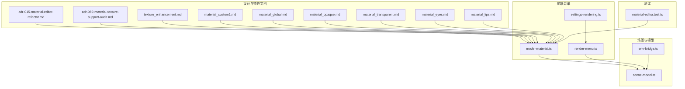
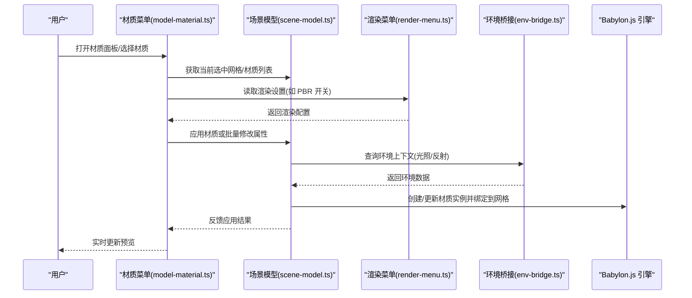
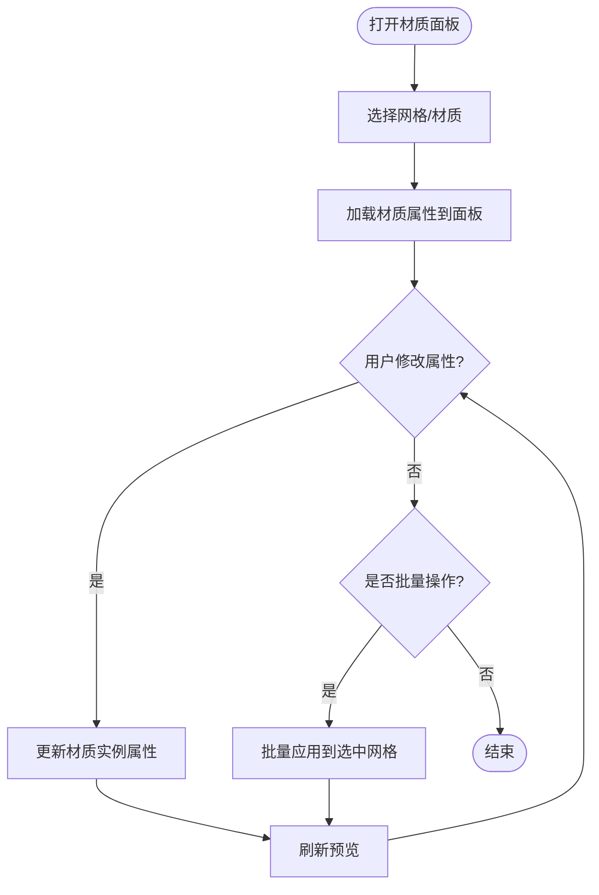
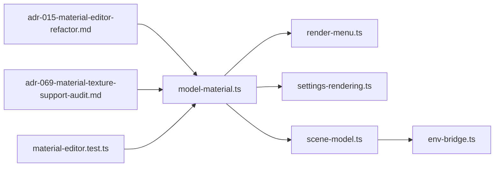

# 材质系统

<cite>
**本文引用的文件**   
- [adr-015-material-editor-refactor.md](file://docs/adr/adr-015-material-editor-refactor.md)
- [adr-069-material-texture-support-audit.md](file://docs/adr/adr-069-material-texture-support-audit.md)
- [model-material.ts](file://frontend/src/menus/model-material.ts)
- [material-editor.test.ts](file://frontend/src/__tests__/material-editor.test.ts)
- [scene-model.ts](file://frontend/src/scene/manager/scene-model.ts)
- [env-bridge.ts](file://frontend/src/scene/env/env-bridge.ts)
- [render-menu.ts](file://frontend/src/menus/render-menu.ts)
- [settings-rendering.ts](file://frontend/src/menus/settings-rendering.ts)
- [texture_enhancement.md](file://docs/research/dancexr-zh/features/texture_enhancement.md)
- [material_custom1.md](file://docs/research/dancexr-zh/features/material_custom1.md)
- [material_global.md](file://docs/research/dancexr-zh/features/material_global.md)
- [material_opaque.md](file://docs/research/dancexr-zh/features/material_opaque.md)
- [material_transparent.md](file://docs/research/dancexr-zh/features/material_transparent.md)
- [material_eyes.md](file://docs/research/dancexr-zh/features/material_eyes.md)
- [material_lips.md](file://docs/research/dancexr-zh/features/material_lips.md)
</cite>

## 目录
1. [简介](#简介)
2. [项目结构](#项目结构)
3. [核心组件](#核心组件)
4. [架构总览](#架构总览)
5. [详细组件分析](#详细组件分析)
6. [依赖关系分析](#依赖关系分析)
7. [性能考量](#性能考量)
8. [故障排查指南](#故障排查指南)
9. [结论](#结论)
10. [附录](#附录)

## 简介
本文件系统性梳理本项目中的“材质系统”，覆盖材质定义、属性与渲染机制，Babylon.js 集成（标准材质、PBR、自定义着色器），材质编辑器的实现要点（属性面板、实时预览、批量修改），材质库管理（创建、保存、共享、版本控制），以及材质与纹理的关联（映射、UV、压缩）。同时提供编程指南与最佳实践，帮助读者快速上手并高效扩展。

## 项目结构
围绕材质系统的代码与文档主要分布在以下位置：
- 前端菜单与 UI：材质相关菜单入口、设置项与渲染菜单
- 场景模型层：将材质应用到模型网格、更新与同步
- ADR 与设计决策：材质编辑器重构、材质与纹理支持审计
- 研究特性文档：PBR、透明、眼睛、嘴唇等材质特性说明
- 测试用例：材质编辑器交互与行为验证

图表来源
- [model-material.ts](file://frontend/src/menus/model-material.ts)
- [render-menu.ts](file://frontend/src/menus/render-menu.ts)
- [settings-rendering.ts](file://frontend/src/menus/settings-rendering.ts)
- [scene-model.ts](file://frontend/src/scene/manager/scene-model.ts)
- [env-bridge.ts](file://frontend/src/scene/env/env-bridge.ts)
- [adr-015-material-editor-refactor.md](file://docs/adr/adr-015-material-editor-refactor.md)
- [adr-069-material-texture-support-audit.md](file://docs/adr/adr-069-material-texture-support-audit.md)
- [texture_enhancement.md](file://docs/research/dancexr-zh/features/texture_enhancement.md)
- [material_custom1.md](file://docs/research/dancexr-zh/features/material_custom1.md)
- [material_global.md](file://docs/research/dancexr-zh/features/material_global.md)
- [material_opaque.md](file://docs/research/dancexr-zh/features/material_opaque.md)
- [material_transparent.md](file://docs/research/dancexr-zh/features/material_transparent.md)
- [material_eyes.md](file://docs/research/dancexr-zh/features/material_eyes.md)
- [material_lips.md](file://docs/research/dancexr-zh/features/material_lips.md)

章节来源
- [model-material.ts](file://frontend/src/menus/model-material.ts)
- [render-menu.ts](file://frontend/src/menus/render-menu.ts)
- [settings-rendering.ts](file://frontend/src/menus/settings-rendering.ts)
- [scene-model.ts](file://frontend/src/scene/manager/scene-model.ts)
- [env-bridge.ts](file://frontend/src/scene/env/env-bridge.ts)
- [adr-015-material-editor-refactor.md](file://docs/adr/adr-015-material-editor-refactor.md)
- [adr-069-material-texture-support-audit.md](file://docs/adr/adr-069-material-texture-support-audit.md)
- [texture_enhancement.md](file://docs/research/dancexr-zh/features/texture_enhancement.md)
- [material_custom1.md](file://docs/research/dancexr-zh/features/material_custom1.md)
- [material_global.md](file://docs/research/dancexr-zh/features/material_global.md)
- [material_opaque.md](file://docs/research/dancexr-zh/features/material_opaque.md)
- [material_transparent.md](file://docs/research/dancexr-zh/features/material_transparent.md)
- [material_eyes.md](file://docs/research/dancexr-zh/features/material_eyes.md)
- [material_lips.md](file://docs/research/dancexr-zh/features/material_lips.md)

## 核心组件
- 材质菜单与入口：提供材质选择、应用与批量操作入口，驱动材质面板与场景模型的联动。
- 渲染菜单与设置：统一渲染管线开关、PBR 模式、环境贴图、反射探针等全局渲染参数，影响材质表现。
- 场景模型层：负责将材质绑定到网格、更新材质属性、处理 UV/纹理通道映射与可见性。
- 环境桥接：在环境系统与材质之间传递光照、反射、天空盒等上下文信息。
- 设计决策与特性文档：规范材质编辑器重构方向、材质与纹理支持范围、各类材质特性（透明、眼睛、嘴唇、自定义等）。
- 测试：对材质编辑器交互、属性变更与预览进行回归验证。

章节来源
- [model-material.ts](file://frontend/src/menus/model-material.ts)
- [render-menu.ts](file://frontend/src/menus/render-menu.ts)
- [settings-rendering.ts](file://frontend/src/menus/settings-rendering.ts)
- [scene-model.ts](file://frontend/src/scene/manager/scene-model.ts)
- [env-bridge.ts](file://frontend/src/scene/env/env-bridge.ts)
- [adr-015-material-editor-refactor.md](file://docs/adr/adr-015-material-editor-refactor.md)
- [adr-069-material-texture-support-audit.md](file://docs/adr/adr-069-material-texture-support-audit.md)
- [material-editor.test.ts](file://frontend/src/__tests__/material-editor.test.ts)

## 架构总览
材质系统采用“菜单驱动 + 场景模型绑定 + 渲染设置”的分层架构。用户通过菜单触发材质操作，菜单层调用场景模型层完成材质实例化与属性写入；渲染菜单与设置层提供全局渲染上下文，确保材质在不同模式下正确表现。

图表来源
- [model-material.ts](file://frontend/src/menus/model-material.ts)
- [scene-model.ts](file://frontend/src/scene/manager/scene-model.ts)
- [render-menu.ts](file://frontend/src/menus/render-menu.ts)
- [env-bridge.ts](file://frontend/src/scene/env/env-bridge.ts)

## 详细组件分析

### 材质编辑器与菜单
- 功能要点
  - 材质选择与应用：从材质库或预设中选择材质，应用到当前选中网格或批量应用到多个网格。
  - 属性面板：展示材质的关键属性（颜色、粗糙度、金属度、透明度、法线强度等），支持滑块、颜色选择器等控件。
  - 实时预览：属性变更后立即刷新材质实例，保证所见即所得。
  - 批量修改：对选中的多个网格应用同一材质或批量调整属性。
- 实现要点
  - 菜单层维护材质状态与选中集合，调用场景模型层执行实际绑定与更新。
  - 与渲染菜单联动，根据全局渲染设置切换材质模式（标准/PBR）与后处理效果。
  - 使用事件总线或响应式状态驱动 UI 更新与预览刷新。

章节来源
- [model-material.ts](file://frontend/src/menus/model-material.ts)
- [material-editor.test.ts](file://frontend/src/__tests__/material-editor.test.ts)
- [adr-015-material-editor-refactor.md](file://docs/adr/adr-015-material-editor-refactor.md)

### 渲染菜单与设置
- 功能要点
  - 渲染模式切换：标准材质与 PBR 材质模式切换。
  - 环境贴图与反射：启用/禁用反射探针、调整环境亮度与色调。
  - 后处理与质量：SSR、阴影质量、抗锯齿等影响材质表现的选项。
- 实现要点
  - 渲染菜单集中管理全局渲染参数，材质系统读取这些参数以决定材质初始化路径与着色器选择。
  - 设置持久化：渲染设置保存到本地配置，重启后恢复。

章节来源
- [render-menu.ts](file://frontend/src/menus/render-menu.ts)
- [settings-rendering.ts](file://frontend/src/menus/settings-rendering.ts)

### 场景模型层与材质绑定
- 功能要点
  - 材质实例化：根据渲染设置创建标准材质或 PBR 材质实例。
  - 属性写入：将颜色、粗糙度、金属度、透明度、法线强度等写入材质对象。
  - 纹理通道映射：将纹理资源绑定到对应通道（漫反射、法线、粗糙度、金属度、透明遮罩等）。
  - UV 坐标处理：确保纹理映射使用正确的 UV 通道与变换（偏移、缩放、旋转）。
- 实现要点
  - 场景模型层封装材质绑定逻辑，对外暴露统一的 applyMaterial/updateProperties API。
  - 与纹理系统协作，处理纹理加载、缓存与复用，避免重复创建。

章节来源
- [scene-model.ts](file://frontend/src/scene/manager/scene-model.ts)
- [env-bridge.ts](file://frontend/src/scene/env/env-bridge.ts)

### 材质与纹理关联
- 纹理映射
  - 漫反射贴图：基础颜色与细节增强。
  - 法线贴图：表面微观凹凸感。
  - 粗糙度/金属度贴图：控制高光与反射强度。
  - 透明遮罩贴图：用于半透明区域控制。
- UV 坐标处理
  - 多 UV 通道支持：不同贴图可使用不同 UV 集。
  - 纹理变换：平移、缩放、旋转与平铺模式。
- 纹理压缩
  - 平台适配：根据目标平台选择合适的压缩格式（如 ASTC、ETC2、BCn）。
  - 内存优化：按需加载与流式加载，减少峰值内存占用。

章节来源
- [adr-069-material-texture-support-audit.md](file://docs/adr/adr-069-material-texture-support-audit.md)
- [texture_enhancement.md](file://docs/research/dancexr-zh/features/texture_enhancement.md)

### 材质库管理
- 材质创建
  - 基于模板或预设快速生成新材质。
  - 支持导入外部材质定义（JSON/二进制）。
- 保存与共享
  - 材质资产序列化，支持导出为通用格式。
  - 共享到素材库，供其他场景或用户引用。
- 版本控制
  - 材质资产版本记录，支持回滚与差异对比。
  - 冲突解决策略：合并策略与覆盖规则。

章节来源
- [adr-015-material-editor-refactor.md](file://docs/adr/adr-015-material-editor-refactor.md)
- [adr-069-material-texture-support-audit.md](file://docs/adr/adr-069-material-texture-support-audit.md)

### 材质特性与着色器支持
- 标准材质
  - 适用于简单表面，支持基础颜色、透明度与简单光照。
- PBR 材质
  - 物理准确的光照模型，支持粗糙度、金属度、环境反射。
- 自定义着色器
  - 支持注入自定义顶点/片段着色器，实现特殊效果（卡通描边、次表面散射等）。
- 特定部位材质
  - 眼睛、嘴唇等部位的特殊材质方案，支持动态属性（湿润度、光泽度）。

章节来源
- [material_custom1.md](file://docs/research/dancexr-zh/features/material_custom1.md)
- [material_global.md](file://docs/research/dancexr-zh/features/material_global.md)
- [material_opaque.md](file://docs/research/dancexr-zh/features/material_opaque.md)
- [material_transparent.md](file://docs/research/dancexr-zh/features/material_transparent.md)
- [material_eyes.md](file://docs/research/dancexr-zh/features/material_eyes.md)
- [material_lips.md](file://docs/research/dancexr-zh/features/material_lips.md)

## 依赖关系分析
材质系统的关键依赖如下：
- 菜单层依赖渲染菜单与设置，以获取全局渲染上下文。
- 场景模型层依赖环境桥接，以获取光照与反射信息。
- 材质编辑器依赖测试用例进行行为验证。
- 特性文档指导材质实现与扩展。

图表来源
- [model-material.ts](file://frontend/src/menus/model-material.ts)
- [render-menu.ts](file://frontend/src/menus/render-menu.ts)
- [settings-rendering.ts](file://frontend/src/menus/settings-rendering.ts)
- [scene-model.ts](file://frontend/src/scene/manager/scene-model.ts)
- [env-bridge.ts](file://frontend/src/scene/env/env-bridge.ts)
- [adr-015-material-editor-refactor.md](file://docs/adr/adr-015-material-editor-refactor.md)
- [adr-069-material-texture-support-audit.md](file://docs/adr/adr-069-material-texture-support-audit.md)
- [material-editor.test.ts](file://frontend/src/__tests__/material-editor.test.ts)

章节来源
- [model-material.ts](file://frontend/src/menus/model-material.ts)
- [render-menu.ts](file://frontend/src/menus/render-menu.ts)
- [settings-rendering.ts](file://frontend/src/menus/settings-rendering.ts)
- [scene-model.ts](file://frontend/src/scene/manager/scene-model.ts)
- [env-bridge.ts](file://frontend/src/scene/env/env-bridge.ts)
- [adr-015-material-editor-refactor.md](file://docs/adr/adr-015-material-editor-refactor.md)
- [adr-069-material-texture-support-audit.md](file://docs/adr/adr-069-material-texture-support-audit.md)
- [material-editor.test.ts](file://frontend/src/__tests__/material-editor.test.ts)

## 性能考量
- 材质实例复用：避免频繁创建与销毁材质实例，尽量复用与更新属性。
- 纹理压缩与流式加载：根据平台选择合适压缩格式，按需加载大纹理，降低内存峰值。
- 批处理更新：批量修改材质属性时合并渲染命令，减少 GPU 状态切换。
- 环境贴图采样优化：合理设置反射探针分辨率与更新频率，平衡质量与性能。
- 透明材质排序：按深度排序透明物体，减少过度绘制与混合开销。

[本节为通用性能建议，不直接分析具体文件]

## 故障排查指南
- 材质不显示或颜色异常
  - 检查纹理通道是否正确映射，确认 UV 坐标与纹理尺寸匹配。
  - 验证渲染设置中 PBR 模式与光照环境是否启用。
- 透明材质闪烁或顺序错误
  - 调整透明物体的渲染顺序，确保从远到近绘制。
  - 检查透明遮罩贴图的 Alpha 通道是否正确。
- 自定义着色器报错
  - 确认着色器语法与 Babylon.js 兼容，检查 uniform 变量绑定。
  - 查看控制台日志定位编译错误。
- 材质库版本冲突
  - 使用版本控制工具对比差异，采用合并策略解决冲突。
  - 回滚到稳定版本并重新应用变更。

章节来源
- [material-editor.test.ts](file://frontend/src/__tests__/material-editor.test.ts)
- [adr-069-material-texture-support-audit.md](file://docs/adr/adr-069-material-texture-support-audit.md)

## 结论
本项目材质系统以菜单驱动为核心，结合场景模型层与渲染设置，实现了标准材质、PBR 材质与自定义着色器的统一接入。材质编辑器提供属性面板、实时预览与批量修改能力，材质库管理支持创建、保存、共享与版本控制。材质与纹理的关联通过通道映射、UV 处理与压缩优化保障渲染质量与性能。遵循本文档的编程指南与最佳实践，可高效扩展材质特性并提升用户体验。

[本节为总结性内容，不直接分析具体文件]

## 附录
- 术语表
  - PBR：基于物理的渲染（Physically Based Rendering）
  - SSR：屏幕空间反射（Screen Space Reflections）
  - UV：纹理坐标（U/V 坐标）
  - 法线贴图：用于模拟表面微观凹凸的贴图
- 参考链接
  - 材质编辑器重构决策：[adr-015-material-editor-refactor.md](file://docs/adr/adr-015-material-editor-refactor.md)
  - 材质与纹理支持审计：[adr-069-material-texture-support-audit.md](file://docs/adr/adr-069-material-texture-support-audit.md)
  - 纹理增强特性：[texture_enhancement.md](file://docs/research/dancexr-zh/features/texture_enhancement.md)
  - 自定义材质特性：[material_custom1.md](file://docs/research/dancexr-zh/features/material_custom1.md)
  - 全局材质特性：[material_global.md](file://docs/research/dancexr-zh/features/material_global.md)
  - 不透明材质特性：[material_opaque.md](file://docs/research/dancexr-zh/features/material_opaque.md)
  - 透明材质特性：[material_transparent.md](file://docs/research/dancexr-zh/features/material_transparent.md)
  - 眼睛材质特性：[material_eyes.md](file://docs/research/dancexr-zh/features/material_eyes.md)
  - 嘴唇材质特性：[material_lips.md](file://docs/research/dancexr-zh/features/material_lips.md)