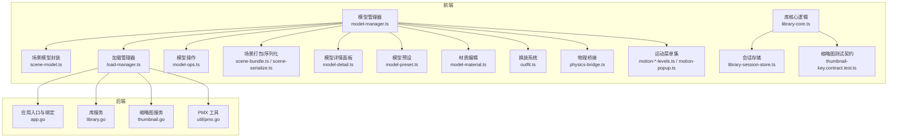
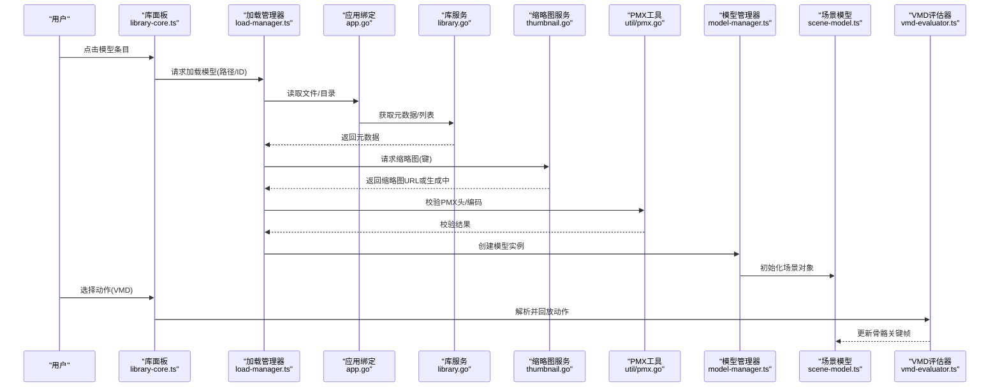
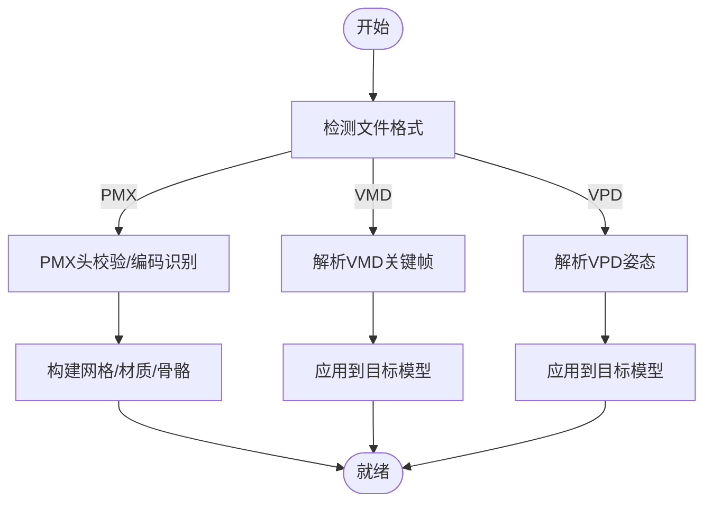
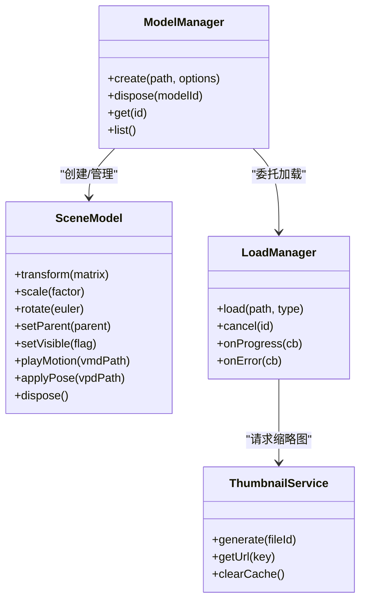
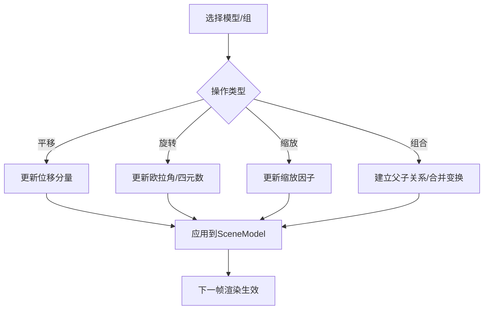
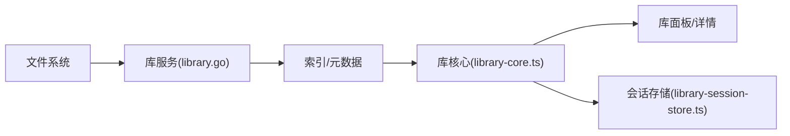
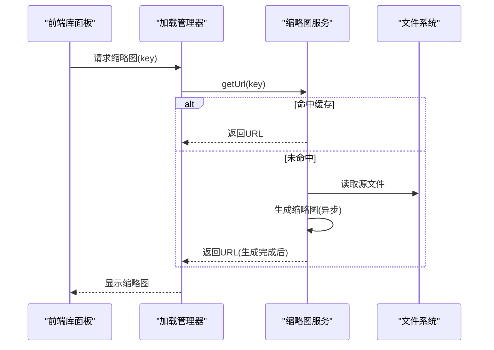
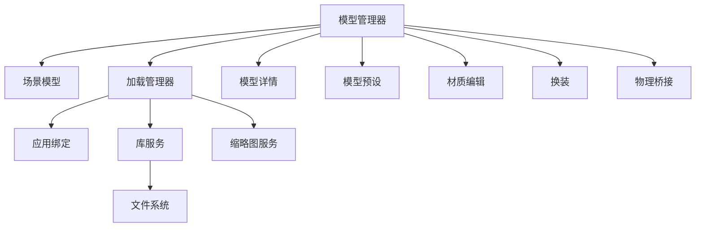

# 模型管理

<cite>
**本文引用的文件**   
- [main.go](file://main.go)
- [app.go](file://internal/app/app.go)
- [library.go](file://internal/app/library.go)
- [thumbnail.go](file://internal/app/thumbnail.go)
- [pmx.go](file://internal/util/pmx.go)
- [vpd-parser.ts](file://frontend/src/motion-algos/vpd-parser.ts)
- [vmd-evaluator.ts](file://frontend/src/motion-algos/vmd-evaluator.ts)
- [vmd-writer.ts](file://frontend/src/motion-algos/vmd-writer.ts)
- [scene-model.ts](file://frontend/src/scene/manager/scene-model.ts)
- [model-manager.ts](file://frontend/src/core/model-manager.ts)
- [model-ops.ts](file://frontend/src/core/model-ops.ts)
- [library-core.ts](file://frontend/src/menus/library-core.ts)
- [library-session-store.ts](file://frontend/src/menus/library-session-store.ts)
- [load-manager.ts](file://frontend/src/core/load-manager.ts)
- [scene-bundle.ts](file://frontend/src/scene/scene-bundle.ts)
- [scene-serialize.ts](file://frontend/src/scene/scene-serialize.ts)
- [model-detail.ts](file://frontend/src/menus/model-detail.ts)
- [model-preset.ts](file://frontend/src/menus/model-preset.ts)
- [model-material.ts](file://frontend/src/menus/model-material.ts)
- [outfit.ts](file://frontend/src/outfit/outfit.ts)
- [physics-bridge.ts](file://frontend/src/physics/physics-bridge.ts)
- [motion-cloth-levels.ts](file://frontend/src/menus/motion-cloth-levels.ts)
- [motion-gaze-levels.ts](file://frontend/src/menus/motion-gaze-levels.ts)
- [motion-feet-levels.ts](file://frontend/src/menus/motion-feet-levels.ts)
- [motion-procmotion-levels.ts](file://frontend/src/menus/motion-procmotion-levels.ts)
- [motion-popup.ts](file://frontend/src/menus/motion-popup.ts)
- [motion-camera-levels.ts](file://frontend/src/menus/motion-camera-levels.ts)
- [motion-override-levels.ts](file://frontend/src/menus/motion-override-levels.ts)
- [motion-pose-levels.ts](file://frontend/src/menus/motion-pose-levels.ts)
- [thumb-key-contract.test.ts](file://frontend/src/__tests__/thumbnail-key.contract.test.ts)
- [library-thumbnail-streaming.test.ts](file://frontend/src/__tests__/library-thumbnail-streaming.test.ts)
- [model-load.spec.ts](file://frontend/e2e/model-load.spec.ts)
- [PMX 加载失败：`is not pmx file`.md](file://docs/buglog/PMX%20加载失败：%60is%20not%20pmx%20file%60.md)
- [VMD 播放无反应.md](file://docs/buglog/VMD%20播放无反应.md)
</cite>

## 目录
1. [简介](#简介)
2. [项目结构](#项目结构)
3. [核心组件](#核心组件)
4. [架构总览](#架构总览)
5. [详细组件分析](#详细组件分析)
6. [依赖关系分析](#依赖关系分析)
7. [性能考虑](#性能考虑)
8. [故障排查指南](#故障排查指南)
9. [结论](#结论)
10. [附录](#附录)

## 简介
本文件面向“模型管理”子系统，系统性阐述 3D 模型的加载、解析、缓存与生命周期管理；说明支持的模型格式（PMX、VMD、VPD）及其解析流程；详述模型操作能力（变换、缩放、旋转、组合等）；解释模型库的索引、元数据与版本控制设计；给出预览与缩略图生成机制及异步优化策略；并提供导入导出 API 的使用示例与参考路径。

## 项目结构
模型管理涉及前端与后端协作：
- 前端负责场景中的模型实例化、动画回放、交互操作、UI 展示与状态同步
- 后端提供文件系统访问、资源扫描、缩略图生成、压缩/解压等能力
- 公共工具层提供 PMX 校验、哈希计算、安全调用等通用能力

图表来源
- [app.go:1-200](file://internal/app/app.go#L1-L200)
- [library.go:1-200](file://internal/app/library.go#L1-L200)
- [thumbnail.go:1-200](file://internal/app/thumbnail.go#L1-L200)
- [pmx.go:1-200](file://internal/util/pmx.go#L1-L200)
- [model-manager.ts:1-200](file://frontend/src/core/model-manager.ts#L1-L200)
- [scene-model.ts:1-200](file://frontend/src/scene/manager/scene-model.ts#L1-L200)
- [load-manager.ts:1-200](file://frontend/src/core/load-manager.ts#L1-L200)
- [library-core.ts:1-200](file://frontend/src/menus/library-core.ts#L1-L200)
- [library-session-store.ts:1-200](file://frontend/src/menus/library-session-store.ts#L1-L200)
- [model-ops.ts:1-200](file://frontend/src/core/model-ops.ts#L1-L200)
- [scene-bundle.ts:1-200](file://frontend/src/scene/scene-bundle.ts#L1-L200)
- [scene-serialize.ts:1-200](file://frontend/src/scene/scene-serialize.ts#L1-L200)
- [model-detail.ts:1-200](file://frontend/src/menus/model-detail.ts#L1-L200)
- [model-preset.ts:1-200](file://frontend/src/menus/model-preset.ts#L1-L200)
- [model-material.ts:1-200](file://frontend/src/menus/model-material.ts#L1-L200)
- [outfit.ts:1-200](file://frontend/src/outfit/outfit.ts#L1-L200)
- [physics-bridge.ts:1-200](file://frontend/src/physics/physics-bridge.ts#L1-L200)
- [motion-cloth-levels.ts:1-200](file://frontend/src/menus/motion-cloth-levels.ts#L1-L200)
- [motion-gaze-levels.ts:1-200](file://frontend/src/menus/motion-gaze-levels.ts#L1-L200)
- [motion-feet-levels.ts:1-200](file://frontend/src/menus/motion-feet-levels.ts#L1-L200)
- [motion-procmotion-levels.ts:1-200](file://frontend/src/menus/motion-procmotion-levels.ts#L1-L200)
- [motion-popup.ts:1-200](file://frontend/src/menus/motion-popup.ts#L1-L200)
- [motion-camera-levels.ts:1-200](file://frontend/src/menus/motion-camera-levels.ts#L1-L200)
- [motion-override-levels.ts:1-200](file://frontend/src/menus/motion-override-levels.ts#L1-L200)
- [motion-pose-levels.ts:1-200](file://frontend/src/menus/motion-pose-levels.ts#L1-L200)
- [thumb-key-contract.test.ts:1-200](file://frontend/src/__tests__/thumbnail-key.contract.test.ts#L1-L200)
- [library-thumbnail-streaming.test.ts:1-200](file://frontend/src/__tests__/library-thumbnail-streaming.test.ts#L1-L200)

章节来源
- [main.go:1-200](file://main.go#L1-L200)
- [app.go:1-200](file://internal/app/app.go#L1-L200)
- [library.go:1-200](file://internal/app/library.go#L1-L200)
- [thumbnail.go:1-200](file://internal/app/thumbnail.go#L1-L200)
- [pmx.go:1-200](file://internal/util/pmx.go#L1-L200)
- [model-manager.ts:1-200](file://frontend/src/core/model-manager.ts#L1-L200)
- [scene-model.ts:1-200](file://frontend/src/scene/manager/scene-model.ts#L1-L200)
- [load-manager.ts:1-200](file://frontend/src/core/load-manager.ts#L1-L200)
- [library-core.ts:1-200](file://frontend/src/menus/library-core.ts#L1-L200)
- [library-session-store.ts:1-200](file://frontend/src/menus/library-session-store.ts#L1-L200)
- [model-ops.ts:1-200](file://frontend/src/core/model-ops.ts#L1-L200)
- [scene-bundle.ts:1-200](file://frontend/src/scene/scene-bundle.ts#L1-L200)
- [scene-serialize.ts:1-200](file://frontend/src/scene/scene-serialize.ts#L1-L200)
- [model-detail.ts:1-200](file://frontend/src/menus/model-detail.ts#L1-L200)
- [model-preset.ts:1-200](file://frontend/src/menus/model-preset.ts#L1-L200)
- [model-material.ts:1-200](file://frontend/src/menus/model-material.ts#L1-L200)
- [outfit.ts:1-200](file://frontend/src/outfit/outfit.ts#L1-L200)
- [physics-bridge.ts:1-200](file://frontend/src/physics/physics-bridge.ts#L1-L200)
- [motion-cloth-levels.ts:1-200](file://frontend/src/menus/motion-cloth-levels.ts#L1-L200)
- [motion-gaze-levels.ts:1-200](file://frontend/src/menus/motion-gaze-levels.ts#L1-L200)
- [motion-feet-levels.ts:1-200](file://frontend/src/menus/motion-feet-levels.ts#L1-L200)
- [motion-procmotion-levels.ts:1-200](file://frontend/src/menus/motion-procmotion-levels.ts#L1-L200)
- [motion-popup.ts:1-200](file://frontend/src/menus/motion-popup.ts#L1-L200)
- [motion-camera-levels.ts:1-200](file://frontend/src/menus/motion-camera-levels.ts#L1-L200)
- [motion-override-levels.ts:1-200](file://frontend/src/menus/motion-override-levels.ts#L1-L200)
- [motion-pose-levels.ts:1-200](file://frontend/src/menus/motion-pose-levels.ts#L1-L200)
- [thumb-key-contract.test.ts:1-200](file://frontend/src/__tests__/thumbnail-key.contract.test.ts#L1-L200)
- [library-thumbnail-streaming.test.ts:1-200](file://frontend/src/__tests__/library-thumbnail-streaming.test.ts#L1-L200)

## 核心组件
- 模型管理器（ModelManager）：统一创建、注册、销毁模型实例，协调加载、动画、物理、材质、预设与 UI 面板
- 场景模型封装（SceneModel）：对单个模型在场景中的生命周期、变换、父子组合、可见性、渲染层等进行封装
- 加载管理器（LoadManager）：抽象资源加载管线，处理并发、取消信号、错误重试与进度回调
- 库核心（LibraryCore）：模型库浏览、筛选、搜索、排序、分页与预览流式加载
- 会话存储（LibrarySessionStore）：维护当前会话的库状态、选中项、滚动位置、过滤条件等
- 模型操作（ModelOps）：提供变换、缩放、旋转、对齐、组合、镜像等常用操作
- 场景打包/序列化（SceneBundle/SceneSerialize）：将场景状态（含模型、动作、环境）序列化为可持久化的包
- 缩略图服务（后端 thumbnail.go + 前端测试契约）：异步生成并缓存缩略图，支持流式传输与键值一致性
- PMX 工具（util/pmx.go）：PMX 头校验、编码检测、基础信息提取
- VMD/VPD 解析与回放：VMD 评估器、写入器，VPD 解析器

章节来源
- [model-manager.ts:1-200](file://frontend/src/core/model-manager.ts#L1-L200)
- [scene-model.ts:1-200](file://frontend/src/scene/manager/scene-model.ts#L1-L200)
- [load-manager.ts:1-200](file://frontend/src/core/load-manager.ts#L1-L200)
- [library-core.ts:1-200](file://frontend/src/menus/library-core.ts#L1-L200)
- [library-session-store.ts:1-200](file://frontend/src/menus/library-session-store.ts#L1-L200)
- [model-ops.ts:1-200](file://frontend/src/core/model-ops.ts#L1-L200)
- [scene-bundle.ts:1-200](file://frontend/src/scene/scene-bundle.ts#L1-L200)
- [scene-serialize.ts:1-200](file://frontend/src/scene/scene-serialize.ts#L1-L200)
- [thumbnail.go:1-200](file://internal/app/thumbnail.go#L1-L200)
- [pmx.go:1-200](file://internal/util/pmx.go#L1-L200)
- [vmd-evaluator.ts:1-200](file://frontend/src/motion-algos/vmd-evaluator.ts#L1-L200)
- [vmd-writer.ts:1-200](file://frontend/src/motion-algos/vmd-writer.ts#L1-L200)
- [vpd-parser.ts:1-200](file://frontend/src/motion-algos/vpd-parser.ts#L1-L200)

## 架构总览
下图展示了从用户选择到模型进入场景、播放动作、生成缩略图的全链路交互。

图表来源
- [library-core.ts:1-200](file://frontend/src/menus/library-core.ts#L1-L200)
- [load-manager.ts:1-200](file://frontend/src/core/load-manager.ts#L1-L200)
- [app.go:1-200](file://internal/app/app.go#L1-L200)
- [library.go:1-200](file://internal/app/library.go#L1-L200)
- [thumbnail.go:1-200](file://internal/app/thumbnail.go#L1-L200)
- [pmx.go:1-200](file://internal/util/pmx.go#L1-L200)
- [model-manager.ts:1-200](file://frontend/src/core/model-manager.ts#L1-L200)
- [scene-model.ts:1-200](file://frontend/src/scene/manager/scene-model.ts#L1-L200)
- [vmd-evaluator.ts:1-200](file://frontend/src/motion-algos/vmd-evaluator.ts#L1-L200)

## 详细组件分析

### 模型加载与解析（PMX/VMD/VPD）
- PMX 模型
  - 后端 PMX 工具负责头部校验、编码识别与基础信息提取，避免无效文件进入渲染管线
  - 前端通过加载管理器发起加载，结合 PMX 工具结果进行后续构建
- VMD 动作
  - 前端 VMD 评估器负责解析关键帧、插值与时间轴，驱动骨骼变换
  - VMD 写入器用于导出/回写动作数据
- VPD 姿态
  - VPD 解析器用于读取静态姿态，快速设置初始骨骼位置/旋转

图表来源
- [pmx.go:1-200](file://internal/util/pmx.go#L1-L200)
- [vmd-evaluator.ts:1-200](file://frontend/src/motion-algos/vmd-evaluator.ts#L1-L200)
- [vmd-writer.ts:1-200](file://frontend/src/motion-algos/vmd-writer.ts#L1-L200)
- [vpd-parser.ts:1-200](file://frontend/src/motion-algos/vpd-parser.ts#L1-L200)

章节来源
- [pmx.go:1-200](file://internal/util/pmx.go#L1-L200)
- [vmd-evaluator.ts:1-200](file://frontend/src/motion-algos/vmd-evaluator.ts#L1-L200)
- [vmd-writer.ts:1-200](file://frontend/src/motion-algos/vmd-writer.ts#L1-L200)
- [vpd-parser.ts:1-200](file://frontend/src/motion-algos/vpd-parser.ts#L1-L200)

### 模型缓存与生命周期管理
- 缓存策略
  - 缩略图：后端生成并持久化，前端按键值命中缓存，未命中时触发异步生成与流式返回
  - 模型资源：由加载管理器统一管理引用计数与释放时机，避免重复加载
- 生命周期
  - 创建：模型管理器根据路径/ID创建 SceneModel 实例
  - 运行：绑定动画、物理、材质、事件监听
  - 销毁：清理纹理、几何体、动画、物理对象，解除订阅，回收内存

图表来源
- [model-manager.ts:1-200](file://frontend/src/core/model-manager.ts#L1-L200)
- [scene-model.ts:1-200](file://frontend/src/scene/manager/scene-model.ts#L1-L200)
- [load-manager.ts:1-200](file://frontend/src/core/load-manager.ts#L1-L200)
- [thumbnail.go:1-200](file://internal/app/thumbnail.go#L1-L200)

章节来源
- [model-manager.ts:1-200](file://frontend/src/core/model-manager.ts#L1-L200)
- [scene-model.ts:1-200](file://frontend/src/scene/manager/scene-model.ts#L1-L200)
- [load-manager.ts:1-200](file://frontend/src/core/load-manager.ts#L1-L200)
- [thumbnail.go:1-200](file://internal/app/thumbnail.go#L1-L200)

### 模型操作（变换、缩放、旋转、组合）
- 变换矩阵：统一以矩阵形式表达平移/旋转/缩放，便于组合与层级传递
- 组合与父子关系：支持将多个模型组合为组，继承父级变换
- 常用操作：对齐、镜像、重置变换、批量选择与操作

图表来源
- [model-ops.ts:1-200](file://frontend/src/core/model-ops.ts#L1-L200)
- [scene-model.ts:1-200](file://frontend/src/scene/manager/scene-model.ts#L1-L200)

章节来源
- [model-ops.ts:1-200](file://frontend/src/core/model-ops.ts#L1-L200)
- [scene-model.ts:1-200](file://frontend/src/scene/manager/scene-model.ts#L1-L200)

### 模型库架构（索引、元数据、版本控制）
- 索引与元数据
  - 后端库服务扫描目录，收集模型文件、动作、贴图、配置等，生成索引与元数据
  - 前端库核心提供筛选、排序、分页、搜索与预览
- 版本控制
  - 基于文件哈希/版本号记录变更，增量更新索引，避免全量重建
  - 会话存储维持当前视图状态，提升交互体验

图表来源
- [library.go:1-200](file://internal/app/library.go#L1-L200)
- [library-core.ts:1-200](file://frontend/src/menus/library-core.ts#L1-L200)
- [library-session-store.ts:1-200](file://frontend/src/menus/library-session-store.ts#L1-L200)

章节来源
- [library.go:1-200](file://internal/app/library.go#L1-L200)
- [library-core.ts:1-200](file://frontend/src/menus/library-core.ts#L1-L200)
- [library-session-store.ts:1-200](file://frontend/src/menus/library-session-store.ts#L1-L200)

### 预览与缩略图生成（异步与性能优化）
- 异步生成
  - 缩略图在后端线程池内异步生成，前端通过键值查询，未命中则等待生成完成
- 流式传输
  - 大尺寸缩略图采用分块/流式返回，降低首屏延迟
- 键值一致性
  - 测试契约确保缩略图键稳定，避免缓存失效

图表来源
- [thumbnail.go:1-200](file://internal/app/thumbnail.go#L1-L200)
- [load-manager.ts:1-200](file://frontend/src/core/load-manager.ts#L1-L200)
- [thumb-key-contract.test.ts:1-200](file://frontend/src/__tests__/thumbnail-key.contract.test.ts#L1-L200)
- [library-thumbnail-streaming.test.ts:1-200](file://frontend/src/__tests__/library-thumbnail-streaming.test.ts#L1-L200)

章节来源
- [thumbnail.go:1-200](file://internal/app/thumbnail.go#L1-L200)
- [thumb-key-contract.test.ts:1-200](file://frontend/src/__tests__/thumbnail-key.contract.test.ts#L1-L200)
- [library-thumbnail-streaming.test.ts:1-200](file://frontend/src/__tests__/library-thumbnail-streaming.test.ts#L1-L200)

### 导入导出 API 与使用示例
- 导入
  - 通过库面板选择模型/动作文件，由加载管理器统一调度，后端提供文件访问与校验
  - 支持批量导入与进度反馈
- 导出
  - 场景打包：将当前场景（模型、动作、环境）序列化为包文件
  - 动作导出：将运行时动作回写为 VMD 文件
- 使用示例（路径参考）
  - 导入入口：[library-core.ts:1-200](file://frontend/src/menus/library-core.ts#L1-L200)
  - 场景打包：[scene-bundle.ts:1-200](file://frontend/src/scene/scene-bundle.ts#L1-L200)、[scene-serialize.ts:1-200](file://frontend/src/scene/scene-serialize.ts#L1-L200)
  - 动作导出：[vmd-writer.ts:1-200](file://frontend/src/motion-algos/vmd-writer.ts#L1-L200)

章节来源
- [library-core.ts:1-200](file://frontend/src/menus/library-core.ts#L1-L200)
- [scene-bundle.ts:1-200](file://frontend/src/scene/scene-bundle.ts#L1-L200)
- [scene-serialize.ts:1-200](file://frontend/src/scene/scene-serialize.ts#L1-L200)
- [vmd-writer.ts:1-200](file://frontend/src/motion-algos/vmd-writer.ts#L1-L200)

### 模型细节与扩展功能
- 模型详情面板：展示模型属性、材质、骨骼、动作列表与快捷操作
- 模型预设：保存/恢复常用参数（材质、物理、灯光）
- 材质编辑：调整漫反射、高光、透明、法线贴图、自发光等
- 换装系统：多套外观切换与叠加
- 物理桥接：连接骨骼物理与风场效果
- 运动菜单：布料、视线、脚步、程序化动作、相机、覆写、姿势等分层控制

章节来源
- [model-detail.ts:1-200](file://frontend/src/menus/model-detail.ts#L1-L200)
- [model-preset.ts:1-200](file://frontend/src/menus/model-preset.ts#L1-L200)
- [model-material.ts:1-200](file://frontend/src/menus/model-material.ts#L1-L200)
- [outfit.ts:1-200](file://frontend/src/outfit/outfit.ts#L1-L200)
- [physics-bridge.ts:1-200](file://frontend/src/physics/physics-bridge.ts#L1-L200)
- [motion-cloth-levels.ts:1-200](file://frontend/src/menus/motion-cloth-levels.ts#L1-L200)
- [motion-gaze-levels.ts:1-200](file://frontend/src/menus/motion-gaze-levels.ts#L1-L200)
- [motion-feet-levels.ts:1-200](file://frontend/src/menus/motion-feet-levels.ts#L1-L200)
- [motion-procmotion-levels.ts:1-200](file://frontend/src/menus/motion-procmotion-levels.ts#L1-L200)
- [motion-popup.ts:1-200](file://frontend/src/menus/motion-popup.ts#L1-L200)
- [motion-camera-levels.ts:1-200](file://frontend/src/menus/motion-camera-levels.ts#L1-L200)
- [motion-override-levels.ts:1-200](file://frontend/src/menus/motion-override-levels.ts#L1-L200)
- [motion-pose-levels.ts:1-200](file://frontend/src/menus/motion-pose-levels.ts#L1-L200)

## 依赖关系分析
- 模块耦合
  - 模型管理器强依赖场景模型与加载管理器，弱依赖 UI 面板与预设/材质/换装等扩展
  - 库核心依赖库服务与会话存储，缩略图服务作为外部资源提供方
- 外部依赖
  - 后端通过 Wails 绑定暴露文件系统、HTTP 服务、缩略图生成等能力
  - 前端依赖 Babylon.js/MMD 生态（通过上层封装）

图表来源
- [model-manager.ts:1-200](file://frontend/src/core/model-manager.ts#L1-L200)
- [scene-model.ts:1-200](file://frontend/src/scene/manager/scene-model.ts#L1-L200)
- [load-manager.ts:1-200](file://frontend/src/core/load-manager.ts#L1-L200)
- [app.go:1-200](file://internal/app/app.go#L1-L200)
- [library.go:1-200](file://internal/app/library.go#L1-L200)
- [thumbnail.go:1-200](file://internal/app/thumbnail.go#L1-L200)

章节来源
- [model-manager.ts:1-200](file://frontend/src/core/model-manager.ts#L1-L200)
- [load-manager.ts:1-200](file://frontend/src/core/load-manager.ts#L1-L200)
- [app.go:1-200](file://internal/app/app.go#L1-L200)
- [library.go:1-200](file://internal/app/library.go#L1-L200)
- [thumbnail.go:1-200](file://internal/app/thumbnail.go#L1-L200)

## 性能考虑
- 缩略图异步与流式：避免阻塞主线程，首屏更快
- 懒加载与按需解析：仅加载当前视图所需资源，减少峰值内存
- 缓存命中率：稳定的缩略图键与资源指纹，提高命中率
- 批量操作：合并多次变换为一次矩阵更新，减少重绘
- 取消与超时：长任务支持取消信号，防止资源泄漏

## 故障排查指南
- PMX 加载失败
  - 现象：提示非 PMX 文件或头校验失败
  - 排查：确认文件编码、PMX 版本、是否损坏；检查后端 PMX 工具校验逻辑
  - 参考：[PMX 加载失败：`is not pmx file`.md](file://docs/buglog/PMX%20加载失败：%60is%20not%20pmx%20file%60.md)
- VMD 播放无反应
  - 现象：选择动作后无变化
  - 排查：确认 VMD 时间轴与模型骨骼命名匹配；检查评估器解析结果与绑定
  - 参考：[VMD 播放无反应.md](file://docs/buglog/VMD%20播放无反应.md)
- 缩略图缓存未命中
  - 现象：缩略图反复生成或空白
  - 排查：核对缩略图键生成规则；检查流式接口与缓存目录权限
  - 参考：[缩略图缓存未命中](file://docs/buglog/2026-07-17-thumbnail-cache-miss.md)

章节来源
- [PMX 加载失败：`is not pmx file`.md](file://docs/buglog/PMX%20加载失败：%60is%20not%20pmx%20file%60.md)
- [VMD 播放无反应.md](file://docs/buglog/VMD%20播放无反应.md)
- [thumb-key-contract.test.ts:1-200](file://frontend/src/__tests__/thumbnail-key.contract.test.ts#L1-L200)
- [library-thumbnail-streaming.test.ts:1-200](file://frontend/src/__tests__/library-thumbnail-streaming.test.ts#L1-L200)

## 结论
模型管理系统以“加载-解析-缓存-生命周期”为主线，结合库索引与元数据管理，形成完整的模型工作流。通过异步缩略图、流式传输与稳定键值策略，显著提升预览性能；通过统一的变换与组合能力，满足复杂场景需求。未来可进一步引入增量索引、更细粒度的资源池与更完善的错误诊断工具。

## 附录
- E2E 用例参考
  - 模型加载端到端测试：[model-load.spec.ts:1-200](file://frontend/e2e/model-load.spec.ts#L1-L200)