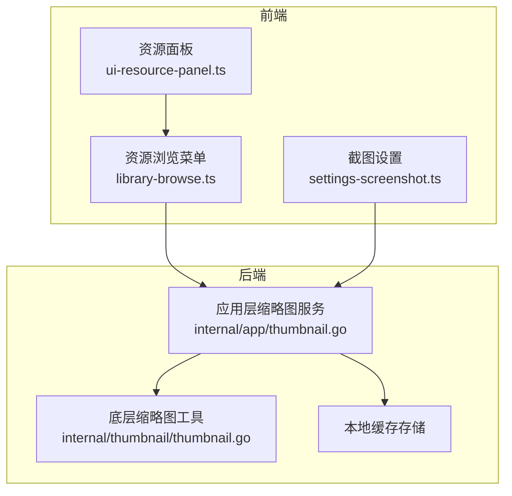
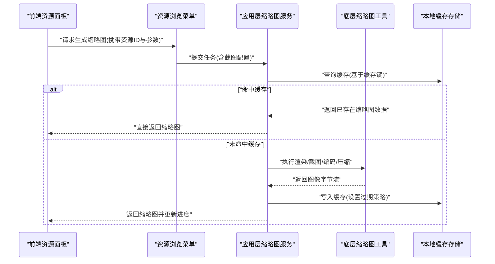
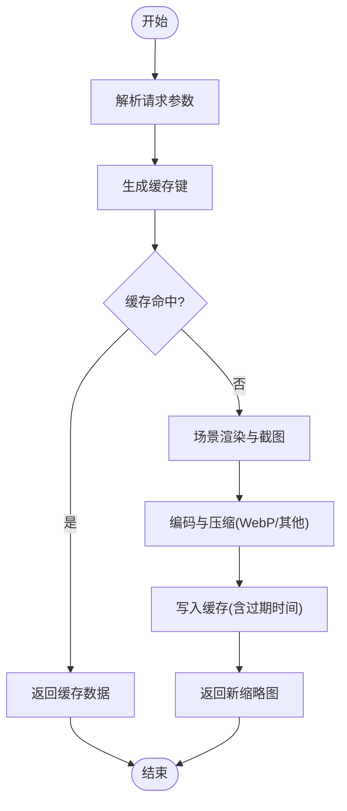
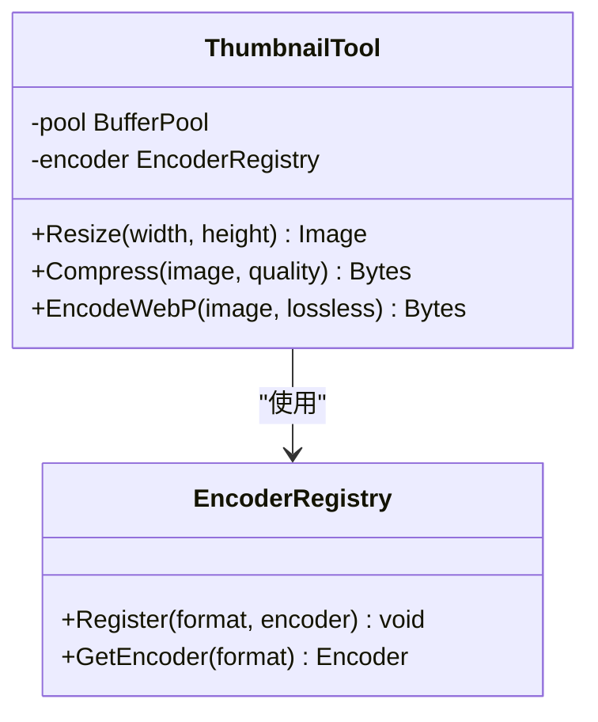
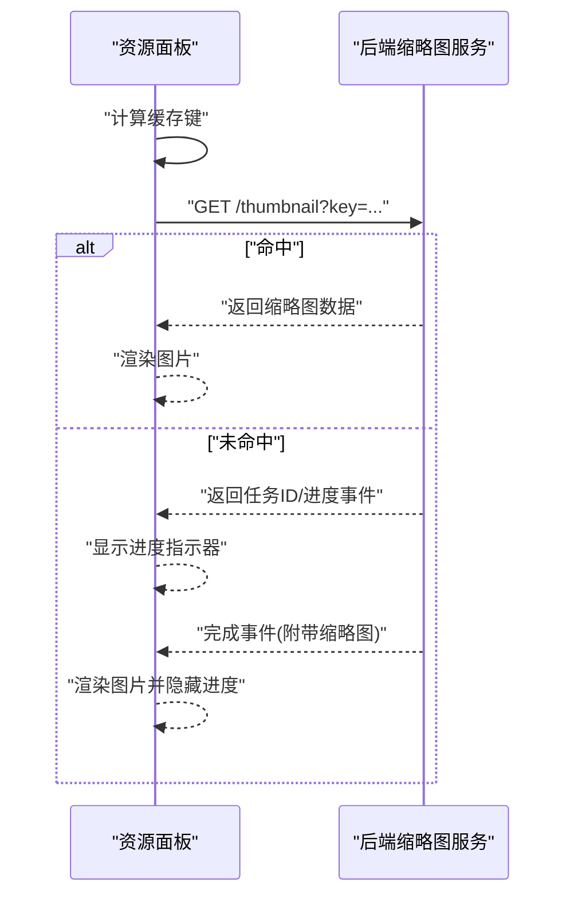
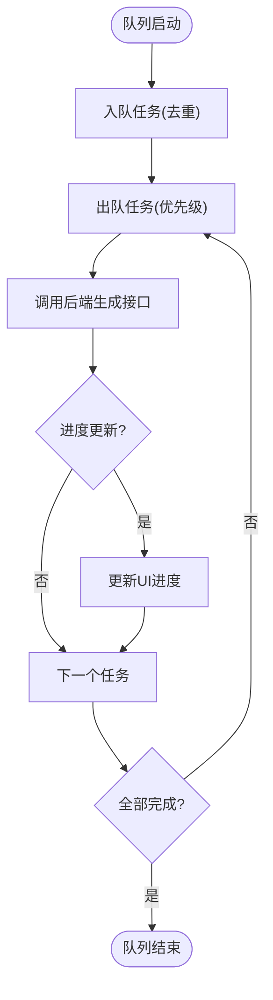
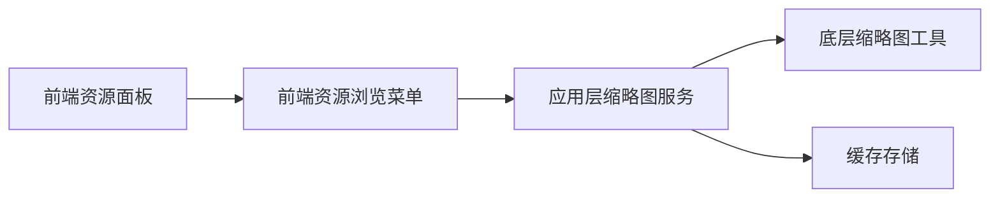

# 缩略图生成

<cite>
**本文引用的文件**   
- [internal/app/thumbnail.go](file://internal/app/thumbnail.go)
- [internal/thumbnail/thumbnail.go](file://internal/thumbnail/thumbnail.go)
- [frontend/src/core/ui-resource-panel.ts](file://frontend/src/core/ui-resource-panel.ts)
- [frontend/src/menus/library-browse.ts](file://frontend/src/menus/library-browse.ts)
- [frontend/src/menus/settings-screenshot.ts](file://frontend/src/menus/settings-screenshot.ts)
- [docs/audit/thumbnail-system.md](file://docs/audit/thumbnail-system.md)
- [buglog/2026-07-17-thumbnail-cache-miss.md](file://buglog/2026-07-17-thumbnail-cache-miss.md)
</cite>

## 目录
1. [简介](#简介)
2. [项目结构](#项目结构)
3. [核心组件](#核心组件)
4. [架构总览](#架构总览)
5. [详细组件分析](#详细组件分析)
6. [依赖关系分析](#依赖关系分析)
7. [性能考量](#性能考量)
8. [故障排查指南](#故障排查指南)
9. [结论](#结论)
10. [附录](#附录)

## 简介
本文件面向缩略图生成系统，系统性阐述从场景渲染、截图捕获、格式转换到缓存与异步处理的完整流程。文档同时覆盖缩略图在资源浏览器中的展示与交互逻辑、API 接口与扩展方法，并提供优化建议与排障指引，帮助读者快速理解并高效使用该系统。

## 项目结构
缩略图相关代码主要分布在后端 Go 模块与前端 TypeScript 模块中：
- 后端（Go）
  - internal/app/thumbnail.go：应用层缩略图服务，负责调度渲染、截图、编码与缓存读写。
  - internal/thumbnail/thumbnail.go：底层缩略图工具库，提供尺寸调整、质量压缩、WebP 支持等能力。
- 前端（TypeScript）
  - frontend/src/core/ui-resource-panel.ts：资源面板 UI，负责缩略图加载、占位与错误回退。
  - frontend/src/menus/library-browse.ts：资源浏览菜单，触发缩略图生成任务与进度反馈。
  - frontend/src/menus/settings-screenshot.ts：截图设置项，影响缩略图输出参数（如分辨率、质量）。
- 文档与问题记录
  - docs/audit/thumbnail-system.md：缩略图系统审计文档，包含设计决策与演进要点。
  - buglog/2026-07-17-thumbnail-cache-miss.md：缓存未命中问题的定位与修复记录。

**图表来源**
- [internal/app/thumbnail.go](file://internal/app/thumbnail.go)
- [internal/thumbnail/thumbnail.go](file://internal/thumbnail/thumbnail.go)
- [frontend/src/core/ui-resource-panel.ts](file://frontend/src/core/ui-resource-panel.ts)
- [frontend/src/menus/library-browse.ts](file://frontend/src/menus/library-browse.ts)
- [frontend/src/menus/settings-screenshot.ts](file://frontend/src/menus/settings-screenshot.ts)

**章节来源**
- [internal/app/thumbnail.go](file://internal/app/thumbnail.go)
- [internal/thumbnail/thumbnail.go](file://internal/thumbnail/thumbnail.go)
- [frontend/src/core/ui-resource-panel.ts](file://frontend/src/core/ui-resource-panel.ts)
- [frontend/src/menus/library-browse.ts](file://frontend/src/menus/library-browse.ts)
- [frontend/src/menus/settings-screenshot.ts](file://frontend/src/menus/settings-screenshot.ts)
- [docs/audit/thumbnail-system.md](file://docs/audit/thumbnail-system.md)
- [buglog/2026-07-17-thumbnail-cache-miss.md](file://buglog/2026-07-17-thumbnail-cache-miss.md)

## 核心组件
- 应用层缩略图服务（Go）
  - 职责：接收前端请求，协调渲染与截图，调用底层工具进行格式转换与压缩，管理缓存键与存储策略，处理并发与错误。
  - 关键流程：参数校验 → 场景快照 → 截图捕获 → 编码与压缩 → 写入缓存 → 返回结果。
- 底层缩略图工具（Go）
  - 职责：实现图像缩放、质量压缩、WebP 编解码、像素缓冲操作等。
  - 关键能力：尺寸归一化、有损/无损压缩、多格式输出、内存安全与性能优化。
- 前端资源面板（TypeScript）
  - 职责：展示缩略图网格，处理懒加载、重试与错误回退，显示进度与状态。
  - 关键行为：根据资源标识计算缓存键，优先读取本地缓存，缺失时发起生成任务，订阅进度事件。
- 资源浏览菜单（TypeScript）
  - 职责：批量或单条触发缩略图生成，传递截图参数（来自设置），聚合任务队列与进度。
- 截图设置（TypeScript）
  - 职责：暴露分辨率、质量、目标格式等配置项，影响缩略图输出质量与体积。

**章节来源**
- [internal/app/thumbnail.go](file://internal/app/thumbnail.go)
- [internal/thumbnail/thumbnail.go](file://internal/thumbnail/thumbnail.go)
- [frontend/src/core/ui-resource-panel.ts](file://frontend/src/core/ui-resource-panel.ts)
- [frontend/src/menus/library-browse.ts](file://frontend/src/menus/library-browse.ts)
- [frontend/src/menus/settings-screenshot.ts](file://frontend/src/menus/settings-screenshot.ts)

## 架构总览
缩略图生成采用前后端协作的架构：前端负责用户交互与任务编排，后端负责重计算的渲染与图像处理。缓存位于后端侧，确保跨会话复用与高命中率。

**图表来源**
- [internal/app/thumbnail.go](file://internal/app/thumbnail.go)
- [internal/thumbnail/thumbnail.go](file://internal/thumbnail/thumbnail.go)
- [frontend/src/core/ui-resource-panel.ts](file://frontend/src/core/ui-resource-panel.ts)
- [frontend/src/menus/library-browse.ts](file://frontend/src/menus/library-browse.ts)

## 详细组件分析

### 应用层缩略图服务（internal/app/thumbnail.go）
- 功能要点
  - 任务入口：接收前端请求，解析截图参数（分辨率、质量、格式）。
  - 缓存键生成：基于资源唯一标识与参数哈希组合生成稳定键值。
  - 渲染与截图：驱动场景进入快照模式，捕获帧缓冲。
  - 编码与压缩：调用底层工具进行缩放与压缩，支持 WebP。
  - 缓存写入：按策略持久化，支持过期清理。
  - 错误处理：统一异常包装，区分网络、IO、编码失败等类型。
- 并发与队列
  - 任务去重：相同键的任务合并，避免重复计算。
  - 进度跟踪：通过事件通道推送进度与状态变更。
- 扩展点
  - 插件式编码器：可注册新的图像格式或压缩算法。
  - 自定义缓存后端：替换为分布式缓存或对象存储。

**图表来源**
- [internal/app/thumbnail.go](file://internal/app/thumbnail.go)

**章节来源**
- [internal/app/thumbnail.go](file://internal/app/thumbnail.go)

### 底层缩略图工具（internal/thumbnail/thumbnail.go）
- 功能要点
  - 尺寸调整：保持纵横比，支持多种插值算法以平衡质量与速度。
  - 质量压缩：有损/无损模式可调，针对纹理与角色模型的不同特性优化。
  - WebP 支持：启用硬件加速路径（若可用），降低 CPU 占用。
  - 内存管理：池化缓冲区，减少 GC 压力。
- 复杂度与优化
  - 缩放算法时间复杂度近似 O(W×H)，空间复杂度 O(W×H)。
  - 批处理与并行：对多资源缩略图进行分片并行处理。
  - 预取与预热：热点资源提前生成缩略图，提升首屏体验。

**图表来源**
- [internal/thumbnail/thumbnail.go](file://internal/thumbnail/thumbnail.go)

**章节来源**
- [internal/thumbnail/thumbnail.go](file://internal/thumbnail/thumbnail.go)

### 前端资源面板（frontend/src/core/ui-resource-panel.ts）
- 功能要点
  - 缩略图网格：虚拟滚动与懒加载，按需请求缩略图。
  - 缓存键映射：将资源 ID 与当前视图参数映射为键，保证一致性。
  - 进度与状态：显示“加载中”、“失败”、“重试”，支持手动刷新。
  - 错误回退：当缩略图不可用时，降级为默认图标或文本占位。
- 交互逻辑
  - 点击资源行：打开详情面板，同时触发缩略图预取。
  - 批量选择：批量生成缩略图，合并任务以减少重复请求。

**图表来源**
- [frontend/src/core/ui-resource-panel.ts](file://frontend/src/core/ui-resource-panel.ts)
- [internal/app/thumbnail.go](file://internal/app/thumbnail.go)

**章节来源**
- [frontend/src/core/ui-resource-panel.ts](file://frontend/src/core/ui-resource-panel.ts)

### 资源浏览菜单（frontend/src/menus/library-browse.ts）
- 功能要点
  - 任务队列：维护待生成列表，支持优先级与去重。
  - 进度聚合：汇总多个任务的进度，提供整体百分比。
  - 错误重试：自动重试失败任务，限制最大重试次数。
- 与设置联动
  - 读取截图设置（分辨率、质量、格式），动态调整生成参数。

**图表来源**
- [frontend/src/menus/library-browse.ts](file://frontend/src/menus/library-browse.ts)

**章节来源**
- [frontend/src/menus/library-browse.ts](file://frontend/src/menus/library-browse.ts)

### 截图设置（frontend/src/menus/settings-screenshot.ts）
- 配置项
  - 分辨率：控制缩略图宽高上限。
  - 质量：控制压缩级别，权衡体积与清晰度。
  - 格式：默认 WebP，可选 PNG/JPEG。
- 影响范围
  - 直接影响缓存键（参数变化导致键不同）。
  - 影响生成耗时与存储大小。

**章节来源**
- [frontend/src/menus/settings-screenshot.ts](file://frontend/src/menus/settings-screenshot.ts)

## 依赖关系分析
- 组件耦合
  - 应用层服务依赖底层工具与缓存存储，解耦渲染与编码细节。
  - 前端面板与菜单通过统一的 API 契约交互，降低耦合度。
- 外部依赖
  - 图像编解码库（WebP/PNG/JPEG）。
  - 文件系统或对象存储（用于缓存持久化）。
- 潜在循环依赖
  - 前端不直接依赖后端内部实现，仅通过绑定接口，避免循环。

**图表来源**
- [frontend/src/core/ui-resource-panel.ts](file://frontend/src/core/ui-resource-panel.ts)
- [frontend/src/menus/library-browse.ts](file://frontend/src/menus/library-browse.ts)
- [internal/app/thumbnail.go](file://internal/app/thumbnail.go)
- [internal/thumbnail/thumbnail.go](file://internal/thumbnail/thumbnail.go)

**章节来源**
- [frontend/src/core/ui-resource-panel.ts](file://frontend/src/core/ui-resource-panel.ts)
- [frontend/src/menus/library-browse.ts](file://frontend/src/menus/library-browse.ts)
- [internal/app/thumbnail.go](file://internal/app/thumbnail.go)
- [internal/thumbnail/thumbnail.go](file://internal/thumbnail/thumbnail.go)

## 性能考量
- 渲染与截图
  - 使用离屏渲染目标，避免主线程阻塞。
  - 合理设置相机 FOV 与裁剪平面，减少无效绘制。
- 编码与压缩
  - 优先使用 WebP，结合有损压缩显著减小体积。
  - 对高频尺寸进行缓存，避免重复缩放。
- 缓存策略
  - LRU 淘汰与 TTL 过期相结合，平衡命中率与磁盘占用。
  - 热区预热：热门资源在后台预生成缩略图。
- 并发与队列
  - 任务分片并行，限制最大并发数以避免 I/O 瓶颈。
  - 任务去重与合并，减少冗余计算。

[本节为通用性能指导，无需特定文件引用]

## 故障排查指南
- 常见问题
  - 缓存未命中：检查缓存键生成是否一致，确认参数哈希是否正确。
  - 生成失败：查看错误码与日志，区分 IO 错误、编码失败与渲染异常。
  - 进度卡住：检查任务队列是否死锁，确认事件通道是否正常发送。
- 定位与修复
  - 参考缓存未命中问题记录，核对键生成逻辑与存储路径。
  - 增加调试钩子，输出关键步骤耗时与中间状态。
  - 对失败任务实施指数退避重试，避免雪崩。

**章节来源**
- [buglog/2026-07-17-thumbnail-cache-miss.md](file://buglog/2026-07-17-thumbnail-cache-miss.md)
- [docs/audit/thumbnail-system.md](file://docs/audit/thumbnail-system.md)

## 结论
缩略图生成系统通过前后端协作、分层设计与完善的缓存机制，实现了高效、可扩展的缩略图生产管线。前端负责交互与任务编排，后端专注渲染与图像处理，配合异步队列与进度反馈，提供良好的用户体验。未来可在编码器扩展、分布式缓存与更细粒度的监控方面持续优化。

[本节为总结性内容，无需特定文件引用]

## 附录
- API 接口概览
  - 生成缩略图：POST /api/thumbnail，参数包括资源 ID、分辨率、质量、格式；返回任务 ID 与进度事件。
  - 查询缩略图：GET /api/thumbnail?key=...，命中则直接返回图像数据。
  - 取消任务：DELETE /api/thumbnail/{taskId}，终止正在生成的任务。
- 扩展方法
  - 注册新编码器：在后端编码器注册表中添加新格式实现。
  - 自定义缓存后端：替换缓存接口实现，支持云存储或数据库。
  - 前端插件：扩展资源面板的缩略图渲染逻辑与错误回退策略。

[本节为概念性说明，无需特定文件引用]