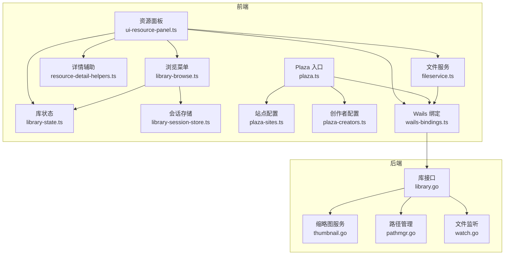
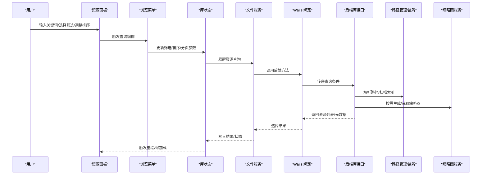
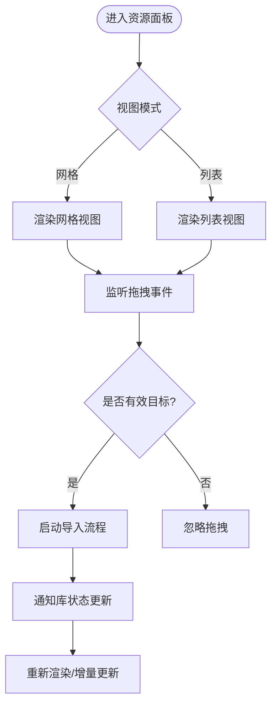
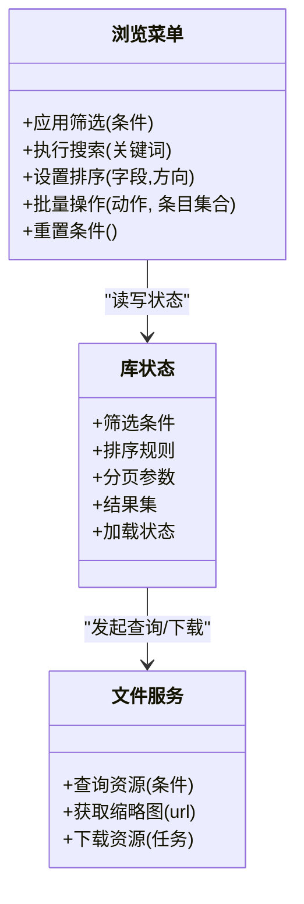
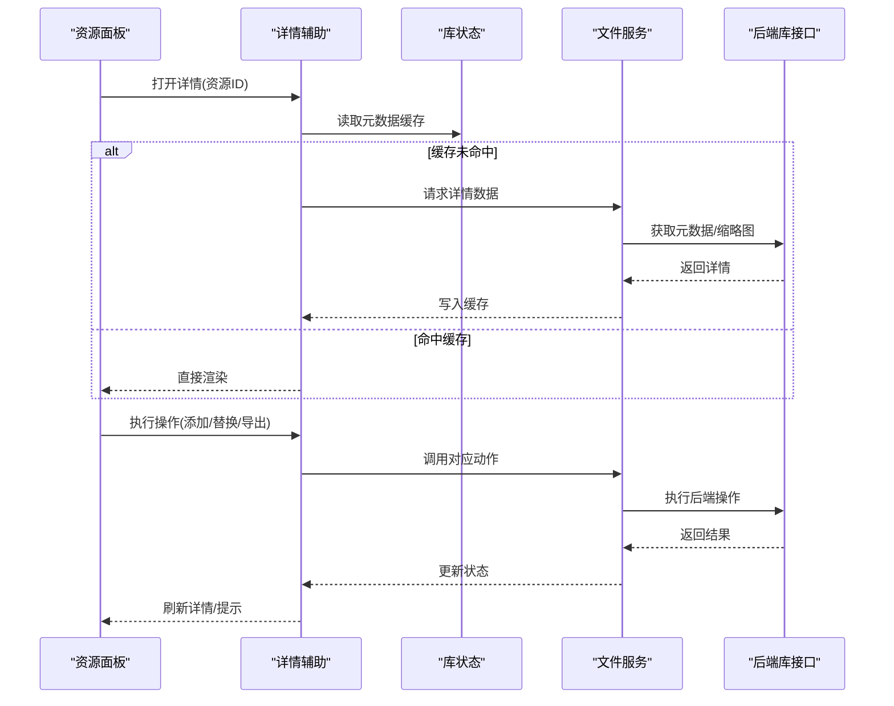
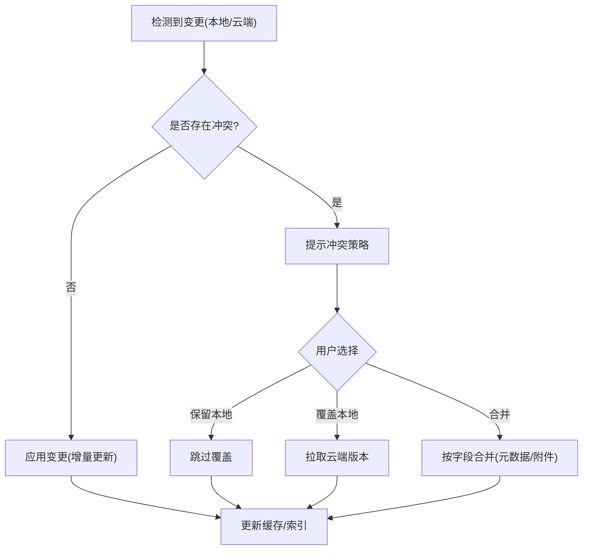
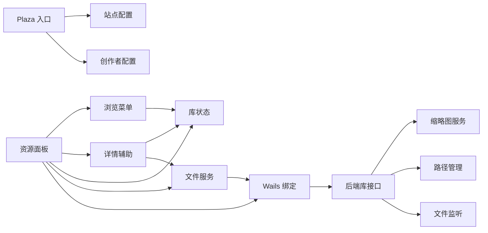

# 资源浏览器

<cite>
**本文引用的文件**   
- [frontend/src/core/ui-resource-panel.ts](file://frontend/src/core/ui-resource-panel.ts)
- [frontend/src/menus/library-browse.ts](file://frontend/src/menus/library-browse.ts)
- [frontend/src/menus/library-core.ts](file://frontend/src/menus/library-core.ts)
- [frontend/src/menus/resource-detail-helpers.ts](file://frontend/src/menus/resource-detail-helpers.ts)
- [internal/app/library.go](file://internal/app/library.go)
- [internal/app/thumbnail.go](file://internal/app/thumbnail.go)
- [internal/app/pathmgr.go](file://internal/app/pathmgr.go)
- [internal/app/watch.go](file://internal/app/watch.go)
- [frontend/src/core/library-state.ts](file://frontend/src/core/library-state.ts)
- [frontend/src/menus/library-session-store.ts](file://frontend/src/menus/library-session-store.ts)
- [frontend/src/menus/plaza.ts](file://frontend/src/menus/plaza.ts)
- [frontend/src/menus/plaza-sites.ts](file://frontend/src/menus/plaza-sites.ts)
- [frontend/src/menus/plaza-creators.ts](file://frontend/src/menus/plaza-creators.ts)
- [frontend/src/core/fileservice.ts](file://frontend/src/core/fileservice.ts)
- [frontend/src/core/wails-bindings.ts](file://frontend/src/core/wails-bindings.ts)
- [frontend/e2e/library-panel-dom.spec.ts](file://frontend/e2e/library-panel-dom.spec.ts)
</cite>

## 目录
1. [简介](#简介)
2. [项目结构](#项目结构)
3. [核心组件](#核心组件)
4. [架构总览](#架构总览)
5. [详细组件分析](#详细组件分析)
6. [依赖关系分析](#依赖关系分析)
7. [性能考虑](#性能考虑)
8. [故障排查指南](#故障排查指南)
9. [结论](#结论)
10. [附录](#附录)

## 简介
本文件面向“资源浏览器”模块，系统性阐述其架构设计与用户界面实现，覆盖资源的分类、搜索、过滤与排序（含多条件查询与智能推荐）、资源面板交互（拖拽、批量操作、上下文菜单）、资源详情页面（元数据展示、预览、操作按钮），以及资源库同步机制（本地缓存、云端同步、冲突解决）和扩展定制指南。文档以代码级事实为依据，辅以可视化图示，帮助读者快速理解并高效使用或二次开发该功能。

## 项目结构
资源浏览器由前端 UI 层、业务逻辑层与后端服务层共同组成：
- 前端 UI 层：负责资源面板渲染、交互事件处理、详情面板与菜单集成。
- 业务逻辑层：封装状态管理、会话持久化、Plaza 云端站点/创作者管理与下载拦截等。
- 后端服务层：提供资源索引、缩略图生成、路径管理、文件系统监听等能力。

**图表来源**
- [frontend/src/core/ui-resource-panel.ts](file://frontend/src/core/ui-resource-panel.ts)
- [frontend/src/menus/library-browse.ts](file://frontend/src/menus/library-browse.ts)
- [frontend/src/menus/resource-detail-helpers.ts](file://frontend/src/menus/resource-detail-helpers.ts)
- [frontend/src/core/library-state.ts](file://frontend/src/core/library-state.ts)
- [frontend/src/menus/library-session-store.ts](file://frontend/src/menus/library-session-store.ts)
- [frontend/src/menus/plaza.ts](file://frontend/src/menus/plaza.ts)
- [frontend/src/menus/plaza-sites.ts](file://frontend/src/menus/plaza-sites.ts)
- [frontend/src/menus/plaza-creators.ts](file://frontend/src/menus/plaza-creators.ts)
- [frontend/src/core/fileservice.ts](file://frontend/src/core/fileservice.ts)
- [frontend/src/core/wails-bindings.ts](file://frontend/src/core/wails-bindings.ts)
- [internal/app/library.go](file://internal/app/library.go)
- [internal/app/thumbnail.go](file://internal/app/thumbnail.go)
- [internal/app/pathmgr.go](file://internal/app/pathmgr.go)
- [internal/app/watch.go](file://internal/app/watch.go)

**章节来源**
- [frontend/src/core/ui-resource-panel.ts](file://frontend/src/core/ui-resource-panel.ts)
- [frontend/src/menus/library-browse.ts](file://frontend/src/menus/library-browse.ts)
- [frontend/src/menus/resource-detail-helpers.ts](file://frontend/src/menus/resource-detail-helpers.ts)
- [frontend/src/core/library-state.ts](file://frontend/src/core/library-state.ts)
- [frontend/src/menus/library-session-store.ts](file://frontend/src/menus/library-session-store.ts)
- [frontend/src/menus/plaza.ts](file://frontend/src/menus/plaza.ts)
- [frontend/src/menus/plaza-sites.ts](file://frontend/src/menus/plaza-sites.ts)
- [frontend/src/menus/plaza-creators.ts](file://frontend/src/menus/plaza-creators.ts)
- [frontend/src/core/fileservice.ts](file://frontend/src/core/fileservice.ts)
- [frontend/src/core/wails-bindings.ts](file://frontend/src/core/wails-bindings.ts)
- [internal/app/library.go](file://internal/app/library.go)
- [internal/app/thumbnail.go](file://internal/app/thumbnail.go)
- [internal/app/pathmgr.go](file://internal/app/pathmgr.go)
- [internal/app/watch.go](file://internal/app/watch.go)

## 核心组件
- 资源面板（UI 层）：承载网格/列表视图、分页与虚拟滚动、选中态、右键菜单、拖放目标区域等。
- 浏览菜单（交互编排）：组织筛选器、排序、搜索框、批量操作入口、导入/导出、刷新等。
- 详情辅助（详情面板）：聚合元数据、预览图、动作/材质/场景相关操作按钮。
- 库状态（状态中心）：维护当前库集合、分页、筛选条件、排序规则、加载状态与错误信息。
- 会话存储（持久化）：保存最近访问、收藏、筛选偏好、布局设置等。
- 文件服务（IO 抽象）：统一本地/云端文件访问、缩略图请求、下载任务管理。
- Wails 绑定（桥接）：将前端调用映射到 Go 后端方法。
- 后端库接口（Go）：扫描目录、构建索引、生成缩略图、读取元数据、响应查询。
- 路径管理（后端）：解析与规范化资源根路径、权限校验、平台差异适配。
- 文件监听（后端）：增量变更通知，驱动前端增量刷新。

**章节来源**
- [frontend/src/core/ui-resource-panel.ts](file://frontend/src/core/ui-resource-panel.ts)
- [frontend/src/menus/library-browse.ts](file://frontend/src/menus/library-browse.ts)
- [frontend/src/menus/resource-detail-helpers.ts](file://frontend/src/menus/resource-detail-helpers.ts)
- [frontend/src/core/library-state.ts](file://frontend/src/core/library-state.ts)
- [frontend/src/menus/library-session-store.ts](file://frontend/src/menus/library-session-store.ts)
- [frontend/src/core/fileservice.ts](file://frontend/src/core/fileservice.ts)
- [frontend/src/core/wails-bindings.ts](file://frontend/src/core/wails-bindings.ts)
- [internal/app/library.go](file://internal/app/library.go)
- [internal/app/thumbnail.go](file://internal/app/thumbnail.go)
- [internal/app/pathmgr.go](file://internal/app/pathmgr.go)
- [internal/app/watch.go](file://internal/app/watch.go)

## 架构总览
资源浏览器的整体流程如下：用户在面板中执行搜索/筛选/排序等操作，前端通过库状态与浏览菜单组合查询条件，经由文件服务与 Wails 绑定调用后端库接口；后端基于路径管理定位资源目录，必要时触发缩略图生成与文件监听增量更新，最终返回结果集供前端渲染。云端资源通过 Plaza 模块接入，遵循统一的下载与缓存策略。

**图表来源**
- [frontend/src/core/ui-resource-panel.ts](file://frontend/src/core/ui-resource-panel.ts)
- [frontend/src/menus/library-browse.ts](file://frontend/src/menus/library-browse.ts)
- [frontend/src/core/library-state.ts](file://frontend/src/core/library-state.ts)
- [frontend/src/core/fileservice.ts](file://frontend/src/core/fileservice.ts)
- [frontend/src/core/wails-bindings.ts](file://frontend/src/core/wails-bindings.ts)
- [internal/app/library.go](file://internal/app/library.go)
- [internal/app/thumbnail.go](file://internal/app/thumbnail.go)
- [internal/app/pathmgr.go](file://internal/app/pathmgr.go)
- [internal/app/watch.go](file://internal/app/watch.go)

## 详细组件分析

### 资源面板（UI 层）
- 职责：渲染资源网格/列表、处理选中与多选、上下文菜单、拖拽放置区、分页与虚拟滚动。
- 关键交互：
  - 拖拽：支持从外部文件或文件夹拖入资源面板，触发导入流程；支持在面板内拖拽进行批量移动（若启用）。
  - 批量操作：勾选多个条目后，显示批量删除/移动到/复制等菜单项。
  - 上下文菜单：右键点击资源项，打开包含“打开详情”“预览”“复制到剪贴板”“在资源管理器中显示”等选项。
- 渲染优化：采用虚拟网格/列表以减少 DOM 节点数量，结合懒加载缩略图提升首屏性能。

**图表来源**
- [frontend/src/core/ui-resource-panel.ts](file://frontend/src/core/ui-resource-panel.ts)
- [frontend/src/core/fileservice.ts](file://frontend/src/core/fileservice.ts)
- [frontend/src/core/wails-bindings.ts](file://frontend/src/core/wails-bindings.ts)

**章节来源**
- [frontend/src/core/ui-resource-panel.ts](file://frontend/src/core/ui-resource-panel.ts)
- [frontend/e2e/library-panel-dom.spec.ts](file://frontend/e2e/library-panel-dom.spec.ts)

### 浏览菜单（筛选/搜索/排序/批量）
- 筛选维度：类型（模型/动作/材质/场景等）、标签/标签组、来源（本地/云端）、时间范围、大小范围等。
- 搜索：支持关键词模糊匹配，命中标题、描述、标签等字段。
- 排序：按名称、时间、大小、评分/热度等；支持升序/降序切换。
- 多条件查询：将各条件合并为结构化查询对象，交由后端进行索引检索。
- 智能推荐：根据最近访问、收藏、相似标签与热门趋势给出推荐条目（云端/本地混合）。
- 批量操作：全选/反选、批量删除、批量移动到指定目录、批量导出清单。

**图表来源**
- [frontend/src/menus/library-browse.ts](file://frontend/src/menus/library-browse.ts)
- [frontend/src/core/library-state.ts](file://frontend/src/core/library-state.ts)
- [frontend/src/core/fileservice.ts](file://frontend/src/core/fileservice.ts)

**章节来源**
- [frontend/src/menus/library-browse.ts](file://frontend/src/menus/library-browse.ts)
- [frontend/src/core/library-state.ts](file://frontend/src/core/library-state.ts)

### 资源详情页面（元数据/预览/操作）
- 元数据展示：名称、版本、作者、许可证、尺寸、帧数、骨骼数、材质数、文件大小、创建/修改时间等。
- 预览：缩略图/动图预览、3D 预览（若可用）、音频波形（动作类）。
- 操作按钮：添加到场景、替换资源、导出、复制链接、查看来源、打开所在目录等。
- 关联推荐：同作者、同标签、相似资源推荐。

**图表来源**
- [frontend/src/menus/resource-detail-helpers.ts](file://frontend/src/menus/resource-detail-helpers.ts)
- [frontend/src/core/library-state.ts](file://frontend/src/core/library-state.ts)
- [frontend/src/core/fileservice.ts](file://frontend/src/core/fileservice.ts)
- [internal/app/library.go](file://internal/app/library.go)

**章节来源**
- [frontend/src/menus/resource-detail-helpers.ts](file://frontend/src/menus/resource-detail-helpers.ts)
- [frontend/src/core/library-state.ts](file://frontend/src/core/library-state.ts)

### 资源库同步机制（本地缓存/云端同步/冲突解决）
- 本地缓存：缩略图与常用元数据落盘，减少重复 IO；会话偏好（筛选、排序、布局）持久化。
- 云端同步：通过 Plaza 模块连接站点与创作者配置，支持拉取/推送资源清单与缩略图。
- 冲突解决：当本地与云端存在同名/同版本资源时，提供“保留本地/覆盖/合并”策略；对不可变资源（如只读清单）优先云端权威。
- 增量更新：后端文件监听变更事件，前端订阅后仅刷新受影响条目。

**图表来源**
- [frontend/src/menus/library-session-store.ts](file://frontend/src/menus/library-session-store.ts)
- [frontend/src/menus/plaza.ts](file://frontend/src/menus/plaza.ts)
- [frontend/src/menus/plaza-sites.ts](file://frontend/src/menus/plaza-sites.ts)
- [frontend/src/menus/plaza-creators.ts](file://frontend/src/menus/plaza-creators.ts)
- [internal/app/watch.go](file://internal/app/watch.go)
- [internal/app/library.go](file://internal/app/library.go)

**章节来源**
- [frontend/src/menus/library-session-store.ts](file://frontend/src/menus/library-session-store.ts)
- [frontend/src/menus/plaza.ts](file://frontend/src/menus/plaza.ts)
- [frontend/src/menus/plaza-sites.ts](file://frontend/src/menus/plaza-sites.ts)
- [frontend/src/menus/plaza-creators.ts](file://frontend/src/menus/plaza-creators.ts)
- [internal/app/watch.go](file://internal/app/watch.go)
- [internal/app/library.go](file://internal/app/library.go)

### 自定义与扩展指南
- 新增筛选维度：在浏览菜单中注册新的筛选器，并在库状态中增加对应字段；后端库接口需支持新条件的索引查询。
- 扩展详情面板：在详情辅助中注入新的元数据字段与操作按钮，确保文件服务能正确获取/执行。
- 自定义缩略图策略：在后端缩略图服务中扩展格式支持与生成算法，前端按需调整预览尺寸与占位符。
- 接入新云端站点：在站点配置中添加新站点定义，在创作者配置中补充创作者映射；Plaza 入口统一调度下载与缓存。
- 插件式菜单：通过菜单工厂注册新的上下文菜单项，绑定到具体资源类型与操作。

**章节来源**
- [frontend/src/menus/library-browse.ts](file://frontend/src/menus/library-browse.ts)
- [frontend/src/menus/resource-detail-helpers.ts](file://frontend/src/menus/resource-detail-helpers.ts)
- [frontend/src/menus/plaza-sites.ts](file://frontend/src/menus/plaza-sites.ts)
- [frontend/src/menus/plaza-creators.ts](file://frontend/src/menus/plaza-creators.ts)
- [internal/app/thumbnail.go](file://internal/app/thumbnail.go)
- [internal/app/library.go](file://internal/app/library.go)

## 依赖关系分析
- 前端内部依赖：
  - 资源面板依赖浏览菜单与库状态，间接依赖文件服务与 Wails 绑定。
  - 详情辅助依赖库状态与文件服务，用于加载元数据与执行操作。
  - Plaza 模块依赖站点与创作者配置，统一对外暴露云端能力。
- 前后端耦合点：
  - Wails 绑定作为唯一桥接面，屏蔽平台差异与异步回调细节。
  - 后端库接口集中处理索引、元数据与缩略图，保证一致性。
- 潜在循环依赖：
  - 避免详情辅助反向依赖资源面板，应通过状态与事件解耦。
  - 文件服务不应直接依赖具体 UI 组件，保持纯函数式 IO 抽象。

**图表来源**
- [frontend/src/core/ui-resource-panel.ts](file://frontend/src/core/ui-resource-panel.ts)
- [frontend/src/menus/library-browse.ts](file://frontend/src/menus/library-browse.ts)
- [frontend/src/menus/resource-detail-helpers.ts](file://frontend/src/menus/resource-detail-helpers.ts)
- [frontend/src/core/library-state.ts](file://frontend/src/core/library-state.ts)
- [frontend/src/core/fileservice.ts](file://frontend/src/core/fileservice.ts)
- [frontend/src/core/wails-bindings.ts](file://frontend/src/core/wails-bindings.ts)
- [frontend/src/menus/plaza.ts](file://frontend/src/menus/plaza.ts)
- [frontend/src/menus/plaza-sites.ts](file://frontend/src/menus/plaza-sites.ts)
- [frontend/src/menus/plaza-creators.ts](file://frontend/src/menus/plaza-creators.ts)
- [internal/app/library.go](file://internal/app/library.go)
- [internal/app/thumbnail.go](file://internal/app/thumbnail.go)
- [internal/app/pathmgr.go](file://internal/app/pathmgr.go)
- [internal/app/watch.go](file://internal/app/watch.go)

**章节来源**
- [frontend/src/core/ui-resource-panel.ts](file://frontend/src/core/ui-resource-panel.ts)
- [frontend/src/menus/library-browse.ts](file://frontend/src/menus/library-browse.ts)
- [frontend/src/menus/resource-detail-helpers.ts](file://frontend/src/menus/resource-detail-helpers.ts)
- [frontend/src/core/library-state.ts](file://frontend/src/core/library-state.ts)
- [frontend/src/core/fileservice.ts](file://frontend/src/core/fileservice.ts)
- [frontend/src/core/wails-bindings.ts](file://frontend/src/core/wails-bindings.ts)
- [frontend/src/menus/plaza.ts](file://frontend/src/menus/plaza.ts)
- [frontend/src/menus/plaza-sites.ts](file://frontend/src/menus/plaza-sites.ts)
- [frontend/src/menus/plaza-creators.ts](file://frontend/src/menus/plaza-creators.ts)
- [internal/app/library.go](file://internal/app/library.go)
- [internal/app/thumbnail.go](file://internal/app/thumbnail.go)
- [internal/app/pathmgr.go](file://internal/app/pathmgr.go)
- [internal/app/watch.go](file://internal/app/watch.go)

## 性能考虑
- 虚拟滚动与分页：大列表下避免一次性渲染所有节点，按需加载可视区域内容。
- 缩略图懒加载：仅在可见区域内请求缩略图，失败时回退占位图，降低带宽与 CPU 压力。
- 增量更新：利用文件监听事件，仅刷新受影响的条目，避免全量重建。
- 缓存策略：对高频访问的元数据与缩略图进行磁盘缓存，合理设置过期与清理策略。
- 并发控制：限制并行下载与缩略图生成任务数，防止阻塞主线程与磁盘 IO。

[本节为通用性能建议，不直接分析具体文件]

## 故障排查指南
- 资源无法加载：
  - 检查路径管理是否正确解析根目录与权限。
  - 确认后端库接口返回的索引是否完整。
- 缩略图缺失或加载缓慢：
  - 验证缩略图服务是否成功生成与缓存。
  - 检查网络与跨域策略（云端缩略图）。
- 云端不同步：
  - 核对站点与创作者配置是否正确。
  - 观察冲突解决策略是否符合预期。
- 文件监听失效：
  - 确认后端监听器是否运行与权限足够。
  - 检查增量更新事件是否被前端正确订阅与处理。

**章节来源**
- [internal/app/pathmgr.go](file://internal/app/pathmgr.go)
- [internal/app/library.go](file://internal/app/library.go)
- [internal/app/thumbnail.go](file://internal/app/thumbnail.go)
- [frontend/src/menus/plaza-sites.ts](file://frontend/src/menus/plaza-sites.ts)
- [frontend/src/menus/plaza-creators.ts](file://frontend/src/menus/plaza-creators.ts)
- [internal/app/watch.go](file://internal/app/watch.go)

## 结论
资源浏览器通过清晰的前后端分层与模块化设计，实现了高效的本地与云端资源管理能力。其交互体验（筛选、搜索、排序、拖拽、批量操作、详情面板）与同步机制（缓存、增量更新、冲突解决）共同保障了良好的可用性。未来可在智能推荐、更丰富的筛选维度与更细粒度的权限控制方面持续演进。

[本节为总结性内容，不直接分析具体文件]

## 附录
- 术语表：
  - 资源：模型、动作、材质、场景等可复用内容的统称。
  - 缩略图：资源的小尺寸预览图，用于快速识别。
  - 增量更新：基于变更事件的局部刷新机制。
  - 冲突解决：本地与云端资源不一致时的处理策略。

[本节为概念说明，不直接分析具体文件]