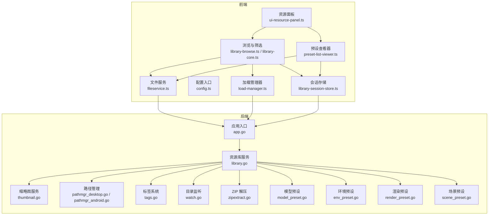
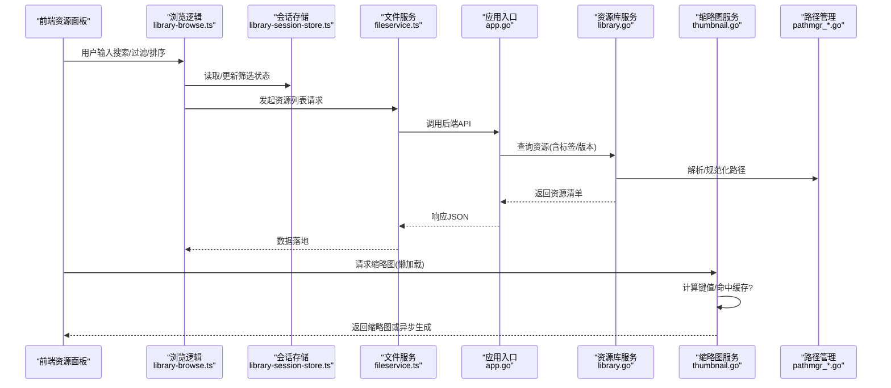
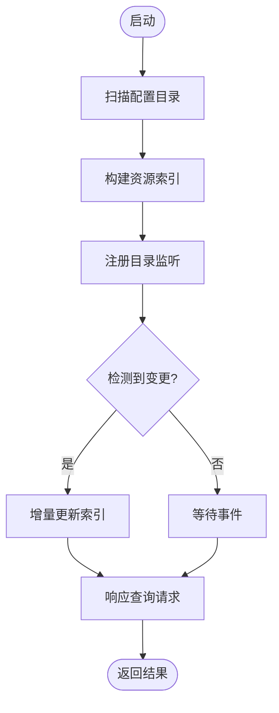
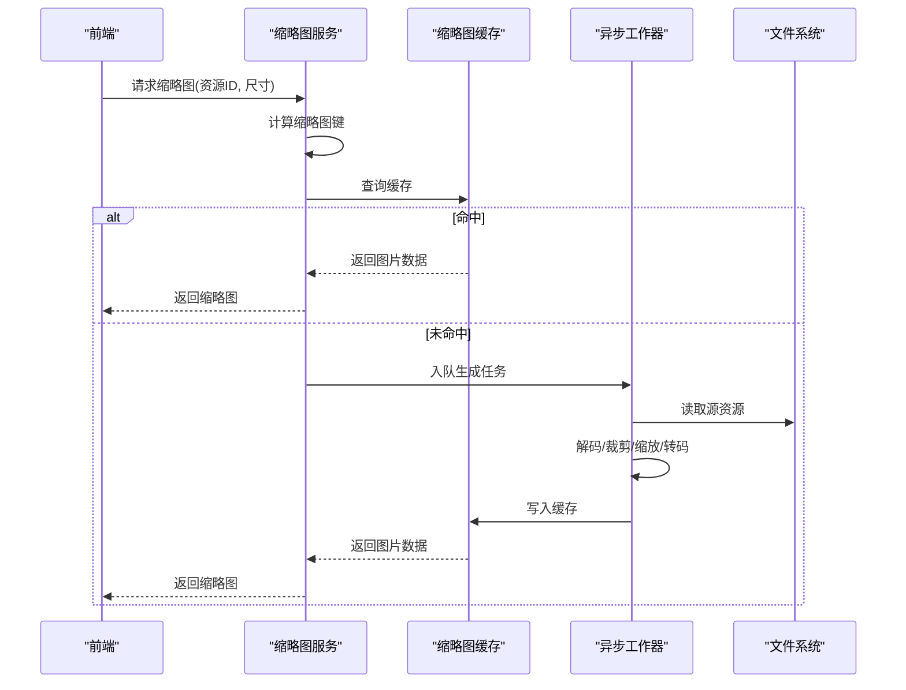
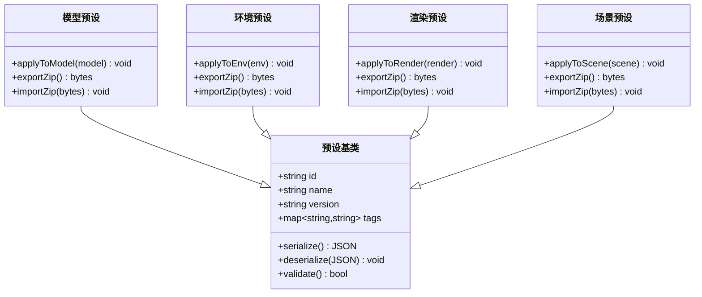
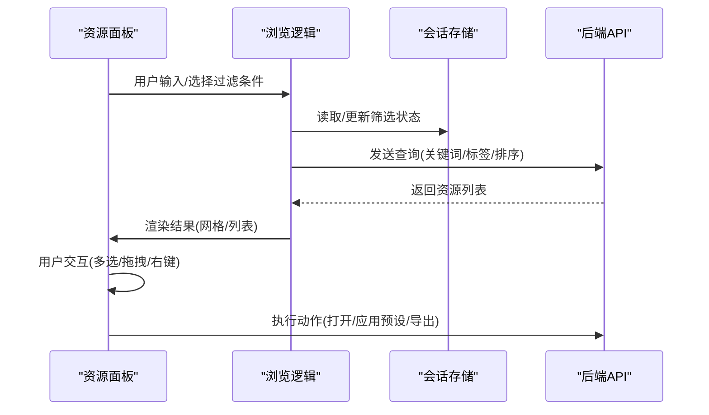
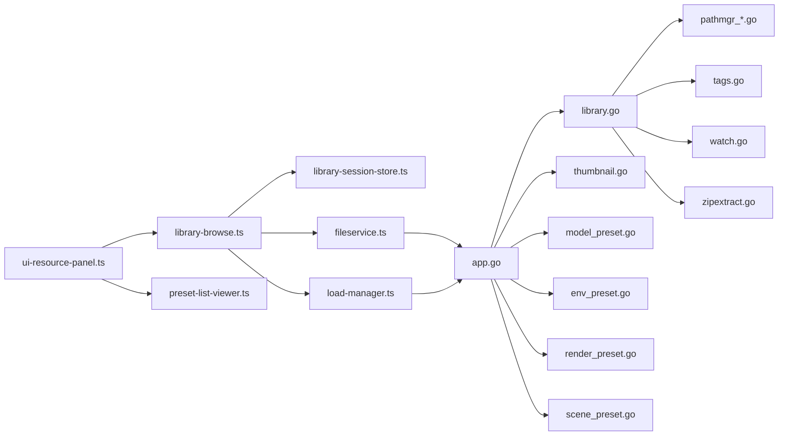

# 资源管理

<cite>
**本文引用的文件**   
- [main.go](file://main.go)
- [app.go](file://internal/app/app.go)
- [library.go](file://internal/app/library.go)
- [thumbnail.go](file://internal/app/thumbnail.go)
- [model_preset.go](file://internal/app/model_preset.go)
- [env_preset.go](file://internal/app/env_preset.go)
- [render_preset.go](file://internal/app/render_preset.go)
- [scene_preset.go](file://internal/app/scene_preset.go)
- [pathmgr_desktop.go](file://internal/app/pathmgr_desktop.go)
- [pathmgr_android.go](file://internal/app/pathmgr_android.go)
- [tags.go](file://internal/app/tags.go)
- [watch.go](file://internal/app/watch.go)
- [zipextract.go](file://internal/app/zipextract.go)
- [ui-resource-panel.ts](file://frontend/src/core/ui-resource-panel.ts)
- [preset-list-viewer.ts](file://frontend/src/menus/preset-list-viewer.ts)
- [library-core.ts](file://frontend/src/menus/library-core.ts)
- [library-browse.ts](file://frontend/src/menus/library-browse.ts)
- [library-session-store.ts](file://frontend/src/menus/library-session-store.ts)
- [library-setup.ts](file://frontend/src/menus/library-setup.ts)
- [library-actions.ts](file://frontend/src/menus/library-actions.ts)
- [model-preset.ts](file://frontend/src/menus/model-preset.ts)
- [resource-detail-helpers.ts](file://frontend/src/menus/resource-detail-helpers.ts)
- [config.ts](file://frontend/src/config.ts)
- [fileservice.ts](file://frontend/src/core/fileservice.ts)
- [load-manager.ts](file://frontend/src/core/load-manager.ts)
- [thumbnail-key.contract.test.ts](file://frontend/src/__tests__/thumbnail-key.contract.test.ts)
- [library-thumbnail-streaming.test.ts](file://frontend/src/__tests__/library-thumbnail-streaming.test.ts)
- [library-session-store.test.ts](file://frontend/src/__tests__/library-session-store.test.ts)
- [ADR-131 资源浏览选择结果.md](file://docs/adr/adr-131-resource-browse-selection-outcome.md)
- [缩略图系统审计.md](file://docs/audit/thumbnail-system.md)
</cite>

## 目录
1. [简介](#简介)
2. [项目结构](#项目结构)
3. [核心组件](#核心组件)
4. [架构总览](#架构总览)
5. [详细组件分析](#详细组件分析)
6. [依赖关系分析](#依赖关系分析)
7. [性能考量](#性能考量)
8. [故障排查指南](#故障排查指南)
9. [结论](#结论)
10. [附录：资源格式规范与扩展指南](#附录资源格式规范与扩展指南)

## 简介
本文件面向“资源管理系统”的架构与实现，覆盖模型库、材质库、预设系统的整体设计；资源的加载、缓存、版本管理与生命周期策略；缩略图生成（异步处理、缓存、格式转换）；资源浏览器（搜索、过滤、排序、交互）；以及预设系统的设计模式（创建、编辑、导入导出、共享）。文末提供资源格式规范与扩展指南，帮助开发者新增资源类型。

## 项目结构
资源管理由前端与后端共同协作：
- 前端负责 UI 交互、列表展示、搜索过滤、排序、预览与预设操作编排。
- 后端负责文件系统访问、扫描索引、缩略图生成、预设读写、路径管理与平台差异适配。

图表来源
- [app.go:1-200](file://internal/app/app.go#L1-L200)
- [library.go:1-200](file://internal/app/library.go#L1-L200)
- [thumbnail.go:1-200](file://internal/app/thumbnail.go#L1-L200)
- [pathmgr_desktop.go:1-200](file://internal/app/pathmgr_desktop.go#L1-L200)
- [pathmgr_android.go:1-200](file://internal/app/pathmgr_android.go#L1-L200)
- [tags.go:1-200](file://internal/app/tags.go#L1-L200)
- [watch.go:1-200](file://internal/app/watch.go#L1-L200)
- [zipextract.go:1-200](file://internal/app/zipextract.go#L1-L200)
- [model_preset.go:1-200](file://internal/app/model_preset.go#L1-L200)
- [env_preset.go:1-200](file://internal/app/env_preset.go#L1-L200)
- [render_preset.go:1-200](file://internal/app/render_preset.go#L1-L200)
- [scene_preset.go:1-200](file://internal/app/scene_preset.go#L1-L200)
- [ui-resource-panel.ts:1-200](file://frontend/src/core/ui-resource-panel.ts#L1-L200)
- [library-browse.ts:1-200](file://frontend/src/menus/library-browse.ts#L1-L200)
- [library-core.ts:1-200](file://frontend/src/menus/library-core.ts#L1-L200)
- [preset-list-viewer.ts:1-200](file://frontend/src/menus/preset-list-viewer.ts#L1-L200)
- [library-session-store.ts:1-200](file://frontend/src/menus/library-session-store.ts#L1-L200)
- [config.ts:1-200](file://frontend/src/config.ts#L1-L200)
- [fileservice.ts:1-200](file://frontend/src/core/fileservice.ts#L1-L200)
- [load-manager.ts:1-200](file://frontend/src/core/load-manager.ts#L1-L200)

章节来源
- [main.go:1-200](file://main.go#L1-L200)
- [app.go:1-200](file://internal/app/app.go#L1-L200)
- [ui-resource-panel.ts:1-200](file://frontend/src/core/ui-resource-panel.ts#L1-L200)

## 核心组件
- 资源库服务：统一扫描、索引、元数据聚合、标签与版本信息维护，为前端提供查询接口。
- 缩略图服务：异步生成、缓存、格式转换与按需更新。
- 预设系统：模型、环境、渲染、场景四类预设的创建、编辑、导入导出与共享。
- 路径管理：跨平台路径解析、规范化与权限适配。
- 目录监听：增量变更感知，驱动索引与缩略图刷新。
- 前端资源面板：列表、网格、详情、搜索、过滤、排序、拖拽与动作执行。
- 会话存储：浏览状态、最近项、筛选条件等持久化。

章节来源
- [library.go:1-200](file://internal/app/library.go#L1-L200)
- [thumbnail.go:1-200](file://internal/app/thumbnail.go#L1-L200)
- [model_preset.go:1-200](file://internal/app/model_preset.go#L1-L200)
- [env_preset.go:1-200](file://internal/app/env_preset.go#L1-L200)
- [render_preset.go:1-200](file://internal/app/render_preset.go#L1-L200)
- [scene_preset.go:1-200](file://internal/app/scene_preset.go#L1-L200)
- [pathmgr_desktop.go:1-200](file://internal/app/pathmgr_desktop.go#L1-L200)
- [pathmgr_android.go:1-200](file://internal/app/pathmgr_android.go#L1-L200)
- [tags.go:1-200](file://internal/app/tags.go#L1-L200)
- [watch.go:1-200](file://internal/app/watch.go#L1-L200)
- [ui-resource-panel.ts:1-200](file://frontend/src/core/ui-resource-panel.ts#L1-L200)
- [library-session-store.ts:1-200](file://frontend/src/menus/library-session-store.ts#L1-L200)

## 架构总览
资源管理采用前后端分离、分层清晰的架构：
- 前端通过绑定调用后端能力，完成资源浏览、搜索、过滤、排序、缩略图请求、预设操作。
- 后端集中管理文件系统、索引、缩略图与预设，提供稳定 API。
- 目录监听与任务队列保障增量更新与并发安全。

图表来源
- [ui-resource-panel.ts:1-200](file://frontend/src/core/ui-resource-panel.ts#L1-L200)
- [library-browse.ts:1-200](file://frontend/src/menus/library-browse.ts#L1-L200)
- [library-session-store.ts:1-200](file://frontend/src/menus/library-session-store.ts#L1-L200)
- [fileservice.ts:1-200](file://frontend/src/core/fileservice.ts#L1-L200)
- [app.go:1-200](file://internal/app/app.go#L1-L200)
- [library.go:1-200](file://internal/app/library.go#L1-L200)
- [thumbnail.go:1-200](file://internal/app/thumbnail.go#L1-L200)
- [pathmgr_desktop.go:1-200](file://internal/app/pathmgr_desktop.go#L1-L200)
- [pathmgr_android.go:1-200](file://internal/app/pathmgr_android.go#L1-L200)

## 详细组件分析

### 资源库服务（模型库、材质库）
- 职责：扫描指定目录，识别模型与材质资源，构建索引，维护元数据（名称、路径、标签、版本、时间戳等），提供查询与变更通知。
- 关键流程：
  - 初始化时根据配置的路径集合进行全量扫描。
  - 监听目录变化，增量更新索引。
  - 对外暴露按关键字、标签、类型、时间等维度的查询接口。
- 与路径管理的耦合：所有路径均经路径管理器规范化，确保跨平台一致性与安全性。

图表来源
- [library.go:1-200](file://internal/app/library.go#L1-L200)
- [watch.go:1-200](file://internal/app/watch.go#L1-L200)
- [pathmgr_desktop.go:1-200](file://internal/app/pathmgr_desktop.go#L1-L200)
- [pathmgr_android.go:1-200](file://internal/app/pathmgr_android.go#L1-L200)

章节来源
- [library.go:1-200](file://internal/app/library.go#L1-L200)
- [watch.go:1-200](file://internal/app/watch.go#L1-L200)
- [pathmgr_desktop.go:1-200](file://internal/app/pathmgr_desktop.go#L1-L200)
- [pathmgr_android.go:1-200](file://internal/app/pathmgr_android.go#L1-L200)

### 缩略图生成系统
- 目标：为模型/材质等资源生成缩略图，支持异步、缓存与格式转换。
- 关键点：
  - 缩略图键：基于资源路径、尺寸、质量等参数计算唯一键，避免重复生成。
  - 缓存策略：本地磁盘缓存，命中则直接返回；未命中则进入异步队列。
  - 异步处理：后台任务生成，完成后写入缓存并通知前端。
  - 格式转换：将源图转换为前端友好的格式（如 WebP/AVIF），兼顾体积与兼容性。
  - 失效与重建：当资源内容或配置变化时，自动失效对应缓存并重建。

图表来源
- [thumbnail.go:1-200](file://internal/app/thumbnail.go#L1-L200)
- [thumbnail-key.contract.test.ts:1-200](file://frontend/src/__tests__/thumbnail-key.contract.test.ts#L1-L200)
- [library-thumbnail-streaming.test.ts:1-200](file://frontend/src/__tests__/library-thumbnail-streaming.test.ts#L1-L200)

章节来源
- [thumbnail.go:1-200](file://internal/app/thumbnail.go#L1-L200)
- [thumbnail-key.contract.test.ts:1-200](file://frontend/src/__tests__/thumbnail-key.contract.test.ts#L1-L200)
- [library-thumbnail-streaming.test.ts:1-200](file://frontend/src/__tests__/library-thumbnail-streaming.test.ts#L1-L200)
- [缩略图系统审计.md:1-200](file://docs/audit/thumbnail-system.md#L1-L200)

### 预设系统（模型、环境、渲染、场景）
- 分类：
  - 模型预设：保存模型的显示/动画/物理相关配置快照。
  - 环境预设：保存光照、天空、地面、水体等环境参数。
  - 渲染预设：保存渲染管线、后处理、画质开关等。
  - 场景预设：保存场景内对象布局、相机位置、全局状态等。
- 设计模式：
  - 工厂/注册表：不同预设类型通过统一接口注册，便于扩展。
  - 序列化/反序列化：JSON 描述预设，支持校验与迁移。
  - 导入/导出：从 ZIP 包导入/导出预设，支持共享与版本兼容。
  - 共享机制：预设可标记作者、标签、版本，便于检索与复用。

图表来源
- [model_preset.go:1-200](file://internal/app/model_preset.go#L1-L200)
- [env_preset.go:1-200](file://internal/app/env_preset.go#L1-L200)
- [render_preset.go:1-200](file://internal/app/render_preset.go#L1-L200)
- [scene_preset.go:1-200](file://internal/app/scene_preset.go#L1-L200)
- [zipextract.go:1-200](file://internal/app/zipextract.go#L1-L200)

章节来源
- [model_preset.go:1-200](file://internal/app/model_preset.go#L1-L200)
- [env_preset.go:1-200](file://internal/app/env_preset.go#L1-L200)
- [render_preset.go:1-200](file://internal/app/render_preset.go#L1-L200)
- [scene_preset.go:1-200](file://internal/app/scene_preset.go#L1-L200)
- [zipextract.go:1-200](file://internal/app/zipextract.go#L1-L200)

### 资源浏览器（搜索、过滤、排序、交互）
- 功能：
  - 搜索：关键字匹配名称、标签、路径片段。
  - 过滤：按类型、标签、时间范围、大小等维度组合过滤。
  - 排序：按名称、时间、大小、评分等排序。
  - 交互：网格/列表切换、多选、拖拽、右键菜单、快捷键。
- 状态管理：
  - 使用会话存储持久化当前视图状态，恢复上次浏览上下文。
  - 与后端索引联动，保证搜索结果一致性。

图表来源
- [ui-resource-panel.ts:1-200](file://frontend/src/core/ui-resource-panel.ts#L1-L200)
- [library-browse.ts:1-200](file://frontend/src/menus/library-browse.ts#L1-L200)
- [library-core.ts:1-200](file://frontend/src/menus/library-core.ts#L1-L200)
- [library-session-store.ts:1-200](file://frontend/src/menus/library-session-store.ts#L1-L200)
- [ADR-131 资源浏览选择结果.md:1-200](file://docs/adr/adr-131-resource-browse-selection-outcome.md#L1-L200)

章节来源
- [ui-resource-panel.ts:1-200](file://frontend/src/core/ui-resource-panel.ts#L1-L200)
- [library-browse.ts:1-200](file://frontend/src/menus/library-browse.ts#L1-L200)
- [library-core.ts:1-200](file://frontend/src/menus/library-core.ts#L1-L200)
- [library-session-store.ts:1-200](file://frontend/src/menus/library-session-store.ts#L1-L200)
- [library-session-store.test.ts:1-200](file://frontend/src/__tests__/library-session-store.test.ts#L1-L200)
- [ADR-131 资源浏览选择结果.md:1-200](file://docs/adr/adr-131-resource-browse-selection-outcome.md#L1-L200)

### 资源加载、缓存、版本与生命周期
- 加载：
  - 前端通过加载管理器协调资源加载顺序与取消信号，避免竞态。
  - 文件服务封装底层 I/O，统一错误与重试策略。
- 缓存：
  - 缩略图缓存已在前述章节说明。
  - 资源元数据在内存中维护，结合磁盘持久化，减少重复扫描。
- 版本管理：
  - 预设包含版本号与变更日志字段，支持向前/向后兼容校验。
  - 资源文件可通过哈希或时间戳判断是否变更，触发增量更新。
- 生命周期：
  - 资源对象遵循创建→就绪→使用→释放的流程。
  - 监听销毁事件，及时释放纹理、几何体、句柄等占用。

章节来源
- [load-manager.ts:1-200](file://frontend/src/core/load-manager.ts#L1-L200)
- [fileservice.ts:1-200](file://frontend/src/core/fileservice.ts#L1-L200)
- [config.ts:1-200](file://frontend/src/config.ts#L1-L200)
- [model_preset.go:1-200](file://internal/app/model_preset.go#L1-L200)
- [env_preset.go:1-200](file://internal/app/env_preset.go#L1-L200)
- [render_preset.go:1-200](file://internal/app/render_preset.go#L1-L200)
- [scene_preset.go:1-200](file://internal/app/scene_preset.go#L1-L200)

## 依赖关系分析
- 前端模块间依赖：
  - ui-resource-panel.ts 依赖 library-browse.ts、preset-list-viewer.ts、library-session-store.ts。
  - library-browse.ts 依赖 fileservice.ts、load-manager.ts、library-session-store.ts。
- 前后端边界：
  - 前端通过 app.go 暴露的绑定调用后端 library.go、thumbnail.go、预设服务等。
  - 路径管理 watch.go 与 zipextract.go 作为基础设施被上层服务复用。

图表来源
- [ui-resource-panel.ts:1-200](file://frontend/src/core/ui-resource-panel.ts#L1-L200)
- [library-browse.ts:1-200](file://frontend/src/menus/library-browse.ts#L1-L200)
- [preset-list-viewer.ts:1-200](file://frontend/src/menus/preset-list-viewer.ts#L1-L200)
- [library-session-store.ts:1-200](file://frontend/src/menus/library-session-store.ts#L1-L200)
- [fileservice.ts:1-200](file://frontend/src/core/fileservice.ts#L1-L200)
- [load-manager.ts:1-200](file://frontend/src/core/load-manager.ts#L1-L200)
- [app.go:1-200](file://internal/app/app.go#L1-L200)
- [library.go:1-200](file://internal/app/library.go#L1-L200)
- [thumbnail.go:1-200](file://internal/app/thumbnail.go#L1-L200)
- [model_preset.go:1-200](file://internal/app/model_preset.go#L1-L200)
- [env_preset.go:1-200](file://internal/app/env_preset.go#L1-L200)
- [render_preset.go:1-200](file://internal/app/render_preset.go#L1-L200)
- [scene_preset.go:1-200](file://internal/app/scene_preset.go#L1-L200)
- [pathmgr_desktop.go:1-200](file://internal/app/pathmgr_desktop.go#L1-L200)
- [pathmgr_android.go:1-200](file://internal/app/pathmgr_android.go#L1-L200)
- [tags.go:1-200](file://internal/app/tags.go#L1-L200)
- [watch.go:1-200](file://internal/app/watch.go#L1-L200)
- [zipextract.go:1-200](file://internal/app/zipextract.go#L1-L200)

章节来源
- [app.go:1-200](file://internal/app/app.go#L1-L200)
- [library.go:1-200](file://internal/app/library.go#L1-L200)
- [thumbnail.go:1-200](file://internal/app/thumbnail.go#L1-L200)
- [model_preset.go:1-200](file://internal/app/model_preset.go#L1-L200)
- [env_preset.go:1-200](file://internal/app/env_preset.go#L1-L200)
- [render_preset.go:1-200](file://internal/app/render_preset.go#L1-L200)
- [scene_preset.go:1-200](file://internal/app/scene_preset.go#L1-L200)
- [pathmgr_desktop.go:1-200](file://internal/app/pathmgr_desktop.go#L1-L200)
- [pathmgr_android.go:1-200](file://internal/app/pathmgr_android.go#L1-L200)
- [tags.go:1-200](file://internal/app/tags.go#L1-L200)
- [watch.go:1-200](file://internal/app/watch.go#L1-L200)
- [zipextract.go:1-200](file://internal/app/zipextract.go#L1-L200)
- [ui-resource-panel.ts:1-200](file://frontend/src/core/ui-resource-panel.ts#L1-L200)
- [library-browse.ts:1-200](file://frontend/src/menus/library-browse.ts#L1-L200)
- [preset-list-viewer.ts:1-200](file://frontend/src/menus/preset-list-viewer.ts#L1-L200)
- [library-session-store.ts:1-200](file://frontend/src/menus/library-session-store.ts#L1-L200)
- [fileservice.ts:1-200](file://frontend/src/core/fileservice.ts#L1-L200)
- [load-manager.ts:1-200](file://frontend/src/core/load-manager.ts#L1-L200)

## 性能考量
- 缩略图：
  - 优先命中缓存，避免重复解码与转码。
  - 异步队列限制并发度，防止 IO 风暴。
  - 按需生成与惰性加载，降低首屏压力。
- 资源索引：
  - 增量更新，仅处理变更文件。
  - 批量写入与合并索引，减少磁盘抖动。
- 前端渲染：
  - 虚拟滚动与分页加载，控制 DOM 节点数量。
  - 去抖与节流搜索输入，减少频繁查询。
- 网络与 I/O：
  - 合理设置超时与重试，提升稳定性。
  - 压缩传输（如 ZIP 打包预设），降低带宽占用。

[本节为通用指导，不直接分析具体文件]

## 故障排查指南
- 缩略图未显示：
  - 检查缩略图键是否与资源路径/尺寸一致。
  - 确认缓存目录存在且可写。
  - 查看异步任务是否阻塞或失败。
- 资源列表不更新：
  - 验证目录监听是否生效。
  - 检查增量更新逻辑是否被跳过。
- 预设导入失败：
  - 校验 ZIP 结构与 JSON Schema。
  - 确认版本兼容性与必填字段。
- 路径问题：
  - 核对跨平台路径规范化是否正确。
  - 检查权限与符号链接处理。

章节来源
- [thumbnail.go:1-200](file://internal/app/thumbnail.go#L1-L200)
- [watch.go:1-200](file://internal/app/watch.go#L1-L200)
- [model_preset.go:1-200](file://internal/app/model_preset.go#L1-L200)
- [env_preset.go:1-200](file://internal/app/env_preset.go#L1-L200)
- [render_preset.go:1-200](file://internal/app/render_preset.go#L1-L200)
- [scene_preset.go:1-200](file://internal/app/scene_preset.go#L1-L200)
- [pathmgr_desktop.go:1-200](file://internal/app/pathmgr_desktop.go#L1-L200)
- [pathmgr_android.go:1-200](file://internal/app/pathmgr_android.go#L1-L200)

## 结论
资源管理系统以清晰的分层与模块化设计，实现了高效的资源浏览、缩略图生成与预设管理。通过统一的索引与缓存策略，系统在大规模资源下仍保持良好性能。预设系统采用可扩展的设计模式，便于未来新增资源类型与业务特性。

[本节为总结性内容，不直接分析具体文件]

## 附录：资源格式规范与扩展指南
- 资源标识：
  - 每个资源需具备唯一 ID（可由路径+哈希派生）。
  - 元数据包含名称、类型、标签、版本、时间戳、大小等。
- 缩略图规范：
  - 键值包含资源 ID、目标尺寸、质量等级。
  - 缓存目录结构按前缀分片，避免单目录过大。
  - 支持多种输出格式，默认优先 WebP/AVIF。
- 预设规范：
  - JSON 结构包含 id、name、version、tags、payload。
  - payload 按预设类型定义字段集，并提供校验规则。
  - 导入/导出使用 ZIP 包，内含 manifest.json 与资源文件。
- 扩展新资源类型：
  - 在后端 library.go 中添加类型识别与元数据提取逻辑。
  - 在 thumbnail.go 中为新类型实现缩略图生成策略。
  - 在对应预设文件中添加序列化/反序列化与校验。
  - 在前端 library-browse.ts 与 ui-resource-panel.ts 中补充 UI 行为与交互。
  - 更新测试用例，覆盖键计算、缓存命中、导入导出流程。

章节来源
- [library.go:1-200](file://internal/app/library.go#L1-L200)
- [thumbnail.go:1-200](file://internal/app/thumbnail.go#L1-L200)
- [model_preset.go:1-200](file://internal/app/model_preset.go#L1-L200)
- [env_preset.go:1-200](file://internal/app/env_preset.go#L1-L200)
- [render_preset.go:1-200](file://internal/app/render_preset.go#L1-L200)
- [scene_preset.go:1-200](file://internal/app/scene_preset.go#L1-L200)
- [zipextract.go:1-200](file://internal/app/zipextract.go#L1-L200)
- [library-browse.ts:1-200](file://frontend/src/menus/library-browse.ts#L1-L200)
- [ui-resource-panel.ts:1-200](file://frontend/src/core/ui-resource-panel.ts#L1-L200)
- [thumbnail-key.contract.test.ts:1-200](file://frontend/src/__tests__/thumbnail-key.contract.test.ts#L1-L200)
- [library-thumbnail-streaming.test.ts:1-200](file://frontend/src/__tests__/library-thumbnail-streaming.test.ts#L1-L200)