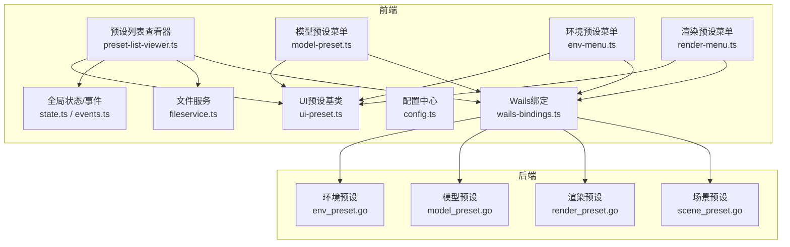
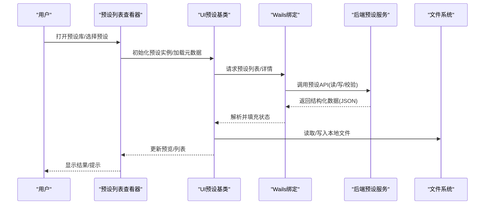
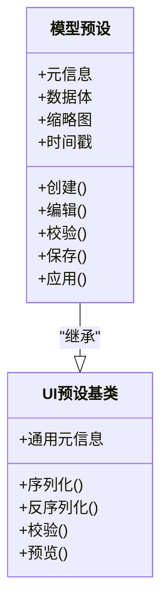
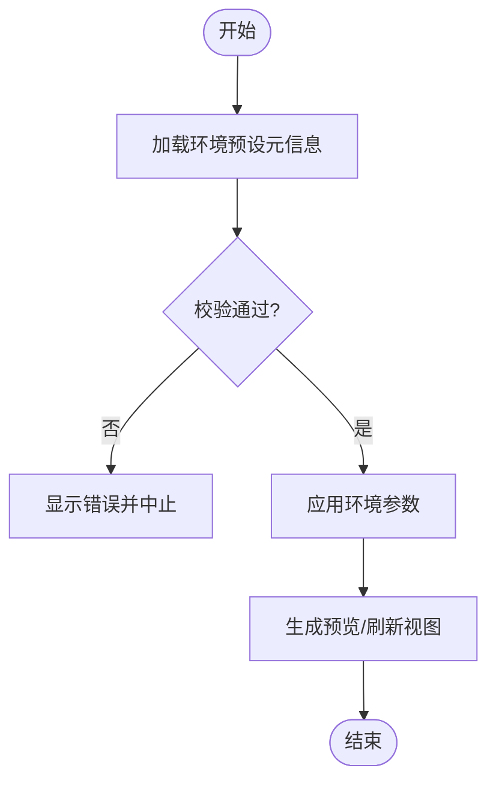
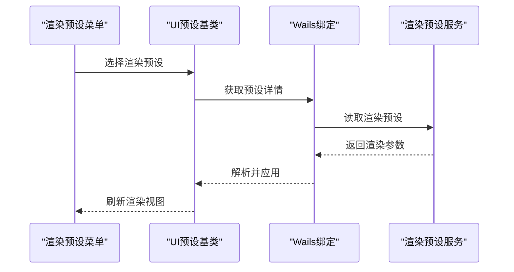
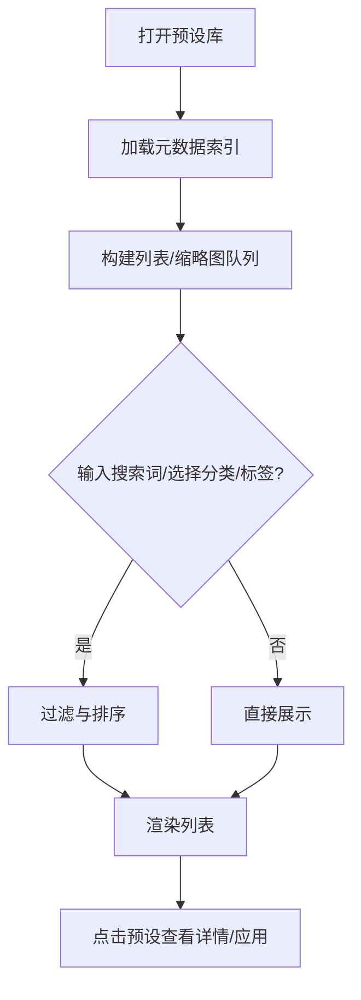
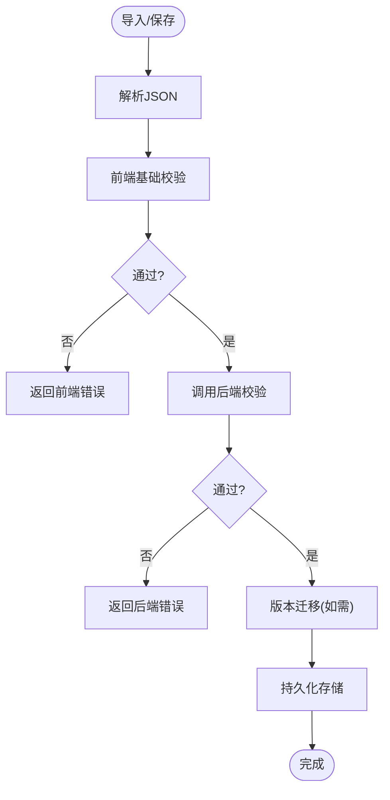
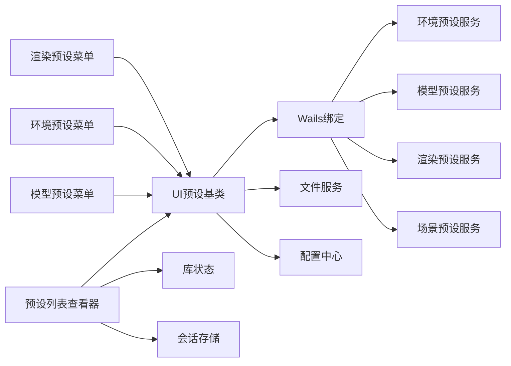

# 预设系统

<cite>
**本文引用的文件**   
- [internal/app/env_preset.go](file://internal/app/env_preset.go)
- [internal/app/model_preset.go](file://internal/app/model_preset.go)
- [internal/app/render_preset.go](file://internal/app/render_preset.go)
- [internal/app/scene_preset.go](file://internal/app/scene_preset.go)
- [frontend/src/menus/preset-list-viewer.ts](file://frontend/src/menus/preset-list-viewer.ts)
- [frontend/src/core/ui-preset.ts](file://frontend/src/core/ui-preset.ts)
- [frontend/src/menus/model-preset.ts](file://frontend/src/menus/model-preset.ts)
- [frontend/src/menus/env-menu.ts](file://frontend/src/menus/env-menu.ts)
- [frontend/src/menus/render-menu.ts](file://frontend/src/menus/render-menu.ts)
- [frontend/src/menus/menu-schema.ts](file://frontend/src/menus/menu-schema.ts)
- [frontend/src/core/config.ts](file://frontend/src/core/config.ts)
- [frontend/src/core/fileservice.ts](file://frontend/src/core/fileservice.ts)
- [frontend/src/core/library-state.ts](file://frontend/src/core/library-state.ts)
- [frontend/src/menus/library-core.ts](file://frontend/src/menus/library-core.ts)
- [frontend/src/menus/library-browse.ts](file://frontend/src/menus/library-browse.ts)
- [frontend/src/menus/library-session-store.ts](file://frontend/src/menus/library-session-store.ts)
- [frontend/src/core/state.ts](file://frontend/src/core/state.ts)
- [frontend/src/core/events.ts](file://frontend/src/core/events.ts)
- [frontend/src/core/i18n/t.ts](file://frontend/src/core/i18n/t.ts)
- [frontend/src/core/i18n/locale.ts](file://frontend/src/core/i18n/locale.ts)
- [frontend/src/core/dialog.ts](file://frontend/src/core/dialog.ts)
- [frontend/src/core/toast.ts](file://frontend/src/core/toast.ts)
- [frontend/src/core/wails-bindings.ts](file://frontend/src/core/wails-bindings.ts)
- [frontend/src/core/platform.ts](file://frontend/src/core/platform.ts)
- [frontend/src/core/safe-call.ts](file://frontend/src/core/safe-call.ts)
- [frontend/src/core/logger.ts](file://frontend/src/core/logger.ts)
- [frontend/src/core/dispose-helpers.ts](file://frontend/src/core/dispose-helpers.ts)
- [frontend/src/core/watch-import.ts](file://frontend/src/core/watch-import.ts)
- [frontend/src/core/reactivity.ts](file://frontend/src/core/reactivity.ts)
- [frontend/src/core/types.ts](file://frontend/src/core/types.ts)
- [frontend/src/core/ui-types.ts](file://frontend/src/core/ui-types.ts)
- [frontend/src/core/ui-helpers.ts](file://frontend/src/core/ui-helpers.ts)
- [frontend/src/core/ui-advanced-rows.ts](file://frontend/src/core/ui-advanced-rows.ts)
- [frontend/src/core/ui-collapsible.ts](file://frontend/src/core/ui-collapsible.ts)
- [frontend/src/core/ui-fullscreen-overlay.ts](file://frontend/src/core/ui-fullscreen-overlay.ts)
- [frontend/src/core/ui-virtual-grid.ts](file://frontend/src/core/ui-virtual网格.ts)
- [frontend/src/core/ui-slider-controller.ts](file://frontend/src/core/ui-slider-controller.ts)
- [frontend/src/core/ui-slide-row.ts](file://frontend/src/core/ui-slide-row.ts)
- [frontend/src/core/ui-rows.ts](file://frontend/src/core/ui-rows.ts)
- [frontend/src/core/ui-resource-panel.ts](file://frontend/src/core/ui-resource-panel.ts)
- [frontend/src/core/freefly-state.ts](file://frontend/src/core/freefly-state.ts)
- [frontend/src/core/playback-state.ts](file://frontend/src/core/playback-state.ts)
- [frontend/src/core/orbit.ts](file://frontend/src/core/orbit.ts)
- [frontend/src/core/status-bar.ts](file://frontend/src/core/status-bar.ts)
- [frontend/src/core/dev-hooks.ts](file://frontend/src/core/dev-hooks.ts)
- [frontend/src/core/runtime-mode.ts](file://frontend/src/core/runtime-mode.ts)
- [frontend/src/core/load-manager.ts](file://frontend/src/core/load-manager.ts)
- [frontend/src/core/render-loop.ts](file://frontend/src/core/render-loop.ts)
- [frontend/src/core/main.ts](file://frontend/src/core/main.ts)
- [frontend/src/core/init.ts](file://frontend/src/core/init.ts)
- [frontend/src/core/color-helpers.ts](file://frontend/src/core/color-helpers.ts)
- [frontend/src/core/dom.ts](file://frontend/src/core/dom.ts)
- [frontend/src/core/utils.ts](file://frontend/src/core/utils.ts)
- [frontend/src/core/wind-utils.ts](file://frontend/src/core/wind-utils.ts)
- [frontend/src/core/shortcut-app.ts](file://frontend/src/core/shortcut-app.ts)
- [frontend/src/core/shortcut-registry.ts](file://frontend/src/core/shortcut-registry.ts)
- [frontend/src/core/audio-bus.ts](file://frontend/src/core/audio-bus.ts)
- [frontend/src/core/goerr.ts](file://frontend/src/core/i18n/goerr.ts)
- [frontend/src/core/librariesessionstore.test.ts](file://frontend/src/__tests__/library-session-store.test.ts)
- [frontend/src/__tests__/model-preset.test.ts](file://frontend/src/__tests__/model-preset.test.ts)
- [frontend/src/__tests__/pose-preset.test.ts](file://frontend/src/__tests__/pose-preset.test.ts)
- [frontend/src/__tests__/env-state.test.ts](file://frontend/src/__tests__/env-state.test.ts)
- [frontend/src/__tests__/water-preset-repro.test.ts](file://frontend/src/__tests__/water-preset-repro.test.ts)
- [frontend/src/__tests__/menu-schema.test.ts](file://frontend/src/__tests__/menu-schema.test.ts)
- [frontend/src/__tests__/config.test.ts](file://frontend/src/__tests__/config.test.ts)
- [frontend/src/__tests__/fileservice.test.ts](file://frontend/src/__tests__/fileservice.test.ts)
- [frontend/src/__tests__/dialog.test.ts](file://frontend/src/__tests__/dialog.test.ts)
- [frontend/src/__tests__/toast.test.ts](file://frontend/src/__tests__/toast.test.ts)
- [frontend/src/__tests__/wails-fixture.ts](file://frontend/src/__tests__/wails-fixture.ts)
- [frontend/src/__tests__/setup-wails.ts](file://frontend/src/__tests__/setup-wails.ts)
- [frontend/src/__tests__/mocks/babylon.ts](file://frontend/src/__tests__/mocks/babylon.ts)
- [frontend/src/__tests__/mocks/babylon-mmd-mocks.ts](file://frontend/src/__tests__/mocks/babylon-mmd-mocks.ts)
- [frontend/src/__tests__/mocks/engine-mock.ts](file://frontend/src/__tests__/mocks/engine-mock.ts)
- [frontend/src/__tests__/mocks/factories.ts](file://frontend/src/__tests__/mocks/factories.ts)
- [frontend/src/__tests__/mocks/binding-factories.ts](file://frontend/src/__tests__/mocks/binding-factories.ts)
- [frontend/src/__tests__/bindings/app.contract.test.ts](file://frontend/src/__tests__/bindings/app.contract.test.ts)
- [frontend/src/__tests__/bindings/app.functions.contract.test.ts](file://frontend/src/__tests__/bindings/app.functions.contract.test.ts)
- [frontend/src/__tests__/scene-model.test.ts](file://frontend/src/__tests__/scene-model.test.ts)
- [frontend/src/__tests__/scene-stage.test.ts](file://frontend/src/__tests__/scene-stage.test.ts)
- [frontend/src/__tests__/material-editor.test.ts](file://frontend/src/__tests__/material-editor.test.ts)
- [frontend/src/__tests__/model-detail-ui.test.ts](file://frontend/src/__tests__/model-detail-ui.test.ts)
- [frontend/src/__tests__/model-manager.test.ts](file://frontend/src/__tests__/model-manager.test.ts)
- [frontend/src/__tests__/model-ops.test.ts](file://frontend/src/__tests__/model-ops.test.ts)
- [frontend/src/__tests__/orbit.test.ts](file://frontend/src/__tests__/orbit.test.ts)
- [frontend/src/__tests__/outfit.test.ts](file://frontend/src/__tests__/outfit.test.ts)
- [frontend/src/__tests__/perception-breathing.test.ts](file://frontend/src/__tests__/perception-breathing.test.ts)
- [frontend/src/__tests__/perception.test.ts](file://frontend/src/__tests__/perception.test.ts)
- [frontend/src/__tests__/physics-bridge.test.ts](file://frontend/src/__tests__/physics-bridge.test.ts)
- [frontend/src/__tests__/playback.test.ts](file://frontend/src/__tests__/playback.test.ts)
- [frontend/src/__tests__/proc-motion-bridge.test.ts](file://frontend/src/__tests__/proc-motion-bridge.test.ts)
- [frontend/src/__tests__/procedural-motion.test.ts](file://frontend/src/__tests__/procedural-motion.test.ts)
- [frontend/src/__tests__/thumbnail-key.contract.test.ts](file://frontend/src/__tests__/thumbnail-key.contract.test.ts)
- [frontend/src/__tests__/ui-helpers.test.ts](file://frontend/src/__tests__/ui-helpers.test.ts)
- [frontend/src/__tests__/utils.test.ts](file://frontend/src/__tests__/utils.test.ts)
- [frontend/src/__tests__/virtual-skirt.test.ts](file://frontend/src/__tests__/virtual-skirt.test.ts)
- [frontend/src/__tests__/vmd-evaluator.regression.spec.ts](file://frontend/src/__tests__/vmd-evaluator.regression.spec.ts)
- [frontend/src/__tests__/vmd-evaluator.test.ts](file://frontend/src/__tests__/vmd-evaluator.test.ts)
- [frontend/src/__tests__/vmd.test.ts](file://frontend/src/__tests__/vmd.test.ts)
- [frontend/src/__tests__/vpd-parser-security.test.ts](file://frontend/src/__tests__/vpd-parser-security.test.ts)
- [frontend/src/__tests__/wasm-layers-blender.perf.test.ts](file://frontend/src/__tests__/wasm-layers-blender.perf.test.ts)
- [frontend/src/__tests__/wasm-layers-blender.test.ts](file://frontend/src/__tests__/wasm-layers-blender.test.ts)
- [frontend/src/__tests__/audio.test.ts](file://frontend/src/__tests__/audio.test.ts)
- [frontend/src/__tests__/beat-detector.test.ts](file://frontend/src/__tests__/beat-detector.test.ts)
- [frontend/src/__tests__/camera.test.ts](file://frontend/src/__tests__/camera.test.ts)
- [frontend/src/__tests__/color-helpers.test.ts](file://frontend/src/__tests__/color-helpers.test.ts)
- [frontend/src/__tests__/dom.test.ts](file://frontend/src/__tests__/dom.test.ts)
- [frontend/src/__tests__/env-bridge.test.ts](file://frontend/src/__tests__/env-bridge.test.ts)
- [frontend/src/__tests__/env-lighting.test.ts](file://frontend/src/__tests__/env-lighting.test.ts)
- [frontend/src/__tests__/environment-integration.test.ts](file://frontend/src/__tests__/environment-integration.test.ts)
- [frontend/src/__tests__/feet-adjustment.test.ts](file://frontend/src/__tests__/feet-adjustment.test.ts)
- [frontend/src/__tests__/footstep-detect.test.ts](file://frontend/src/__tests__/footstep-detect.test.ts)
- [frontend/src/__tests__/fullscreen-overlay.test.ts](file://frontend/src/__tests__/fullscreen-overlay.test.ts)
- [frontend/src/__tests__/goerr.test.ts](file://frontend/src/__tests__/goerr.test.ts)
- [frontend/src/__tests__/ground-collision.test.ts](file://frontend/src/__tests__/ground-collision.test.ts)
- [frontend/src/__tests__/lipsync-bridge.test.ts](file://frontend/src/__tests__/lipsync-bridge.test.ts)
- [frontend/src/__tests__/lipsync.test.ts](file://frontend/src/__tests__/lipsync.test.ts)
- [frontend/src/__tests__/motion-history.test.ts](file://frontend/src/__tests__/motion-history.test.ts)
- [frontend/src/__tests__/motion-math.test.ts](file://frontend/src/__tests__/motion-math.test.ts)
- [frontend/src/__tests__/motion-modules-registry.test.ts](file://frontend/src/__tests__/motion-modules-registry.test.ts)
- [frontend/src/__tests__/motion-modules-timed.test.ts](file://frontend/src/__tests__/motion-modules-timed.test.ts)
- [frontend/src/__tests__/performance-reflection.test.ts](file://frontend/src/__tests__/performance-reflection.test.ts)
- [frontend/src/__tests__/planar-reflection.test.ts](file://frontend/src/__tests__/planar-reflection.test.ts)
- [frontend/src/__tests__/scene-water.test.ts](file://frontend/src/__tests__/scene-water.test.ts)
- [frontend/src/__tests__/settings-panel-dom.spec.ts](file://frontend/src/e2e/settings-panel-dom.spec.ts)
- [frontend/src/__tests__/shortcuts-dom.spec.ts](file://frontend/src/e2e/shortcuts-dom.spec.ts)
- [frontend/src/__tests__/smoke.spec.ts](file://frontend/src/e2e/smoke.spec.ts)
- [frontend/src/__tests__/action-play.spec.ts](file://frontend/src/e2e/action-play.spec.ts)
- [frontend/src/__tests__/env-cloud-dom.spec.ts](file://frontend/src/e2e/env-cloud-dom.spec.ts)
- [frontend/src/__tests__/env-sky.spec.ts](file://frontend/src/e2e/env-sky.spec.ts)
- [frontend/src/__tests__/export-screenshot.spec.ts](file://frontend/src/e2e/export-screenshot.spec.ts)
- [frontend/src/__tests__/helpers.ts](file://frontend/src/e2e/helpers.ts)
- [frontend/src/__tests__/library-panel-dom.spec.ts](file://frontend/src/e2e/library-panel-dom.spec.ts)
- [frontend/src/__tests__/model-load.spec.ts](file://frontend/src/e2e/model-load.spec.ts)
- [frontend/src/__tests__/motion-panel-dom.spec.ts](file://frontend/src/e2e/motion-panel-dom.spec.ts)
- [frontend/src/__tests__/motion-playback-dom.spec.ts](file://frontend/src/e2e/motion-playback-dom.spec.ts)
- [frontend/src/__tests__/scene-ground-dom.spec.ts](file://frontend/src/e2e/scene-ground-dom.spec.ts)
- [frontend/src/__tests__/scene-panel-dom.spec.ts](file://frontend/src/e2e/scene-panel-dom.spec.ts)
- [frontend/src/__tests__/scene-water-dom.spec.ts](file://frontend/src/e2e/scene-water-dom.spec.ts)
- [frontend/src/__tests__/wails-fixture.ts](file://frontend/src/e2e/wails-fixture.ts)
</cite>

## 目录
1. [简介](#简介)
2. [项目结构](#项目结构)
3. [核心组件](#核心组件)
4. [架构总览](#架构总览)
5. [详细组件分析](#详细组件分析)
6. [依赖分析](#依赖分析)
7. [性能考虑](#性能考虑)
8. [故障排查指南](#故障排查指南)
9. [结论](#结论)
10. [附录](#附录)

## 简介
本文件系统化梳理“预设系统”的概念、类型与数据结构，覆盖模型预设、环境预设、渲染预设等关键领域；说明预设的创建、编辑、导入导出流程及JSON格式规范与数据验证机制；解释预设库管理界面（浏览、搜索、分类、标签）的实现要点；阐述版本管理与兼容性策略；并提供面向开发者的自定义预设开发指南。文档以代码级事实为依据，辅以可视化图示，帮助读者从概念到实现全面掌握预设体系。

## 项目结构
预设系统横跨前端与后端：
- 后端（Go）提供统一的预设读写、校验与持久化能力，并暴露给前端调用。
- 前端（TypeScript）负责UI交互、状态管理、预览与本地缓存，以及通过Wails绑定与后端通信。

图表来源
- [frontend/src/menus/preset-list-viewer.ts](file://frontend/src/menus/preset-list-viewer.ts)
- [frontend/src/core/ui-preset.ts](file://frontend/src/core/ui-preset.ts)
- [frontend/src/menus/model-preset.ts](file://frontend/src/menus/model-preset.ts)
- [frontend/src/menus/env-menu.ts](file://frontend/src/menus/env-menu.ts)
- [frontend/src/menus/render-menu.ts](file://frontend/src/menus/render-menu.ts)
- [frontend/src/core/state.ts](file://frontend/src/core/state.ts)
- [frontend/src/core/events.ts](file://frontend/src/core/events.ts)
- [frontend/src/core/fileservice.ts](file://frontend/src/core/fileservice.ts)
- [frontend/src/core/config.ts](file://frontend/src/core/config.ts)
- [frontend/src/core/wails-bindings.ts](file://frontend/src/core/wails-bindings.ts)
- [internal/app/env_preset.go](file://internal/app/env_preset.go)
- [internal/app/model_preset.go](file://internal/app/model_preset.go)
- [internal/app/render_preset.go](file://internal/app/render_preset.go)
- [internal/app/scene_preset.go](file://internal/app/scene_preset.go)

章节来源
- [frontend/src/menus/preset-list-viewer.ts](file://frontend/src/menus/preset-list-viewer.ts)
- [frontend/src/core/ui-preset.ts](file://frontend/src/core/ui-preset.ts)
- [frontend/src/menus/model-preset.ts](file://frontend/src/menus/model-preset.ts)
- [frontend/src/menus/env-menu.ts](file://frontend/src/menus/env-menu.ts)
- [frontend/src/menus/render-menu.ts](file://frontend/src/menus/render-menu.ts)
- [frontend/src/core/state.ts](file://frontend/src/core/state.ts)
- [frontend/src/core/events.ts](file://frontend/src/core/events.ts)
- [frontend/src/core/fileservice.ts](file://frontend/src/core/fileservice.ts)
- [frontend/src/core/config.ts](file://frontend/src/core/config.ts)
- [frontend/src/core/wails-bindings.ts](file://frontend/src/core/wails-bindings.ts)
- [internal/app/env_preset.go](file://internal/app/env_preset.go)
- [internal/app/model_preset.go](file://internal/app/model_preset.go)
- [internal/app/render_preset.go](file://internal/app/render_preset.go)
- [internal/app/scene_preset.go](file://internal/app/scene_preset.go)

## 核心组件
- 预设基类与通用UI能力：定义预设元信息、序列化/反序列化、校验、预览、保存/加载等通用行为，供各类型预设复用。
- 类型化预设模块：
  - 模型预设：封装模型相关属性（如材质、骨骼、动画层等）的快照与恢复。
  - 环境预设：封装光照、天空、水体、粒子、地形等环境子系统参数。
  - 渲染预设：封装渲染管线开关、后处理、反射、阴影等图形参数。
  - 场景预设：组合多子系统的综合快照（可选）。
- 预设库与浏览：提供列表展示、搜索过滤、分类与标签、缩略图、最近使用记录等。
- 导入导出：统一JSON Schema驱动的数据交换格式，支持校验、回退兼容与错误提示。
- 版本与兼容：通过元数据中的版本字段与迁移逻辑保证跨版本可用。

章节来源
- [frontend/src/core/ui-preset.ts](file://frontend/src/core/ui-preset.ts)
- [frontend/src/menus/model-preset.ts](file://frontend/src/menus/model-preset.ts)
- [frontend/src/menus/env-menu.ts](file://frontend/src/menus/env-menu.ts)
- [frontend/src/menus/render-menu.ts](file://frontend/src/menus/render-menu.ts)
- [frontend/src/menus/preset-list-viewer.ts](file://frontend/src/menus/preset-list-viewer.ts)
- [frontend/src/core/fileservice.ts](file://frontend/src/core/fileservice.ts)
- [frontend/src/core/config.ts](file://frontend/src/core/config.ts)
- [frontend/src/core/wails-bindings.ts](file://frontend/src/core/wails-bindings.ts)
- [internal/app/env_preset.go](file://internal/app/env_preset.go)
- [internal/app/model_preset.go](file://internal/app/model_preset.go)
- [internal/app/render_preset.go](file://internal/app/render_preset.go)
- [internal/app/scene_preset.go](file://internal/app/scene_preset.go)

## 架构总览
预设系统采用“前端UI + 后端服务”的分层架构。前端通过菜单与面板触发操作，经由Wails绑定调用后端预设服务进行读取、写入与校验；同时结合本地文件服务与配置中心完成持久化与路径解析。

图表来源
- [frontend/src/menus/preset-list-viewer.ts](file://frontend/src/menus/preset-list-viewer.ts)
- [frontend/src/core/ui-preset.ts](file://frontend/src/core/ui-preset.ts)
- [frontend/src/core/wails-bindings.ts](file://frontend/src/core/wails-bindings.ts)
- [internal/app/env_preset.go](file://internal/app/env_preset.go)
- [internal/app/model_preset.go](file://internal/app/model_preset.go)
- [internal/app/render_preset.go](file://internal/app/render_preset.go)
- [internal/app/scene_preset.go](file://internal/app/scene_preset.go)
- [frontend/src/core/fileservice.ts](file://frontend/src/core/fileservice.ts)

## 详细组件分析

### 模型预设（Model Preset）
- 职责：对模型相关属性进行快照与恢复，包括材质、骨骼、动画层、物理等可配置项。
- 数据结构：包含元信息（名称、描述、作者、版本、标签、分类）、数据体（属性键值映射或嵌套对象）、缩略图引用、时间戳等。
- 生命周期：创建→编辑→校验→保存→应用→撤销/重做（可选）。
- 与后端交互：通过Wails调用后端模型预设接口，完成读取、写入与校验。

图表来源
- [frontend/src/core/ui-preset.ts](file://frontend/src/core/ui-preset.ts)
- [frontend/src/menus/model-preset.ts](file://frontend/src/menus/model-preset.ts)

章节来源
- [frontend/src/core/ui-preset.ts](file://frontend/src/core/ui-preset.ts)
- [frontend/src/menus/model-preset.ts](file://frontend/src/menus/model-preset.ts)
- [frontend/src/core/wails-bindings.ts](file://frontend/src/core/wails-bindings.ts)
- [internal/app/model_preset.go](file://internal/app/model_preset.go)

### 环境预设（Environment Preset）
- 职责：对光照、天空、水体、粒子、地形等环境子系统参数进行集中管理。
- 数据结构：与环境菜单层级一致，便于一键切换；包含元信息与具体参数集合。
- 特性：支持分层（feature-level）与分组，便于在菜单中按功能域组织。

图表来源
- [frontend/src/menus/env-menu.ts](file://frontend/src/menus/env-menu.ts)
- [frontend/src/core/ui-preset.ts](file://frontend/src/core/ui-preset.ts)
- [internal/app/env_preset.go](file://internal/app/env_preset.go)

章节来源
- [frontend/src/menus/env-menu.ts](file://frontend/src/menus/env-menu.ts)
- [frontend/src/core/ui-preset.ts](file://frontend/src/core/ui-preset.ts)
- [internal/app/env_preset.go](file://internal/app/env_preset.go)

### 渲染预设（Render Preset）
- 职责：统一管理渲染管线开关、后处理、反射、阴影、水面反射等图形相关设置。
- 数据结构：与渲染菜单层级对应，确保一键切换时能完整还原渲染状态。
- 特性：支持质量档位与设备适配，避免在不支持的设备上启用昂贵效果。

图表来源
- [frontend/src/menus/render-menu.ts](file://frontend/src/menus/render-menu.ts)
- [frontend/src/core/ui-preset.ts](file://frontend/src/core/ui-preset.ts)
- [frontend/src/core/wails-bindings.ts](file://frontend/src/core/wails-bindings.ts)
- [internal/app/render_preset.go](file://internal/app/render_preset.go)

章节来源
- [frontend/src/menus/render-menu.ts](file://frontend/src/menus/render-menu.ts)
- [frontend/src/core/ui-preset.ts](file://frontend/src/core/ui-preset.ts)
- [frontend/src/core/wails-bindings.ts](file://frontend/src/core/wails-bindings.ts)
- [internal/app/render_preset.go](file://internal/app/render_preset.go)

### 场景预设（Scene Preset）
- 职责：组合多个子系统（模型、环境、渲染、动作等）的状态快照，用于快速重建场景。
- 数据结构：聚合型，包含对各子系统预设的引用或内联参数。
- 适用场景：演示、回放、分享复杂场景配置。

章节来源
- [internal/app/scene_preset.go](file://internal/app/scene_preset.go)

### 预设库管理界面（浏览、搜索、分类、标签）
- 列表展示：基于虚拟网格与分页，提升大数据量下的性能。
- 搜索与过滤：支持关键词匹配、分类筛选、标签过滤。
- 缩略图：异步加载与缓存，减少IO压力。
- 最近使用：维护最近访问记录，提高常用预设的可发现性。

图表来源
- [frontend/src/menus/preset-list-viewer.ts](file://frontend/src/menus/preset-list-viewer.ts)
- [frontend/src/core/ui-virtual-grid.ts](file://frontend/src/core/ui-virtual网格.ts)
- [frontend/src/core/library-state.ts](file://frontend/src/core/library-state.ts)
- [frontend/src/menus/library-core.ts](file://frontend/src/menus/library-core.ts)
- [frontend/src/menus/library-browse.ts](file://frontend/src/menus/library-browse.ts)
- [frontend/src/menus/library-session-store.ts](file://frontend/src/menus/library-session-store.ts)

章节来源
- [frontend/src/menus/preset-list-viewer.ts](file://frontend/src/menus/preset-list-viewer.ts)
- [frontend/src/core/ui-virtual-grid.ts](file://frontend/src/core/ui-virtual网格.ts)
- [frontend/src/core/library-state.ts](file://frontend/src/core/library-state.ts)
- [frontend/src/menus/library-core.ts](file://frontend/src/menus/library-core.ts)
- [frontend/src/menus/library-browse.ts](file://frontend/src/menus/library-browse.ts)
- [frontend/src/menus/library-session-store.ts](file://frontend/src/menus/library-session-store.ts)

### JSON格式规范与数据验证
- 统一Schema：所有预设遵循一致的JSON Schema，包含元信息、数据体、版本、标签、分类等字段。
- 校验流程：前端先进行轻量校验，再交由后端进行严格校验，确保数据完整性与安全性。
- 错误处理：将校验错误转换为可读消息，并通过对话框/提示组件反馈给用户。
- 兼容策略：当检测到旧版本结构时，尝试自动迁移或提示用户升级。

图表来源
- [frontend/src/core/ui-preset.ts](file://frontend/src/core/ui-preset.ts)
- [frontend/src/core/dialog.ts](file://frontend/src/core/dialog.ts)
- [frontend/src/core/toast.ts](file://frontend/src/core/toast.ts)
- [frontend/src/core/wails-bindings.ts](file://frontend/src/core/wails-bindings.ts)
- [internal/app/env_preset.go](file://internal/app/env_preset.go)
- [internal/app/model_preset.go](file://internal/app/model_preset.go)
- [internal/app/render_preset.go](file://internal/app/render_preset.go)
- [internal/app/scene_preset.go](file://internal/app/scene_preset.go)

章节来源
- [frontend/src/core/ui-preset.ts](file://frontend/src/core/ui-preset.ts)
- [frontend/src/core/dialog.ts](file://frontend/src/core/dialog.ts)
- [frontend/src/core/toast.ts](file://frontend/src/core/toast.ts)
- [frontend/src/core/wails-bindings.ts](file://frontend/src/core/wails-bindings.ts)
- [internal/app/env_preset.go](file://internal/app/env_preset.go)
- [internal/app/model_preset.go](file://internal/app/model_preset.go)
- [internal/app/render_preset.go](file://internal/app/render_preset.go)
- [internal/app/scene_preset.go](file://internal/app/scene_preset.go)

### 版本管理与兼容性处理
- 版本字段：每个预设包含明确的版本标识，用于判断是否需要进行迁移。
- 迁移策略：向后兼容优先，新增字段默认空值或安全默认值；破坏性变更需显式升级提示。
- 降级策略：当运行环境不支持某些特性时，自动禁用或替换为等效方案。

章节来源
- [frontend/src/core/ui-preset.ts](file://frontend/src/core/ui-preset.ts)
- [frontend/src/core/config.ts](file://frontend/src/core/config.ts)
- [internal/app/env_preset.go](file://internal/app/env_preset.go)
- [internal/app/model_preset.go](file://internal/app/model_preset.go)
- [internal/app/render_preset.go](file://internal/app/render_preset.go)
- [internal/app/scene_preset.go](file://internal/app/scene_preset.go)

### 预设开发指南（自定义预设）
- 步骤概览：
  1) 定义预设元信息与数据结构（遵循统一Schema）。
  2) 实现创建/编辑/校验/保存/应用方法。
  3) 接入菜单与列表查看器，提供预览与缩略图。
  4) 编写单元测试与E2E用例，覆盖边界条件与兼容性。
- 最佳实践：
  - 保持字段命名稳定，避免破坏性变更。
  - 提供合理的默认值与范围约束。
  - 使用国际化文案，确保错误提示友好。
  - 利用事件总线与状态管理，确保UI与数据同步。

章节来源
- [frontend/src/core/ui-preset.ts](file://frontend/src/core/ui-preset.ts)
- [frontend/src/menus/preset-list-viewer.ts](file://frontend/src/menus/preset-list-viewer.ts)
- [frontend/src/core/events.ts](file://frontend/src/core/events.ts)
- [frontend/src/core/i18n/t.ts](file://frontend/src/core/i18n/t.ts)
- [frontend/src/core/i18n/locale.ts](file://frontend/src/core/i18n/locale.ts)
- [frontend/src/core/state.ts](file://frontend/src/core/state.ts)

## 依赖分析
预设系统的前端模块之间存在清晰的依赖关系：UI层依赖UI基类与状态/事件；菜单层依赖UI基类与Wails绑定；Wails绑定依赖后端服务；文件服务与配置中心提供基础设施支撑。

图表来源
- [frontend/src/menus/preset-list-viewer.ts](file://frontend/src/menus/preset-list-viewer.ts)
- [frontend/src/core/ui-preset.ts](file://frontend/src/core/ui-preset.ts)
- [frontend/src/menus/model-preset.ts](file://frontend/src/menus/model-preset.ts)
- [frontend/src/menus/env-menu.ts](file://frontend/src/menus/env-menu.ts)
- [frontend/src/menus/render-menu.ts](file://frontend/src/menus/render-menu.ts)
- [frontend/src/core/wails-bindings.ts](file://frontend/src/core/wails-bindings.ts)
- [frontend/src/core/fileservice.ts](file://frontend/src/core/fileservice.ts)
- [frontend/src/core/config.ts](file://frontend/src/core/config.ts)
- [frontend/src/core/library-state.ts](file://frontend/src/core/library-state.ts)
- [frontend/src/menus/library-session-store.ts](file://frontend/src/menus/library-session-store.ts)
- [internal/app/env_preset.go](file://internal/app/env_preset.go)
- [internal/app/model_preset.go](file://internal/app/model_preset.go)
- [internal/app/render_preset.go](file://internal/app/render_preset.go)
- [internal/app/scene_preset.go](file://internal/app/scene_preset.go)

章节来源
- [frontend/src/menus/preset-list-viewer.ts](file://frontend/src/menus/preset-list-viewer.ts)
- [frontend/src/core/ui-preset.ts](file://frontend/src/core/ui-preset.ts)
- [frontend/src/menus/model-preset.ts](file://frontend/src/menus/model-preset.ts)
- [frontend/src/menus/env-menu.ts](file://frontend/src/menus/env-menu.ts)
- [frontend/src/menus/render-menu.ts](file://frontend/src/menus/render-menu.ts)
- [frontend/src/core/wails-bindings.ts](file://frontend/src/core/wails-bindings.ts)
- [frontend/src/core/fileservice.ts](file://frontend/src/core/fileservice.ts)
- [frontend/src/core/config.ts](file://frontend/src/core/config.ts)
- [frontend/src/core/library-state.ts](file://frontend/src/core/library-state.ts)
- [frontend/src/menus/library-session-store.ts](file://frontend/src/menus/library-session-store.ts)
- [internal/app/env_preset.go](file://internal/app/env_preset.go)
- [internal/app/model_preset.go](file://internal/app/model_preset.go)
- [internal/app/render_preset.go](file://internal/app/render_preset.go)
- [internal/app/scene_preset.go](file://internal/app/scene_preset.go)

## 性能考虑
- 列表虚拟化：使用虚拟网格渲染大量预设条目，降低DOM压力。
- 缩略图懒加载与缓存：按需加载与内存缓存，避免重复IO。
- 异步与并发控制：批量请求时使用并发限制与取消信号，防止阻塞主线程。
- 增量更新：仅更新变化的UI节点，减少重绘开销。
- 后端校验优化：对大体积数据进行流式校验与分块处理。

[本节为通用指导，不直接分析具体文件]

## 故障排查指南
- 常见问题定位：
  - 导入失败：检查JSON结构与Schema一致性，关注前后端校验错误信息。
  - 应用无效：确认预设版本与当前运行环境兼容，必要时执行迁移。
  - 预览异常：检查缩略图资源路径与权限，确认渲染预设未启用不支持的特性。
- 调试工具：
  - 日志输出：使用日志组件记录关键步骤与错误堆栈。
  - 对话框/提示：对用户可见的错误进行友好提示。
  - 测试覆盖：参考现有单测与E2E用例，复现问题并修复回归。

章节来源
- [frontend/src/core/logger.ts](file://frontend/src/core/logger.ts)
- [frontend/src/core/dialog.ts](file://frontend/src/core/dialog.ts)
- [frontend/src/core/toast.ts](file://frontend/src/core/toast.ts)
- [frontend/src/core/safe-call.ts](file://frontend/src/core/safe-call.ts)
- [frontend/src/core/i18n/goerr.ts](file://frontend/src/core/i18n/goerr.ts)
- [frontend/src/__tests__/model-preset.test.ts](file://frontend/src/__tests__/model-preset.test.ts)
- [frontend/src/__tests__/pose-preset.test.ts](file://frontend/src/__tests__/pose-preset.test.ts)
- [frontend/src/__tests__/env-state.test.ts](file://frontend/src/__tests__/env-state.test.ts)
- [frontend/src/__tests__/water-preset-repro.test.ts](file://frontend/src/__tests__/water-preset-repro.test.ts)
- [frontend/src/__tests__/menu-schema.test.ts](file://frontend/src/__tests__/menu-schema.test.ts)
- [frontend/src/__tests__/config.test.ts](file://frontend/src/__tests__/config.test.ts)
- [frontend/src/__tests__/fileservice.test.ts](file://frontend/src/__tests__/fileservice.test.ts)
- [frontend/src/__tests__/dialog.test.ts](file://frontend/src/__tests__/dialog.test.ts)
- [frontend/src/__tests__/toast.test.ts](file://frontend/src/__tests__/toast.test.ts)

## 结论
预设系统通过统一的Schema与分层架构，实现了模型、环境、渲染等多类型预设的标准化管理与高效应用。前端提供友好的交互体验，后端保障数据一致性与安全性。借助版本迁移与兼容性策略，系统在演进过程中保持稳定。开发者可依据本指南快速扩展新的预设类型，完善生态。

[本节为总结，不直接分析具体文件]

## 附录
- 术语表：
  - 预设：一组可复用的配置快照，用于快速恢复或切换特定状态。
  - 元信息：预设的描述性数据（名称、版本、标签等）。
  - 数据体：预设的核心参数集合。
  - 迁移：将旧版数据结构转换为新版结构的逻辑。
- 相关文件索引：
  - 前端UI与状态：见“核心组件”与“依赖分析”部分。
  - 后端服务：见“架构总览”与“依赖分析”部分。
  - 测试用例：见“故障排查指南”部分。

[本节为补充信息，不直接分析具体文件]