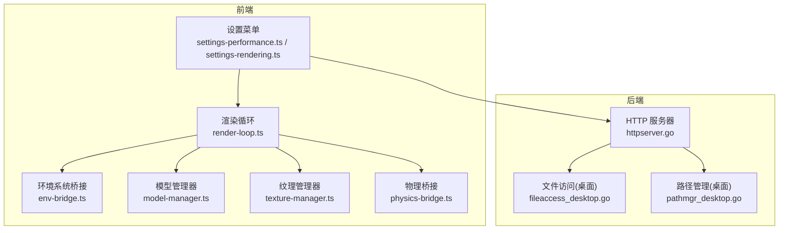
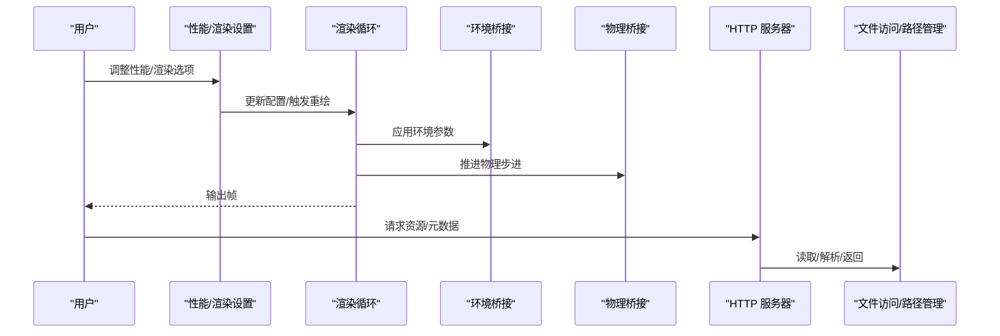
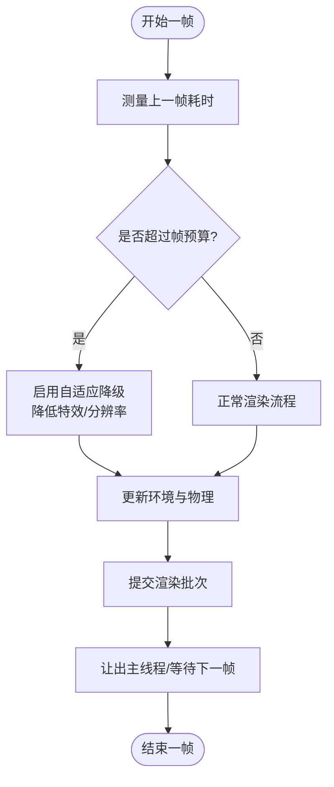
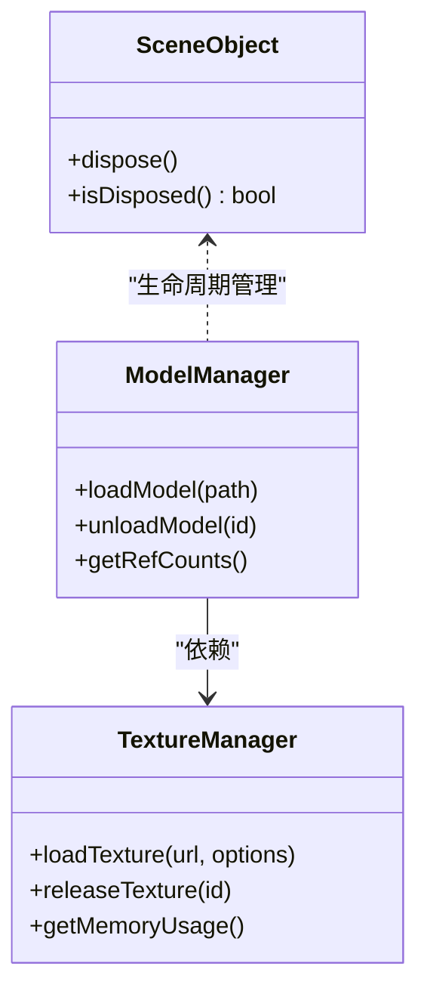
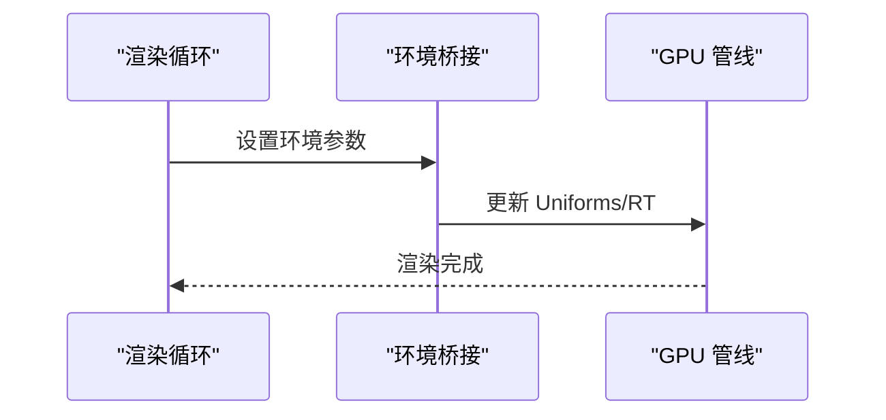
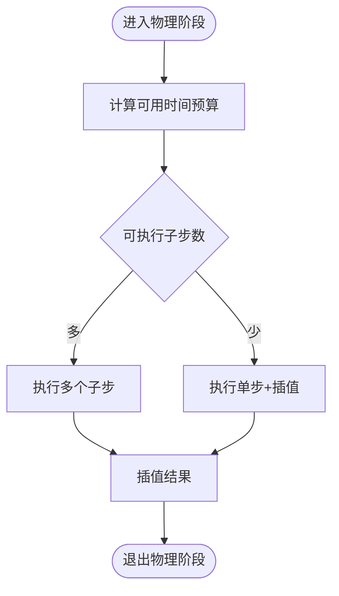
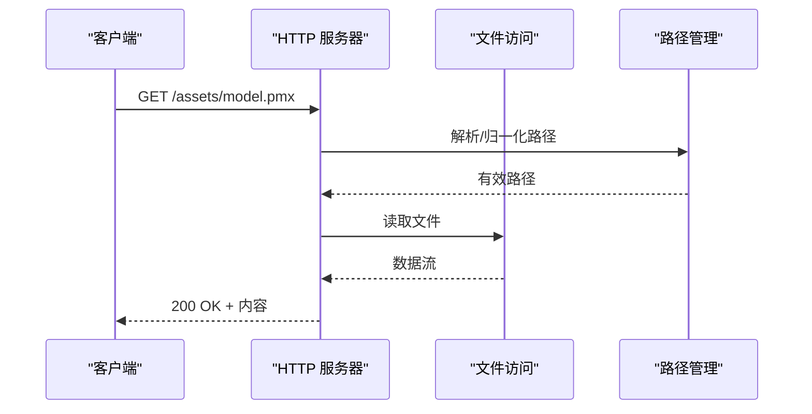
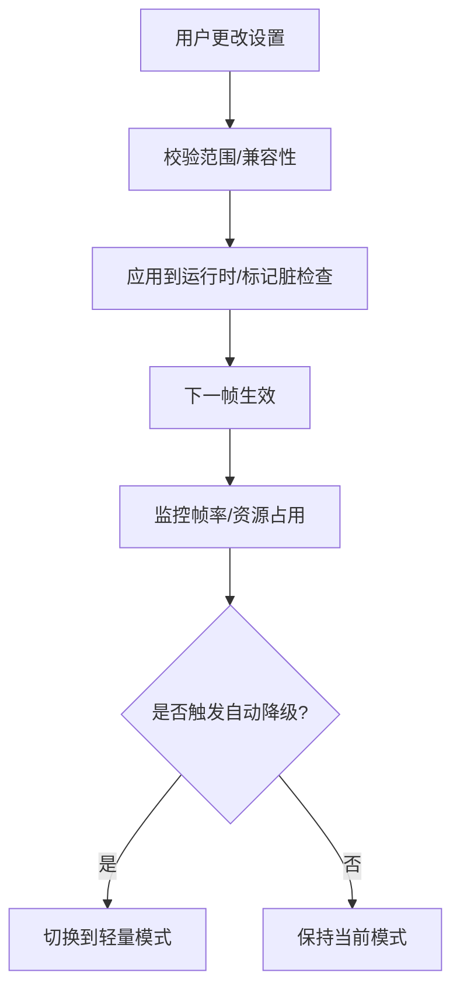
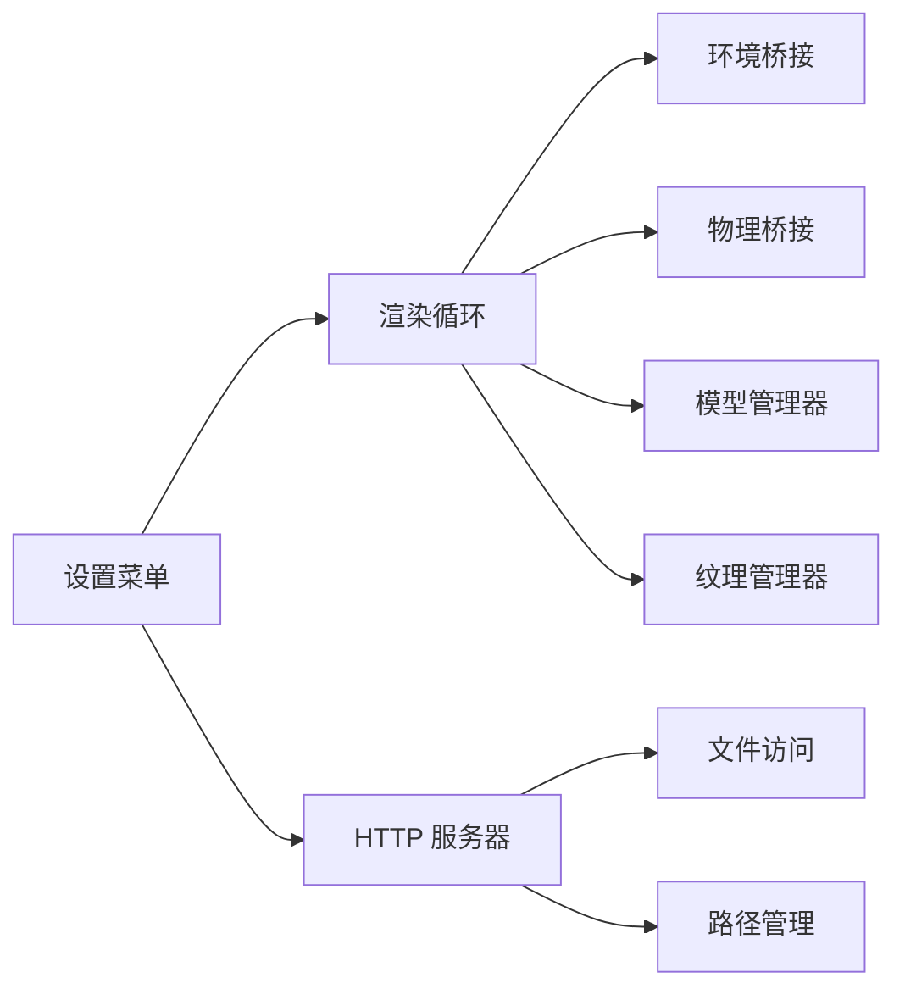

# 性能优化策略

<cite>
**本文引用的文件**   
- [main.go](file://main.go)
- [frontend/src/core/render-loop.ts](file://frontend/src/core/render-loop.ts)
- [frontend/src/menus/settings-performance.ts](file://frontend/src/menus/settings-performance.ts)
- [frontend/src/menus/settings-rendering.ts](file://frontend/src/menus/settings-rendering.ts)
- [frontend/src/scene/env/env-bridge.ts](file://frontend/src/scene/env/env-bridge.ts)
- [frontend/src/scene/manager/model-manager.ts](file://frontend/src/scene/manager/model-manager.ts)
- [frontend/src/scene/manager/texture-manager.ts](file://frontend/src/scene/manager/texture-manager.ts)
- [frontend/src/physics/physics-bridge.ts](file://frontend/src/physics/physics-bridge.ts)
- [internal/app/httpserver.go](file://internal/app/httpserver.go)
- [internal/app/fileaccess_desktop.go](file://internal/app/fileaccess_desktop.go)
- [internal/app/pathmgr_desktop.go](file://internal/app/pathmgr_desktop.go)
- [frontend/vitest.perf.config.ts](file://frontend/vitest.perf.config.ts)
</cite>

## 目录
1. [简介](#简介)
2. [项目结构](#项目结构)
3. [核心组件](#核心组件)
4. [架构总览](#架构总览)
5. [详细组件分析](#详细组件分析)
6. [依赖关系分析](#依赖关系分析)
7. [性能考量](#性能考量)
8. [故障排查指南](#故障排查指南)
9. [结论](#结论)
10. [附录](#附录)

## 简介
本文件面向 MikuMikuAR 项目的性能优化，覆盖前端渲染循环、内存与资源管理、CPU 使用率控制、GPU 加速利用，以及后端并发与 I/O 优化。文档同时提供性能监控与分析工具的使用指南，包括指标采集、瓶颈识别与基准测试方法，并总结各平台（桌面、移动端、Android）的特定优化技巧与经验。

## 项目结构
本项目采用前后端分离：
- 前端基于 TypeScript + Vite，负责场景渲染、UI、交互与 WASM 物理/动作计算桥接。
- 后端基于 Go + Wails v3，负责文件系统访问、HTTP 服务、跨进程通信与平台适配。

**图表来源** 
- [frontend/src/core/render-loop.ts](file://frontend/src/core/render-loop.ts)
- [frontend/src/menus/settings-performance.ts](file://frontend/src/menus/settings-performance.ts)
- [frontend/src/menus/settings-rendering.ts](file://frontend/src/menus/settings-rendering.ts)
- [frontend/src/scene/env/env-bridge.ts](file://frontend/src/scene/env/env-bridge.ts)
- [frontend/src/scene/manager/model-manager.ts](file://frontend/src/scene/manager/model-manager.ts)
- [frontend/src/scene/manager/texture-manager.ts](file://frontend/src/scene/manager/texture-manager.ts)
- [frontend/src/physics/physics-bridge.ts](file://frontend/src/physics/physics-bridge.ts)
- [internal/app/httpserver.go](file://internal/app/httpserver.go)
- [internal/app/fileaccess_desktop.go](file://internal/app/fileaccess_desktop.go)
- [internal/app/pathmgr_desktop.go](file://internal/app/pathmgr_desktop.go)

**章节来源**
- [main.go:1-200](file://main.go#L1-L200)
- [frontend/src/core/render-loop.ts](file://frontend/src/core/render-loop.ts)
- [frontend/src/menus/settings-performance.ts](file://frontend/src/menus/settings-performance.ts)
- [frontend/src/menus/settings-rendering.ts](file://frontend/src/menus/settings-rendering.ts)
- [internal/app/httpserver.go](file://internal/app/httpserver.go)

## 核心组件
- 渲染循环：统一帧调度、帧率控制、渲染阶段编排与 GPU/CPU 工作负载平衡。
- 设置菜单：暴露性能与渲染相关开关，驱动运行时行为切换。
- 环境系统桥接：将环境参数（光照、雾、反射等）同步到渲染管线。
- 模型/纹理管理器：负责资源生命周期、缓存与按需加载。
- 物理桥接：协调 CPU/WASM 物理步进与渲染步长对齐。
- 后端 HTTP 服务器：提供静态资源与元数据接口，配合文件系统与路径管理提升 I/O 吞吐。

**章节来源**
- [frontend/src/core/render-loop.ts](file://frontend/src/core/render-loop.ts)
- [frontend/src/menus/settings-performance.ts](file://frontend/src/menus/settings-performance.ts)
- [frontend/src/menus/settings-rendering.ts](file://frontend/src/menus/settings-rendering.ts)
- [frontend/src/scene/env/env-bridge.ts](file://frontend/src/scene/env/env-bridge.ts)
- [frontend/src/scene/manager/model-manager.ts](file://frontend/src/scene/manager/model-manager.ts)
- [frontend/src/scene/manager/texture-manager.ts](file://frontend/src/scene/manager/texture-manager.ts)
- [frontend/src/physics/physics-bridge.ts](file://frontend/src/physics/physics-bridge.ts)
- [internal/app/httpserver.go](file://internal/app/httpserver.go)

## 架构总览
下图展示从用户设置到渲染/物理执行的关键调用链，体现前端渲染循环与后端服务的协作方式。

**图表来源** 
- [frontend/src/menus/settings-performance.ts](file://frontend/src/menus/settings-performance.ts)
- [frontend/src/menus/settings-rendering.ts](file://frontend/src/menus/settings-rendering.ts)
- [frontend/src/core/render-loop.ts](file://frontend/src/core/render-loop.ts)
- [frontend/src/scene/env/env-bridge.ts](file://frontend/src/scene/env/env-bridge.ts)
- [frontend/src/physics/physics-bridge.ts](file://frontend/src/physics/physics-bridge.ts)
- [internal/app/httpserver.go](file://internal/app/httpserver.go)
- [internal/app/fileaccess_desktop.go](file://internal/app/fileaccess_desktop.go)
- [internal/app/pathmgr_desktop.go](file://internal/app/pathmgr_desktop.go)

## 详细组件分析

### 渲染循环与帧率控制
- 目标：稳定帧率、减少掉帧、降低 CPU/GPU 峰值。
- 关键策略：
  - 固定时间步长或自适应步长，确保物理与渲染一致性。
  - 帧预算分配：UI 更新、逻辑计算、渲染提交分阶段执行。
  - 动态降级：在低帧率时自动关闭高开销特性（如反射、体积云）。
  - 批处理与合并绘制：减少状态切换与 draw call。
  - 异步加载与延迟初始化：首屏快速进入，后台预热资源。

**图表来源** 
- [frontend/src/core/render-loop.ts](file://frontend/src/core/render-loop.ts)

**章节来源**
- [frontend/src/core/render-loop.ts](file://frontend/src/core/render-loop.ts)

### 资源管理与内存控制
- 模型与纹理：
  - 引入引用计数与懒加载，避免一次性加载全部资源。
  - 纹理压缩与多分辨率贴图，按设备能力选择合适尺寸。
  - 显存占用监控与回收策略，防止 OOM。
- 场景对象：
  - 对象池复用频繁创建销毁的对象（粒子、临时矩阵等）。
  - 清理未使用节点与材质，释放 GPU 资源。

**图表来源** 
- [frontend/src/scene/manager/model-manager.ts](file://frontend/src/scene/manager/model-manager.ts)
- [frontend/src/scene/manager/texture-manager.ts](file://frontend/src/scene/manager/texture-manager.ts)

**章节来源**
- [frontend/src/scene/manager/model-manager.ts](file://frontend/src/scene/manager/model-manager.ts)
- [frontend/src/scene/manager/texture-manager.ts](file://frontend/src/scene/manager/texture-manager.ts)

### 环境系统与 GPU 加速
- 环境参数（光照、雾、反射、天空盒）通过桥接层集中下发，减少重复计算。
- 利用 GPU 进行后处理（SSR、反射探针、体积云），结合 LOD 与裁剪降低带宽。
- 对不支持高级特性的平台回退到轻量模式。

**图表来源** 
- [frontend/src/scene/env/env-bridge.ts](file://frontend/src/scene/env/env-bridge.ts)
- [frontend/src/core/render-loop.ts](file://frontend/src/core/render-loop.ts)

**章节来源**
- [frontend/src/scene/env/env-bridge.ts](file://frontend/src/scene/env/env-bridge.ts)
- [frontend/src/core/render-loop.ts](file://frontend/src/core/render-loop.ts)

### 物理与 CPU 使用率控制
- 物理步进与渲染步长解耦，使用插值保证视觉平滑。
- 根据帧率动态调整物理子步数，避免 CPU 过载。
- 将密集计算下沉至 WASM，减少主线程阻塞。

**图表来源** 
- [frontend/src/physics/physics-bridge.ts](file://frontend/src/physics/physics-bridge.ts)

**章节来源**
- [frontend/src/physics/physics-bridge.ts](file://frontend/src/physics/physics-bridge.ts)

### 后端并发与 I/O 优化
- HTTP 服务器：
  - 连接复用与请求队列限流，避免突发流量导致雪崩。
  - 静态资源响应开启缓存头，减少重复传输。
- 文件系统：
  - 批量读取与预取，降低系统调用次数。
  - 路径规范化与缓存命中，减少磁盘寻址。
- 平台差异：
  - Android 下注意沙箱限制与存储权限，必要时走代理或缓存目录。

**图表来源** 
- [internal/app/httpserver.go](file://internal/app/httpserver.go)
- [internal/app/fileaccess_desktop.go](file://internal/app/fileaccess_desktop.go)
- [internal/app/pathmgr_desktop.go](file://internal/app/pathmgr_desktop.go)

**章节来源**
- [internal/app/httpserver.go](file://internal/app/httpserver.go)
- [internal/app/fileaccess_desktop.go](file://internal/app/fileaccess_desktop.go)
- [internal/app/pathmgr_desktop.go](file://internal/app/pathmgr_desktop.go)

### 设置项与运行时开关
- 性能设置：
  - 目标帧率、最大并发任务数、物理精度、阴影质量、反射强度等。
- 渲染设置：
  - 抗锯齿、后处理开关、纹理质量、LOD 距离、体积云密度等。
- 联动机制：
  - 修改设置后立即生效或标记脏检查在下帧应用，避免卡顿。

**图表来源** 
- [frontend/src/menus/settings-performance.ts](file://frontend/src/menus/settings-performance.ts)
- [frontend/src/menus/settings-rendering.ts](file://frontend/src/menus/settings-rendering.ts)

**章节来源**
- [frontend/src/menus/settings-performance.ts](file://frontend/src/menus/settings-performance.ts)
- [frontend/src/menus/settings-rendering.ts](file://frontend/src/menus/settings-rendering.ts)

## 依赖关系分析
- 前端模块耦合：
  - 渲染循环依赖环境桥接、物理桥接与资源管理器。
  - 设置菜单作为入口，影响渲染与物理行为。
- 前后端边界：
  - 通过 HTTP 与 Wails 绑定进行通信，I/O 集中在后端，前端专注渲染与交互。

**图表来源** 
- [frontend/src/menus/settings-performance.ts](file://frontend/src/menus/settings-performance.ts)
- [frontend/src/menus/settings-rendering.ts](file://frontend/src/menus/settings-rendering.ts)
- [frontend/src/core/render-loop.ts](file://frontend/src/core/render-loop.ts)
- [frontend/src/scene/env/env-bridge.ts](file://frontend/src/scene/env/env-bridge.ts)
- [frontend/src/physics/physics-bridge.ts](file://frontend/src/physics/physics-bridge.ts)
- [frontend/src/scene/manager/model-manager.ts](file://frontend/src/scene/manager/model-manager.ts)
- [frontend/src/scene/manager/texture-manager.ts](file://frontend/src/scene/manager/texture-manager.ts)
- [internal/app/httpserver.go](file://internal/app/httpserver.go)
- [internal/app/fileaccess_desktop.go](file://internal/app/fileaccess_desktop.go)
- [internal/app/pathmgr_desktop.go](file://internal/app/pathmgr_desktop.go)

**章节来源**
- [frontend/src/core/render-loop.ts](file://frontend/src/core/render-loop.ts)
- [frontend/src/menus/settings-performance.ts](file://frontend/src/menus/settings-performance.ts)
- [frontend/src/menus/settings-rendering.ts](file://frontend/src/menus/settings-rendering.ts)
- [frontend/src/scene/env/env-bridge.ts](file://frontend/src/scene/env/env-bridge.ts)
- [frontend/src/physics/physics-bridge.ts](file://frontend/src/physics/physics-bridge.ts)
- [frontend/src/scene/manager/model-manager.ts](file://frontend/src/scene/manager/model-manager.ts)
- [frontend/src/scene/manager/texture-manager.ts](file://frontend/src/scene/manager/texture-manager.ts)
- [internal/app/httpserver.go](file://internal/app/httpserver.go)
- [internal/app/fileaccess_desktop.go](file://internal/app/fileaccess_desktop.go)
- [internal/app/pathmgr_desktop.go](file://internal/app/pathmgr_desktop.go)

## 性能考量
- 前端渲染
  - 帧率控制：以目标 FPS 为约束，动态调整特效与分辨率。
  - 资源加载：优先加载可见区域与近景资源，远距与背景延迟加载。
  - GPU 加速：充分利用后处理与着色器，减少 CPU 参与。
- 内存管理
  - 显存/堆内存双监控，设定阈值触发回收与降级。
  - 对象池与纹理复用，避免频繁 GC 抖动。
- CPU 使用率
  - 物理子步数与动画更新频率随帧率自适应。
  - 将密集计算迁移到 WASM 或 Web Worker。
- 后端 I/O
  - 并发请求限流与缓存命中优化，减少磁盘压力。
  - 路径规范化与索引缓存，提高查找效率。
- 垃圾回收调优
  - 前端：减少短生命周期对象，避免大数组频繁扩容。
  - 后端：合理设置 GOGC，避免频繁 GC；使用对象池复用结构体。

[本节为通用指导，不直接分析具体文件]

## 故障排查指南
- 指标采集
  - 使用内置性能面板记录 FPS、CPU/GPU 占用、显存/堆内存变化。
  - 在后端记录请求耗时、错误码与并发量。
- 瓶颈识别
  - 定位高 Draw Call 与长尾帧，分析渲染阶段耗时分布。
  - 检查物理步进是否过大导致 CPU 峰值。
  - 观察资源加载是否造成主线程阻塞。
- 基准测试
  - 使用前端性能测试配置运行回归用例，对比不同设置下的帧率与资源占用。
  - 对关键路径（模型加载、纹理解码、物理求解）建立微基准。

**章节来源**
- [frontend/vitest.perf.config.ts](file://frontend/vitest.perf.config.ts)

## 结论
通过统一的渲染循环、精细的资源与内存管理、自适应的物理步进与后端 I/O 优化，可在多平台上实现稳定的高性能表现。建议持续监控关键指标，结合自动化基准测试与设置联动，形成闭环的性能治理体系。

## 附录
- 平台特定技巧
  - 桌面端：充分利用多核与独立显卡，开启高质量后处理。
  - 移动端：降低分辨率与特效，优先保证触控流畅。
  - Android：注意存储权限与沙箱路径，必要时使用缓存目录与代理。
- 最佳实践清单
  - 首屏快速进入，后台预热资源。
  - 小步快跑，增量更新，避免整帧重算。
  - 显式释放不再使用的资源，避免泄漏。
  - 对关键路径编写基准测试，纳入 CI 回归。

[本节为通用指导，不直接分析具体文件]