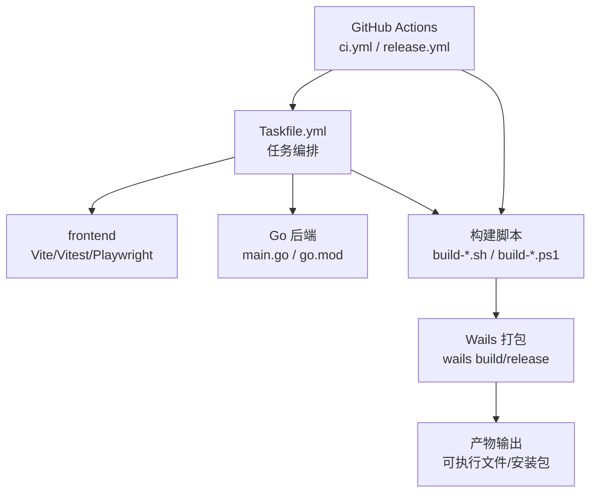
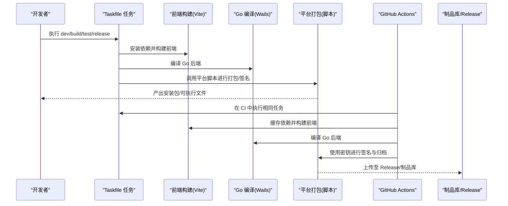
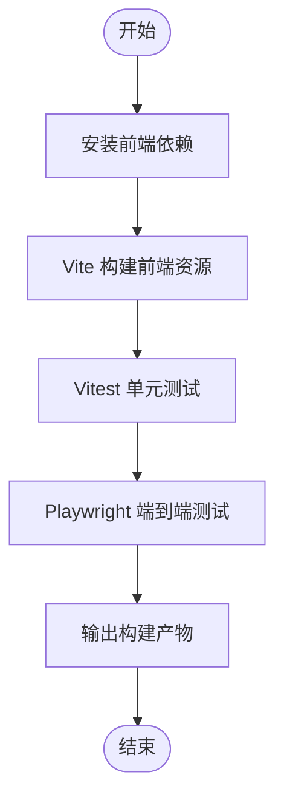
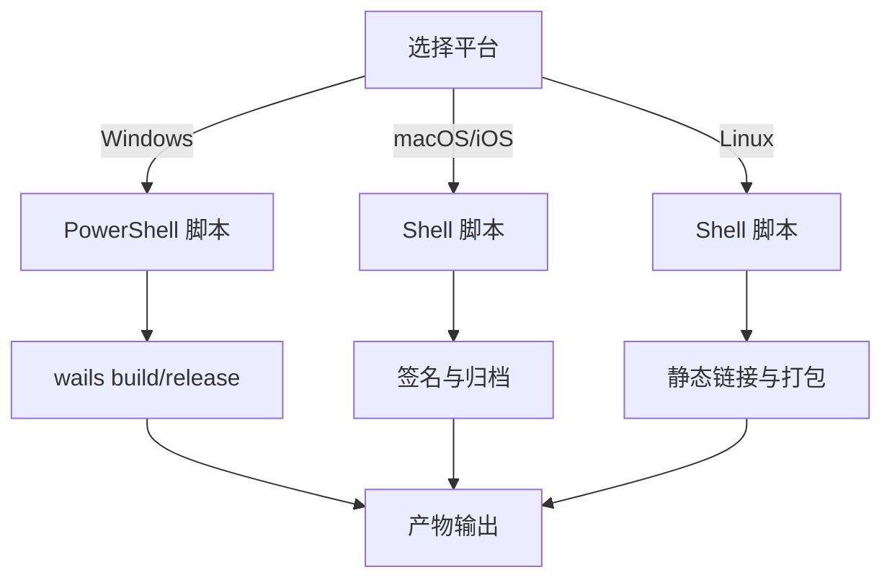
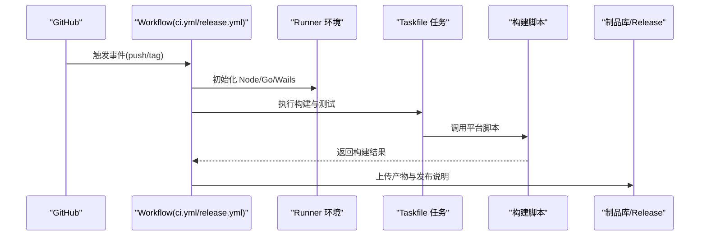
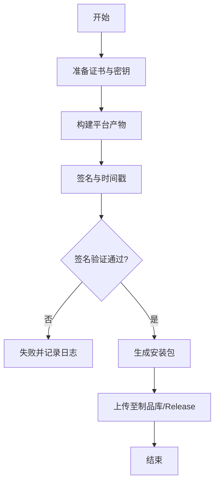
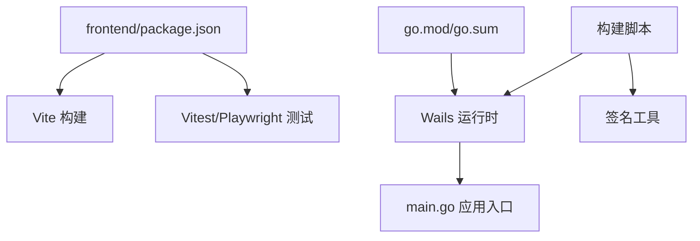

# 构建与部署

<cite>
**本文引用的文件**   
- [Taskfile.yml](file://Taskfile.yml)
- [main.go](file://main.go)
- [go.mod](file://go.mod)
- [package.json](file://package.json)
- [frontend/package.json](file://frontend/package.json)
- [frontend/vite.config.ts](file://frontend/vite.config.ts)
- [frontend/playwright.config.ts](file://frontend/playwright.config.ts)
- [scripts/build-android.ps1](file://scripts/build-android.ps1)
- [scripts/build-darwin.sh](file://scripts/build-darwin.sh)
- [scripts/build-ios.sh](file://scripts/build-ios.sh)
- [scripts/build-linux.sh](file://scripts/build-linux.sh)
- [scripts/wails/build.ps1](file://scripts/wails/build.ps1)
- [scripts/wails/release.ps1](file://scripts/wails/release.ps1)
- [scripts/setup-github-secrets.ps1](file://scripts/setup-github-secrets.ps1)
- [.github/workflows/ci.yml](file://.github/workflows/ci.yml)
- [.github/workflows/release.yml](file://.github/workflows/release.yml)
</cite>

## 目录
1. [简介](#简介)
2. [项目结构](#项目结构)
3. [核心组件](#核心组件)
4. [架构总览](#架构总览)
5. [详细组件分析](#详细组件分析)
6. [依赖关系分析](#依赖关系分析)
7. [性能考量](#性能考量)
8. [故障排除指南](#故障排除指南)
9. [结论](#结论)
10. [附录](#附录)

## 简介
本文件面向跨平台桌面/移动应用的自动化构建与部署，覆盖以下主题：
- 任务编排与脚本体系（Taskfile、各平台构建脚本）
- 依赖管理与版本控制策略
- CI/CD 工作流（GitHub Actions）：自动化测试、代码质量检查、打包与发布
- 应用签名与打包流程（数字证书管理、安全校验、安装包生成）
- 多环境部署策略（开发、测试、生产差异化配置）
- 常见问题与排障建议

## 项目结构
仓库采用“前端 + Go 后端 + 多平台构建脚本 + GitHub Actions”的混合工程组织方式。关键目录与职责如下：
- 根级 Taskfile.yml：统一的任务入口，串联前端构建、Go 编译、平台打包等步骤
- main.go：应用入口，承载 Wails v3 绑定与运行时初始化
- go.mod/go.sum：Go 模块与依赖锁定
- frontend：Web 前端资源与 Vite/Vitest/Playwright 工具链
- scripts：跨平台构建与辅助脚本（Windows PowerShell、macOS/Linux Shell）
- .github/workflows：CI/CD 流水线定义

图表来源
- [Taskfile.yml](file://Taskfile.yml)
- [main.go](file://main.go)
- [go.mod](file://go.mod)
- [frontend/vite.config.ts](file://frontend/vite.config.ts)
- [scripts/wails/build.ps1](file://scripts/wails/build.ps1)

章节来源
- [Taskfile.yml](file://Taskfile.yml)
- [main.go](file://main.go)
- [go.mod](file://go.mod)
- [frontend/vite.config.ts](file://frontend/vite.config.ts)

## 核心组件
- 任务编排器（Taskfile.yml）
  - 提供统一的 dev/build/test/release 任务，屏蔽平台差异
  - 组合前端构建、Go 编译、Wails 打包、签名与归档
- 前端构建（Vite）
  - 通过 vite.config.ts 控制构建目标、资源路径、环境变量注入
  - Vitest 单元测试与 Playwright 端到端测试
- Go 后端（Wails v3）
  - main.go 作为应用入口，负责窗口、菜单、事件绑定与资源加载
  - go.mod 管理 Go 依赖与版本锁定
- 平台构建脚本
  - Windows: PowerShell 脚本调用 wails build/release
  - macOS/iOS: Shell 脚本处理签名与分发
  - Linux: Shell 脚本完成静态链接与包生成
- CI/CD（GitHub Actions）
  - ci.yml：拉取代码、缓存依赖、运行测试与质量检查
  - release.yml：触发条件、构建产物、签名与发布

章节来源
- [Taskfile.yml](file://Taskfile.yml)
- [frontend/vite.config.ts](file://frontend/vite.config.ts)
- [frontend/playwright.config.ts](file://frontend/playwright.config.ts)
- [main.go](file://main.go)
- [go.mod](file://go.mod)
- [scripts/wails/build.ps1](file://scripts/wails/build.ps1)
- [scripts/wails/release.ps1](file://scripts/wails/release.ps1)
- [scripts/build-darwin.sh](file://scripts/build-darwin.sh)
- [scripts/build-ios.sh](file://scripts/build-ios.sh)
- [scripts/build-linux.sh](file://scripts/build-linux.sh)
- [scripts/build-android.ps1](file://scripts/build-android.ps1)

## 架构总览
下图展示从代码提交到产物的端到端构建与发布流程，包括本地开发与 CI 两条路径。

图表来源
- [Taskfile.yml](file://Taskfile.yml)
- [frontend/vite.config.ts](file://frontend/vite.config.ts)
- [scripts/wails/build.ps1](file://scripts/wails/build.ps1)
- [scripts/wails/release.ps1](file://scripts/wails/release.ps1)
- [.github/workflows/ci.yml](file://.github/workflows/ci.yml)
- [.github/workflows/release.yml](file://.github/workflows/release.yml)

## 详细组件分析

### 任务编排（Taskfile.yml）
- 作用
  - 统一入口，封装跨平台差异
  - 组合前端构建、Go 编译、Wails 打包、签名与归档
- 典型任务
  - dev：启动前端热重载与后端调试
  - build：构建前端与 Go 后端
  - test：运行单元测试与端到端测试
  - release：按平台生成安装包并进行签名
- 注意事项
  - 确保 Node.js、Go、Wails CLI 已安装且版本匹配
  - 不同平台的签名证书与环境变量需提前配置

章节来源
- [Taskfile.yml](file://Taskfile.yml)

### 前端构建与测试（Vite/Vitest/Playwright）
- 构建配置（vite.config.ts）
  - 指定构建模式、资源路径、环境变量注入
  - 控制输出目录与压缩选项
- 测试配置（playwright.config.ts）
  - 浏览器选择、视口设置、超时与重试策略
  - 与 Wails 集成的 fixture 与断言
- 依赖管理（frontend/package.json）
  - 声明前端依赖与脚本命令
  - 与根 package.json 协同管理

图表来源
- [frontend/vite.config.ts](file://frontend/vite.config.ts)
- [frontend/playwright.config.ts](file://frontend/playwright.config.ts)
- [frontend/package.json](file://frontend/package.json)

章节来源
- [frontend/vite.config.ts](file://frontend/vite.config.ts)
- [frontend/playwright.config.ts](file://frontend/playwright.config.ts)
- [frontend/package.json](file://frontend/package.json)

### Go 后端与 Wails 集成（main.go / go.mod）
- 应用入口（main.go）
  - 初始化 Wails 应用、注册路由与事件
  - 加载前端资源、配置窗口与菜单
- 依赖管理（go.mod）
  - 锁定 Go 模块版本，保证构建可重复性
  - 配合 go.sum 校验依赖完整性

章节来源
- [main.go](file://main.go)
- [go.mod](file://go.mod)

### 平台构建脚本
- Windows（PowerShell）
  - scripts/wails/build.ps1：调用 wails build 生成 Windows 可执行文件
  - scripts/wails/release.ps1：执行签名、归档与发布准备
  - scripts/build-android.ps1：Android 平台构建（如需）
- macOS/iOS（Shell）
  - scripts/build-darwin.sh：macOS 应用构建与签名
  - scripts/build-ios.sh：iOS 应用构建与签名
- Linux（Shell）
  - scripts/build-linux.sh：Linux 静态链接与包生成

图表来源
- [scripts/wails/build.ps1](file://scripts/wails/build.ps1)
- [scripts/wails/release.ps1](file://scripts/wails/release.ps1)
- [scripts/build-darwin.sh](file://scripts/build-darwin.sh)
- [scripts/build-ios.sh](file://scripts/build-ios.sh)
- [scripts/build-linux.sh](file://scripts/build-linux.sh)
- [scripts/build-android.ps1](file://scripts/build-android.ps1)

章节来源
- [scripts/wails/build.ps1](file://scripts/wails/build.ps1)
- [scripts/wails/release.ps1](file://scripts/wails/release.ps1)
- [scripts/build-darwin.sh](file://scripts/build-darwin.sh)
- [scripts/build-ios.sh](file://scripts/build-ios.sh)
- [scripts/build-linux.sh](file://scripts/build-linux.sh)
- [scripts/build-android.ps1](file://scripts/build-android.ps1)

### CI/CD 工作流（GitHub Actions）
- 持续集成（ci.yml）
  - 触发条件：push/PR
  - 步骤：设置 Node/Go 环境、缓存依赖、构建前端与后端、运行测试与质量检查
- 持续部署（release.yml）
  - 触发条件：tag 或手动触发
  - 步骤：构建多平台产物、签名、生成 Release 并上传制品

图表来源
- [.github/workflows/ci.yml](file://.github/workflows/ci.yml)
- [.github/workflows/release.yml](file://.github/workflows/release.yml)
- [Taskfile.yml](file://Taskfile.yml)
- [scripts/wails/build.ps1](file://scripts/wails/build.ps1)
- [scripts/wails/release.ps1](file://scripts/wails/release.ps1)

章节来源
- [.github/workflows/ci.yml](file://.github/workflows/ci.yml)
- [.github/workflows/release.yml](file://.github/workflows/release.yml)

### 应用签名与打包流程
- 数字证书管理
  - Windows：使用 signtool 与证书文件（PFX/P12），通过环境变量或密钥库访问
  - macOS/iOS：使用 Apple Developer 证书与配置文件，结合 Keychain 或 CI 密钥
  - Android：使用 keystore 与签名参数
- 安全验证
  - 校验签名有效性、时间戳服务器可达性
  - 对产物进行哈希校验与完整性检查
- 安装包生成
  - Windows：MSI/EXE 打包与签名
  - macOS：dmg/pkg 打包与签名
  - iOS：IPA 打包与签名
  - Linux：deb/rpm 打包与校验

图表来源
- [scripts/wails/release.ps1](file://scripts/wails/release.ps1)
- [scripts/build-darwin.sh](file://scripts/build-darwin.sh)
- [scripts/build-ios.sh](file://scripts/build-ios.sh)
- [scripts/build-linux.sh](file://scripts/build-linux.sh)
- [scripts/build-android.ps1](file://scripts/build-android.ps1)
- [scripts/setup-github-secrets.ps1](file://scripts/setup-github-secrets.ps1)

章节来源
- [scripts/wails/release.ps1](file://scripts/wails/release.ps1)
- [scripts/build-darwin.sh](file://scripts/build-darwin.sh)
- [scripts/build-ios.sh](file://scripts/build-ios.sh)
- [scripts/build-linux.sh](file://scripts/build-linux.sh)
- [scripts/build-android.ps1](file://scripts/build-android.ps1)
- [scripts/setup-github-secrets.ps1](file://scripts/setup-github-secrets.ps1)

### 多环境部署策略
- 开发环境
  - 启用前端热重载与后端调试
  - 关闭严格签名与优化，提升迭代速度
- 测试环境
  - 启用完整测试套件（单元+E2E）
  - 使用测试证书与沙箱资源
- 生产环境
  - 启用严格签名与完整性校验
  - 最小化依赖与资源体积，开启压缩与缓存策略

章节来源
- [Taskfile.yml](file://Taskfile.yml)
- [frontend/vite.config.ts](file://frontend/vite.config.ts)
- [frontend/playwright.config.ts](file://frontend/playwright.config.ts)

## 依赖关系分析
- 前端依赖
  - 由 frontend/package.json 管理，包含构建、测试与工具链
- Go 依赖
  - 由 go.mod 与 go.sum 管理，确保可重复构建
- 外部工具
  - Node.js、Go、Wails CLI、平台 SDK（Xcode/Android Studio）、签名工具

图表来源
- [frontend/package.json](file://frontend/package.json)
- [go.mod](file://go.mod)
- [main.go](file://main.go)
- [scripts/wails/build.ps1](file://scripts/wails/build.ps1)

章节来源
- [frontend/package.json](file://frontend/package.json)
- [go.mod](file://go.mod)
- [main.go](file://main.go)

## 性能考量
- 构建缓存
  - 利用 Node/Go 依赖缓存减少冷启动时间
  - 前端资源增量构建与分包策略
- 并行化
  - 多平台构建并行执行（CI 矩阵）
  - 前后端构建解耦，避免阻塞
- 产物优化
  - 启用压缩与 Tree-shaking
  - 按需加载资源与懒加载模型

[本节为通用指导，不直接分析具体文件]

## 故障排除指南
- 常见构建问题
  - Node/Go 版本不匹配：确认 Runner 或本地环境版本与脚本要求一致
  - 签名失败：检查证书有效期、Keychain/Keystore 权限与时间戳服务器连通性
  - 前端资源 404：核对 Vite 构建输出路径与 Wails 资源挂载路径
  - 测试失败：检查 Playwright 浏览器安装与视口配置
- 定位方法
  - 查看 CI 日志中的错误堆栈与退出码
  - 在本地复现时逐步执行 Taskfile 任务以隔离问题
  - 使用脚本提供的详细日志输出定位签名与打包环节

章节来源
- [scripts/wails/build.ps1](file://scripts/wails/build.ps1)
- [scripts/wails/release.ps1](file://scripts/wails/release.ps1)
- [scripts/build-darwin.sh](file://scripts/build-darwin.sh)
- [scripts/build-ios.sh](file://scripts/build-ios.sh)
- [scripts/build-linux.sh](file://scripts/build-linux.sh)
- [scripts/build-android.ps1](file://scripts/build-android.ps1)
- [frontend/playwright.config.ts](file://frontend/playwright.config.ts)

## 结论
通过 Taskfile 统一编排、平台脚本解耦与 GitHub Actions 自动化，本项目实现了跨平台的高效构建与稳定发布。建议在 CI 中完善缓存与并行策略，并在签名环节引入更严格的校验与审计，以提升整体可靠性与安全性。

[本节为总结性内容，不直接分析具体文件]

## 附录
- 快速上手
  - 安装 Node.js、Go、Wails CLI 与平台 SDK
  - 配置必要的环境变量与密钥（参考 setup 脚本）
  - 执行 Taskfile 任务进行本地构建与测试
- 参考脚本与配置
  - 任务编排：Taskfile.yml
  - 前端构建：frontend/vite.config.ts
  - 端到端测试：frontend/playwright.config.ts
  - 平台脚本：scripts/*
  - CI 工作流：.github/workflows/*.yml

章节来源
- [Taskfile.yml](file://Taskfile.yml)
- [frontend/vite.config.ts](file://frontend/vite.config.ts)
- [frontend/playwright.config.ts](file://frontend/playwright.config.ts)
- [scripts/setup-github-secrets.ps1](file://scripts/setup-github-secrets.ps1)
- [.github/workflows/ci.yml](file://.github/workflows/ci.yml)
- [.github/workflows/release.yml](file://.github/workflows/release.yml)