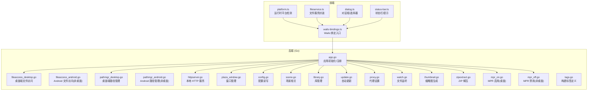
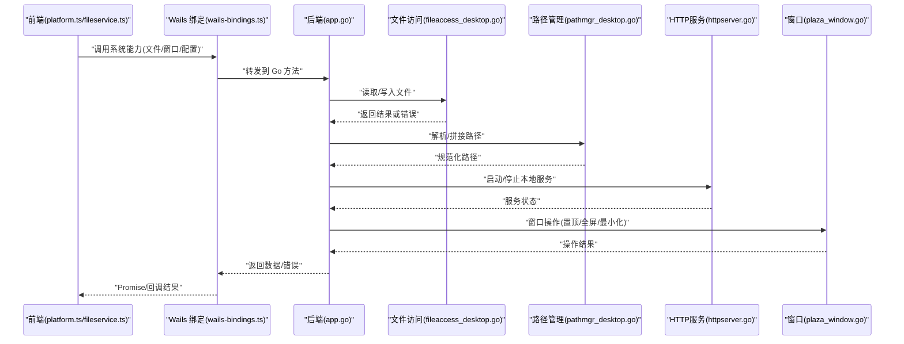
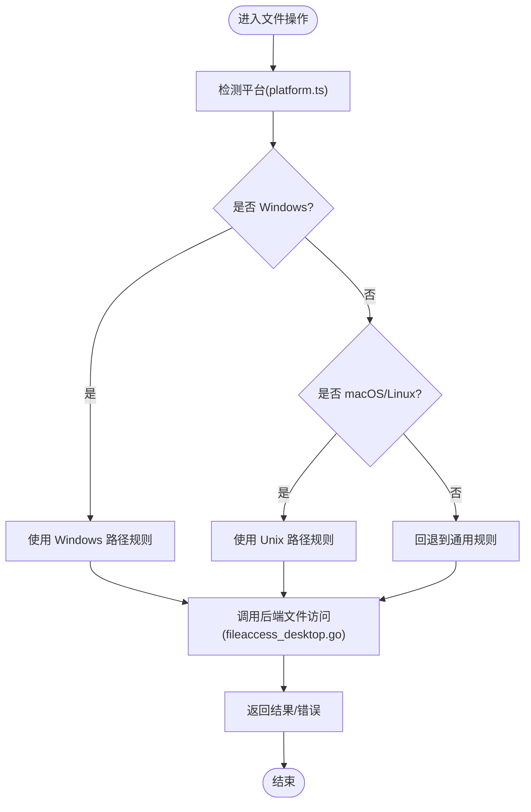
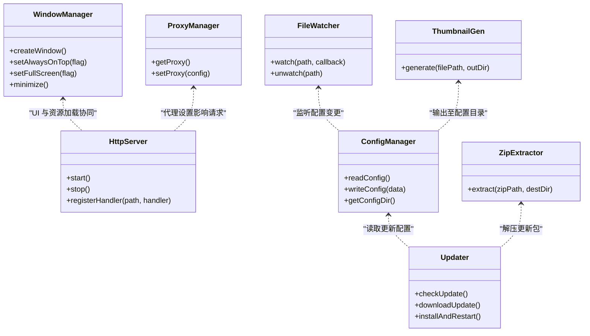
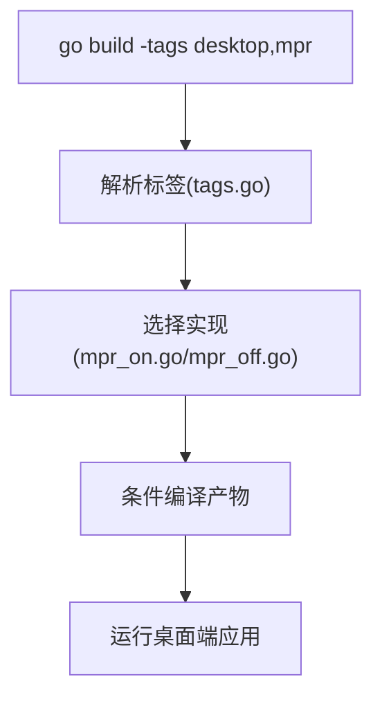
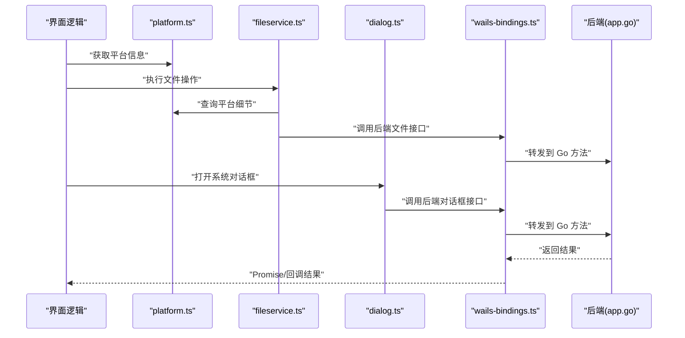
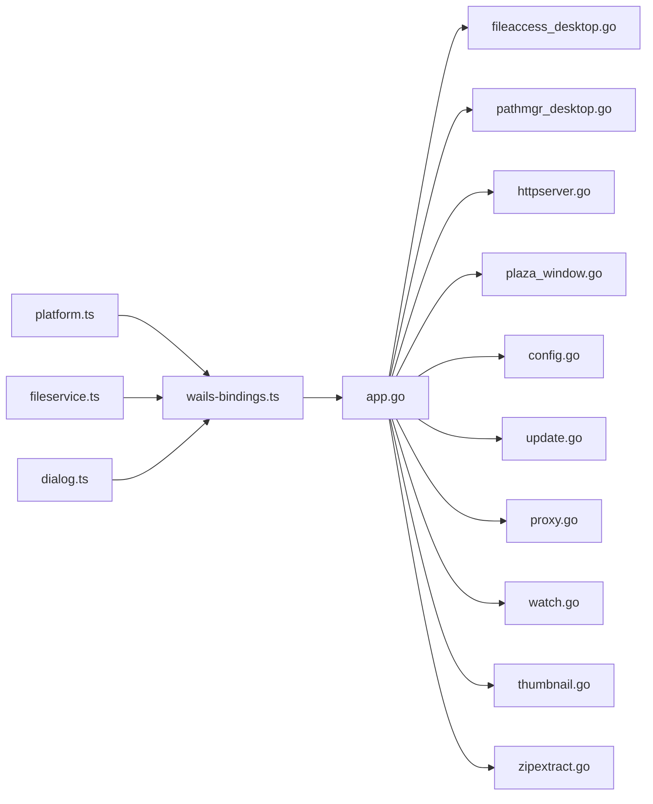

# 桌面端平台适配

<cite>
**本文引用的文件**   
- [main.go](file://main.go)
- [app.go](file://internal/app/app.go)
- [fileaccess_desktop.go](file://internal/app/fileaccess_desktop.go)
- [fileaccess_android.go](file://internal/app/fileaccess_android.go)
- [pathmgr_desktop.go](file://internal/app/pathmgr_desktop.go)
- [pathmgr_android.go](file://internal/app/pathmgr_android.go)
- [tags.go](file://internal/app/tags.go)
- [httpserver.go](file://internal/app/httpserver.go)
- [plaza_window.go](file://internal/app/plaza_window.go)
- [config.go](file://internal/app/config.go)
- [scene.go](file://internal/app/scene.go)
- [library.go](file://internal/app/library.go)
- [update.go](file://internal/app/update.go)
- [proxy.go](file://internal/app/proxy.go)
- [watch.go](file://internal/app/watch.go)
- [thumbnail.go](file://internal/app/thumbnail.go)
- [zipextract.go](file://internal/app/zipextract.go)
- [mpr_on.go](file://internal/app/mpr_on.go)
- [mpr_off.go](file://internal/app/mpr_off.go)
- [platform.ts](file://frontend/src/core/platform.ts)
- [wails-bindings.ts](file://frontend/src/core/wails-bindings.ts)
- [fileservice.ts](file://frontend/src/core/fileservice.ts)
- [dialog.ts](file://frontend/src/core/dialog.ts)
- [status-bar.ts](file://frontend/src/core/status-bar.ts)
- [build-darwin.sh](file://scripts/build-darwin.sh)
- [build-linux.sh](file://scripts/build-linux.sh)
- [build.ps1](file://scripts/wails/build.ps1)
</cite>

## 目录
1. [简介](#简介)
2. [项目结构](#项目结构)
3. [核心组件](#核心组件)
4. [架构总览](#架构总览)
5. [详细组件分析](#详细组件分析)
6. [依赖关系分析](#依赖关系分析)
7. [性能考虑](#性能考虑)
8. [故障排查指南](#故障排查指南)
9. [结论](#结论)
10. [附录](#附录)

## 简介
本文件面向桌面端（Windows、macOS、Linux）平台适配，聚焦以下目标：
- 文件系统访问差异处理与统一抽象
- 窗口管理与系统集成功能（通知、剪贴板、文件关联等）在三大平台的实现要点
- Go 后端通过构建标签与条件编译隔离平台特定代码
- 前端通过运行时平台检测与桥接层进行功能适配
- 提供各平台开发环境搭建、调试技巧与常见问题解决方案
- 给出跨平台差异处理的示例路径与性能优化建议

## 项目结构
本项目采用“Go 后端 + Wails 前端”的桌面应用架构。后端负责系统能力（文件、窗口、更新、代理等），前端通过 Wails 绑定调用后端能力，并在必要时根据运行时平台做差异化逻辑。

图表来源
- [platform.ts](file://frontend/src/core/platform.ts)
- [wails-bindings.ts](file://frontend/src/core/wails-bindings.ts)
- [fileservice.ts](file://frontend/src/core/fileservice.ts)
- [dialog.ts](file://frontend/src/core/dialog.ts)
- [status-bar.ts](file://frontend/src/core/status-bar.ts)
- [app.go](file://internal/app/app.go)
- [fileaccess_desktop.go](file://internal/app/fileaccess_desktop.go)
- [pathmgr_desktop.go](file://internal/app/pathmgr_desktop.go)
- [httpserver.go](file://internal/app/httpserver.go)
- [plaza_window.go](file://internal/app/plaza_window.go)
- [config.go](file://internal/app/config.go)
- [scene.go](file://internal/app/scene.go)
- [library.go](file://internal/app/library.go)
- [update.go](file://internal/app/update.go)
- [proxy.go](file://internal/app/proxy.go)
- [watch.go](file://internal/app/watch.go)
- [thumbnail.go](file://internal/app/thumbnail.go)
- [zipextract.go](file://internal/app/zipextract.go)
- [mpr_on.go](file://internal/app/mpr_on.go)
- [mpr_off.go](file://internal/app/mpr_off.go)
- [tags.go](file://internal/app/tags.go)

章节来源
- [main.go](file://main.go)
- [app.go](file://internal/app/app.go)
- [platform.ts](file://frontend/src/core/platform.ts)
- [wails-bindings.ts](file://frontend/src/core/wails-bindings.ts)

## 核心组件
- 平台检测与适配（前端）
  - platform.ts：提供运行时平台信息（如 Windows/macOS/Linux），供 UI 与业务逻辑分支使用。
  - fileservice.ts：对文件操作进行封装，内部可结合 platform.ts 做路径分隔符、大小写敏感等差异处理。
  - dialog.ts：封装系统对话框（打开/保存/选择文件夹等），在不同平台下调用不同 API。
  - status-bar.ts：状态栏/提示，用于展示平台相关的提示信息或错误。
- 系统能力（后端）
  - fileaccess_desktop.go / pathmgr_desktop.go：桌面端文件访问与路径管理的具体实现。
  - httpserver.go：启动本地 HTTP 服务，为前端资源加载、API 代理等提供支持。
  - plaza_window.go：窗口管理（创建、置顶、全屏、最小化等）。
  - config.go：应用配置读写，涉及跨平台路径与权限。
  - update.go：自动更新流程（下载、校验、重启）。
  - proxy.go：网络代理设置（影响浏览器内核与网络请求）。
  - watch.go：文件变更监听（用于热重载或增量同步）。
  - thumbnail.go：缩略图生成（可能依赖平台图形库）。
  - zipextract.go：ZIP 解压（用于资源包、模型包等）。
  - mpr_on.go / mpr_off.go：基于构建标签控制 MPR（媒体处理器）功能的启用/禁用。
  - tags.go：集中定义构建标签，配合 go build 的 -tags 参数进行条件编译。

章节来源
- [platform.ts](file://frontend/src/core/platform.ts)
- [fileservice.ts](file://frontend/src/core/fileservice.ts)
- [dialog.ts](file://frontend/src/core/dialog.ts)
- [status-bar.ts](file://frontend/src/core/status-bar.ts)
- [fileaccess_desktop.go](file://internal/app/fileaccess_desktop.go)
- [pathmgr_desktop.go](file://internal/app/pathmgr_desktop.go)
- [httpserver.go](file://internal/app/httpserver.go)
- [plaza_window.go](file://internal/app/plaza_window.go)
- [config.go](file://internal/app/config.go)
- [update.go](file://internal/app/update.go)
- [proxy.go](file://internal/app/proxy.go)
- [watch.go](file://internal/app/watch.go)
- [thumbnail.go](file://internal/app/thumbnail.go)
- [zipextract.go](file://internal/app/zipextract.go)
- [mpr_on.go](file://internal/app/mpr_on.go)
- [mpr_off.go](file://internal/app/mpr_off.go)
- [tags.go](file://internal/app/tags.go)

## 架构总览
下图展示了从前端到后端的典型调用链，以及平台差异点的位置。

图表来源
- [platform.ts](file://frontend/src/core/platform.ts)
- [fileservice.ts](file://frontend/src/core/fileservice.ts)
- [wails-bindings.ts](file://frontend/src/core/wails-bindings.ts)
- [app.go](file://internal/app/app.go)
- [fileaccess_desktop.go](file://internal/app/fileaccess_desktop.go)
- [pathmgr_desktop.go](file://internal/app/pathmgr_desktop.go)
- [httpserver.go](file://internal/app/httpserver.go)
- [plaza_window.go](file://internal/app/plaza_window.go)

## 详细组件分析

### 文件系统访问差异处理
- 后端抽象与实现
  - 桌面端实现位于 fileaccess_desktop.go，提供统一的读/写/枚举接口，内部处理路径分隔符、大小写敏感、权限检查等差异。
  - Android 实现位于 fileaccess_android.go，作为非桌面分支存在，避免引入桌面无关依赖。
- 路径管理
  - pathmgr_desktop.go 负责用户目录、缓存目录、配置文件目录等路径的获取与规范化，确保跨平台一致。
  - pathmgr_android.go 为非桌面分支，提供对应平台的路径策略。
- 前端适配
  - fileservice.ts 在前端侧封装常用文件操作，必要时依据 platform.ts 的平台信息进行路径拼接或行为调整。
  - dialog.ts 封装系统对话框，针对不同平台调用不同的选择器 API。

图表来源
- [platform.ts](file://frontend/src/core/platform.ts)
- [fileservice.ts](file://frontend/src/core/fileservice.ts)
- [fileaccess_desktop.go](file://internal/app/fileaccess_desktop.go)
- [pathmgr_desktop.go](file://internal/app/pathmgr_desktop.go)

章节来源
- [fileaccess_desktop.go](file://internal/app/fileaccess_desktop.go)
- [fileaccess_android.go](file://internal/app/fileaccess_android.go)
- [pathmgr_desktop.go](file://internal/app/pathmgr_desktop.go)
- [pathmgr_android.go](file://internal/app/pathmgr_android.go)
- [fileservice.ts](file://frontend/src/core/fileservice.ts)
- [dialog.ts](file://frontend/src/core/dialog.ts)

### 窗口管理与系统集成功能
- 窗口管理
  - plaza_window.go 提供窗口创建、置顶、全屏、最小化等能力，适用于桌面端。
- 本地 HTTP 服务
  - httpserver.go 启动本地服务，便于前端资源加载、API 代理、WebSocket 通信等。
- 配置与路径
  - config.go 负责配置文件的读写，需考虑不同平台的默认路径与权限。
- 自动更新
  - update.go 提供版本检查、下载、安装与重启流程，需处理平台特定的安装包格式与签名验证。
- 代理设置
  - proxy.go 设置系统或浏览器内核代理，影响网络请求行为。
- 文件监听
  - watch.go 监听文件或目录变化，支持热重载或增量同步。
- 缩略图与压缩
  - thumbnail.go 生成缩略图，可能依赖平台图形库。
  - zipextract.go 解压 ZIP 包，用于资源包或模型包。

图表来源
- [plaza_window.go](file://internal/app/plaza_window.go)
- [httpserver.go](file://internal/app/httpserver.go)
- [config.go](file://internal/app/config.go)
- [update.go](file://internal/app/update.go)
- [proxy.go](file://internal/app/proxy.go)
- [watch.go](file://internal/app/watch.go)
- [thumbnail.go](file://internal/app/thumbnail.go)
- [zipextract.go](file://internal/app/zipextract.go)

章节来源
- [plaza_window.go](file://internal/app/plaza_window.go)
- [httpserver.go](file://internal/app/httpserver.go)
- [config.go](file://internal/app/config.go)
- [update.go](file://internal/app/update.go)
- [proxy.go](file://internal/app/proxy.go)
- [watch.go](file://internal/app/watch.go)
- [thumbnail.go](file://internal/app/thumbnail.go)
- [zipextract.go](file://internal/app/zipextract.go)

### 构建标签与条件编译
- 标签定义
  - tags.go 集中定义构建标签，便于通过 go build -tags 控制功能开关。
- 平台分支
  - mpr_on.go 与 mpr_off.go 分别实现 MPR 功能的启用与禁用，按标签选择编译。
- 非桌面分支
  - fileaccess_android.go 与 pathmgr_android.go 作为非桌面分支，避免引入桌面依赖。

图表来源
- [tags.go](file://internal/app/tags.go)
- [mpr_on.go](file://internal/app/mpr_on.go)
- [mpr_off.go](file://internal/app/mpr_off.go)

章节来源
- [tags.go](file://internal/app/tags.go)
- [mpr_on.go](file://internal/app/mpr_on.go)
- [mpr_off.go](file://internal/app/mpr_off.go)
- [fileaccess_android.go](file://internal/app/fileaccess_android.go)
- [pathmgr_android.go](file://internal/app/pathmgr_android.go)

### 前端运行时平台检测与功能适配
- platform.ts 提供平台信息（如 Windows/macOS/Linux），供 UI 与业务逻辑分支使用。
- fileservice.ts 在文件操作中根据平台信息调整路径分隔符、大小写敏感等差异。
- dialog.ts 根据不同平台调用对应的系统对话框 API。
- wails-bindings.ts 作为 Wails 绑定入口，将前端调用转发到后端方法。

图表来源
- [platform.ts](file://frontend/src/core/platform.ts)
- [fileservice.ts](file://frontend/src/core/fileservice.ts)
- [dialog.ts](file://frontend/src/core/dialog.ts)
- [wails-bindings.ts](file://frontend/src/core/wails-bindings.ts)
- [app.go](file://internal/app/app.go)

章节来源
- [platform.ts](file://frontend/src/core/platform.ts)
- [fileservice.ts](file://frontend/src/core/fileservice.ts)
- [dialog.ts](file://frontend/src/core/dialog.ts)
- [wails-bindings.ts](file://frontend/src/core/wails-bindings.ts)

## 依赖关系分析
- 前端依赖
  - platform.ts 被多个模块引用以进行平台判断。
  - fileservice.ts 与 dialog.ts 依赖 wails-bindings.ts 与后端能力。
- 后端依赖
  - app.go 聚合并注册各子系统（文件、窗口、配置、更新、代理、监听、缩略图、压缩等）。
  - 平台特定实现通过构建标签与非桌面分支隔离。

图表来源
- [platform.ts](file://frontend/src/core/platform.ts)
- [wails-bindings.ts](file://frontend/src/core/wails-bindings.ts)
- [fileservice.ts](file://frontend/src/core/fileservice.ts)
- [dialog.ts](file://frontend/src/core/dialog.ts)
- [app.go](file://internal/app/app.go)
- [fileaccess_desktop.go](file://internal/app/fileaccess_desktop.go)
- [pathmgr_desktop.go](file://internal/app/pathmgr_desktop.go)
- [httpserver.go](file://internal/app/httpserver.go)
- [plaza_window.go](file://internal/app/plaza_window.go)
- [config.go](file://internal/app/config.go)
- [update.go](file://internal/app/update.go)
- [proxy.go](file://internal/app/proxy.go)
- [watch.go](file://internal/app/watch.go)
- [thumbnail.go](file://internal/app/thumbnail.go)
- [zipextract.go](file://internal/app/zipextract.go)

章节来源
- [app.go](file://internal/app/app.go)
- [fileaccess_desktop.go](file://internal/app/fileaccess_desktop.go)
- [pathmgr_desktop.go](file://internal/app/pathmgr_desktop.go)
- [httpserver.go](file://internal/app/httpserver.go)
- [plaza_window.go](file://internal/app/plaza_window.go)
- [config.go](file://internal/app/config.go)
- [update.go](file://internal/app/update.go)
- [proxy.go](file://internal/app/proxy.go)
- [watch.go](file://internal/app/watch.go)
- [thumbnail.go](file://internal/app/thumbnail.go)
- [zipextract.go](file://internal/app/zipextract.go)

## 性能考虑
- 文件 I/O
  - 批量操作优先：合并多次读写，减少系统调用次数。
  - 异步与流式处理：大文件读取/写入使用流式接口，避免阻塞主线程。
  - 路径规范化：统一路径处理，减少重复计算。
- 窗口与渲染
  - 避免频繁切换全屏/置顶：批量窗口操作，减少重绘开销。
  - 合理设置窗口透明度与阴影：在高 DPI 设备上谨慎使用特效。
- 网络与代理
  - 复用连接：HTTP 客户端保持连接池，减少握手开销。
  - 代理设置生效范围：仅在需要时修改代理，避免全局影响。
- 更新与压缩
  - 增量更新：优先差分更新，减少下载体积。
  - 并行解压：多线程解压 ZIP，提升速度但注意 CPU 占用。
- 缩略图生成
  - 缓存策略：已生成的缩略图缓存到磁盘，避免重复计算。
  - 异步生成：后台任务生成缩略图，不阻塞 UI。

[本节为通用性能指导，无需具体文件分析]

## 故障排查指南
- 文件访问失败
  - 检查路径是否存在与权限是否正确（config.go、fileaccess_desktop.go）。
  - 确认路径分隔符与大小写敏感问题（fileservice.ts、platform.ts）。
- 窗口操作异常
  - 确认窗口句柄有效与事件循环正常（plaza_window.go）。
  - 检查全屏/置顶状态是否与当前显示管理器兼容。
- 本地 HTTP 服务不可用
  - 检查端口占用与防火墙设置（httpserver.go）。
  - 确认 CORS 与协议头设置正确。
- 自动更新失败
  - 校验签名与哈希值（update.go）。
  - 检查网络连接与代理设置（proxy.go）。
- 文件监听无响应
  - 确认监听路径有效且未被其他进程独占（watch.go）。
  - 检查事件队列与回调是否被阻塞。
- 缩略图缺失或损坏
  - 检查输入文件格式与解码库可用性（thumbnail.go）。
  - 确认输出目录可写。
- 构建标签未生效
  - 确认 go build -tags 参数与 tags.go 中定义的标签一致（tags.go、mpr_on.go、mpr_off.go）。

章节来源
- [config.go](file://internal/app/config.go)
- [fileaccess_desktop.go](file://internal/app/fileaccess_desktop.go)
- [fileservice.ts](file://frontend/src/core/fileservice.ts)
- [platform.ts](file://frontend/src/core/platform.ts)
- [plaza_window.go](file://internal/app/plaza_window.go)
- [httpserver.go](file://internal/app/httpserver.go)
- [update.go](file://internal/app/update.go)
- [proxy.go](file://internal/app/proxy.go)
- [watch.go](file://internal/app/watch.go)
- [thumbnail.go](file://internal/app/thumbnail.go)
- [tags.go](file://internal/app/tags.go)
- [mpr_on.go](file://internal/app/mpr_on.go)
- [mpr_off.go](file://internal/app/mpr_off.go)

## 结论
通过在 Go 后端使用构建标签与非桌面分支隔离平台特定代码，在前端通过 platform.ts 进行运行时平台检测与功能适配，本项目实现了 Windows、macOS、Linux 三大桌面平台的统一体验。文件系统访问、窗口管理、配置、更新、代理、监听、缩略图与压缩等子系统均提供了清晰的职责边界与扩展点。建议在后续迭代中持续完善错误处理、日志记录与性能监控，以提升跨平台稳定性与用户体验。

[本节为总结性内容，无需具体文件分析]

## 附录

### 各平台开发环境搭建指南
- Windows
  - 安装 Go 工具链与 Wails CLI。
  - 使用 scripts/wails/build.ps1 进行构建与打包。
  - 调试：在 IDE 中附加到运行中的进程，或使用 Wails 内置调试模式。
- macOS
  - 安装 Go 工具链与 Wails CLI。
  - 使用 scripts/build-darwin.sh 进行构建与打包。
  - 调试：在终端运行开发模式，查看控制台输出；或在 Xcode 中附加调试器。
- Linux
  - 安装 Go 工具链与 Wails CLI。
  - 使用 scripts/build-linux.sh 进行构建与打包。
  - 调试：在终端运行开发模式，查看控制台输出；或使用 gdb/lldb 附加调试。

章节来源
- [build.ps1](file://scripts/wails/build.ps1)
- [build-darwin.sh](file://scripts/build-darwin.sh)
- [build-linux.sh](file://scripts/build-linux.sh)

### 常见平台差异处理示例路径
- 路径分隔符与大小写敏感
  - 前端：fileservice.ts 根据 platform.ts 的平台信息调整路径拼接与比较逻辑。
  - 后端：fileaccess_desktop.go 与 pathmgr_desktop.go 提供统一接口与路径规范化。
- 系统对话框
  - 前端：dialog.ts 封装打开/保存/选择文件夹等操作，调用后端对应方法。
  - 后端：由 Wails 提供的原生对话框 API 实现。
- 窗口管理
  - 后端：plaza_window.go 提供窗口创建、置顶、全屏、最小化等方法。
- 自动更新
  - 后端：update.go 实现版本检查、下载、安装与重启流程。
- 代理设置
  - 后端：proxy.go 提供代理查询与设置接口。
- 文件监听
  - 后端：watch.go 提供文件与目录监听能力。
- 缩略图与压缩
  - 后端：thumbnail.go 与 zipextract.go 分别提供缩略图生成与 ZIP 解压能力。

章节来源
- [fileservice.ts](file://frontend/src/core/fileservice.ts)
- [platform.ts](file://frontend/src/core/platform.ts)
- [fileaccess_desktop.go](file://internal/app/fileaccess_desktop.go)
- [pathmgr_desktop.go](file://internal/app/pathmgr_desktop.go)
- [dialog.ts](file://frontend/src/core/dialog.ts)
- [plaza_window.go](file://internal/app/plaza_window.go)
- [update.go](file://internal/app/update.go)
- [proxy.go](file://internal/app/proxy.go)
- [watch.go](file://internal/app/watch.go)
- [thumbnail.go](file://internal/app/thumbnail.go)
- [zipextract.go](file://internal/app/zipextract.go)