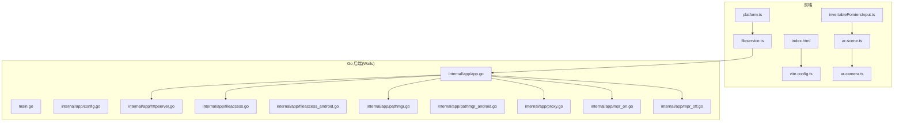
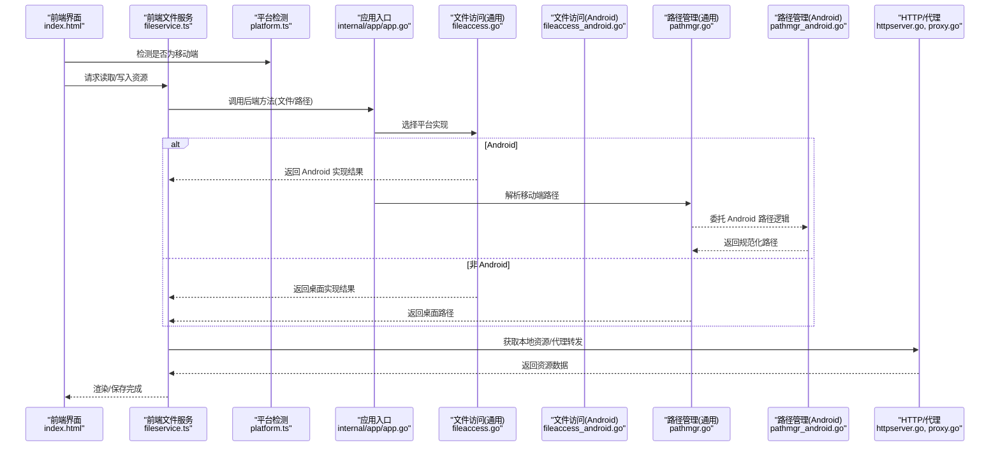
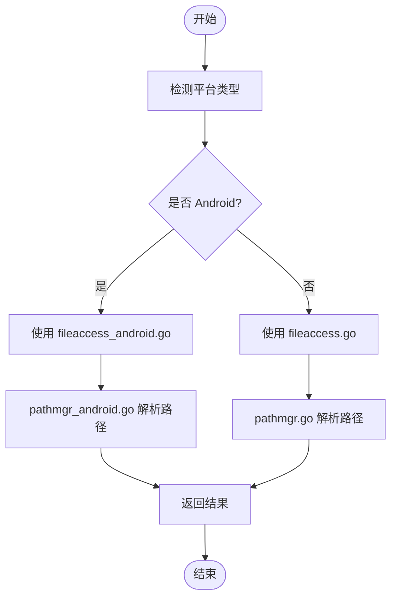
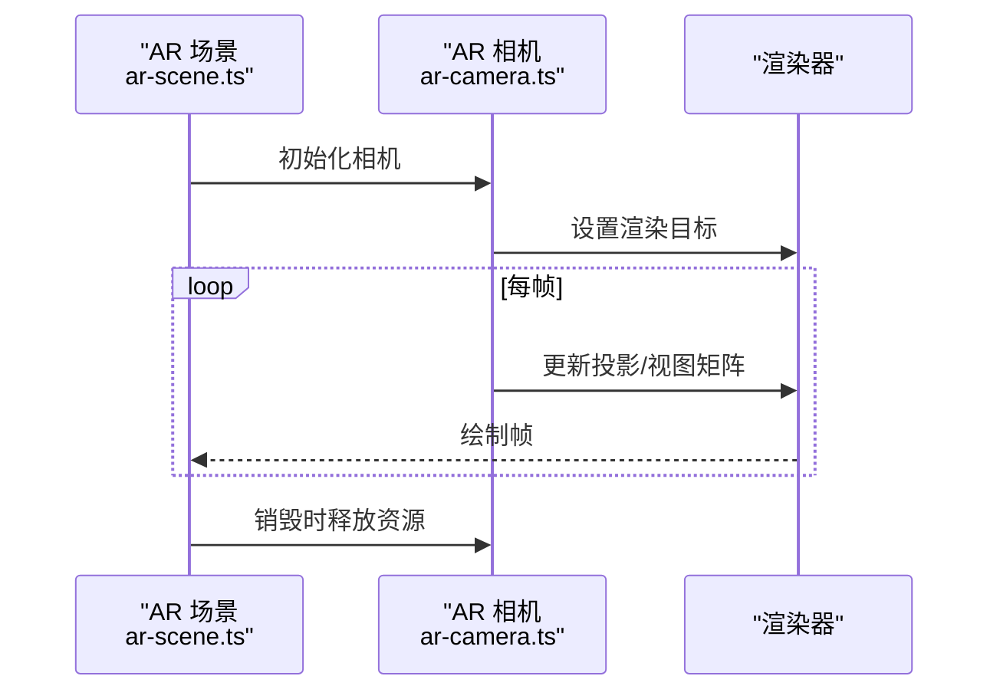
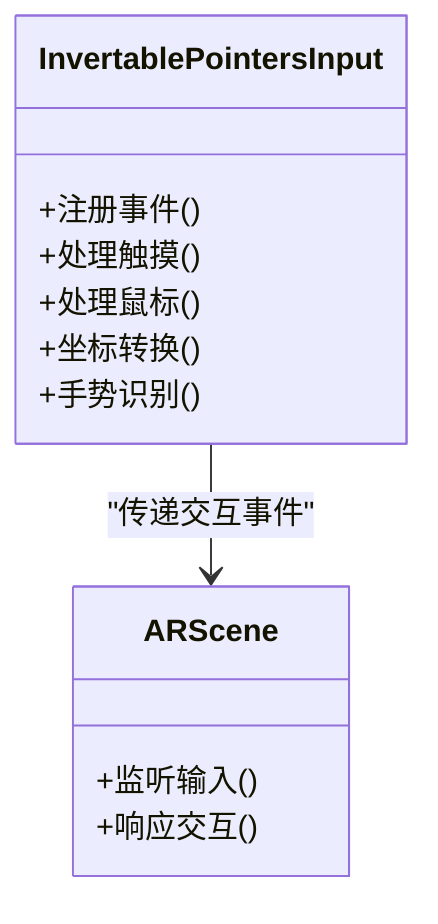
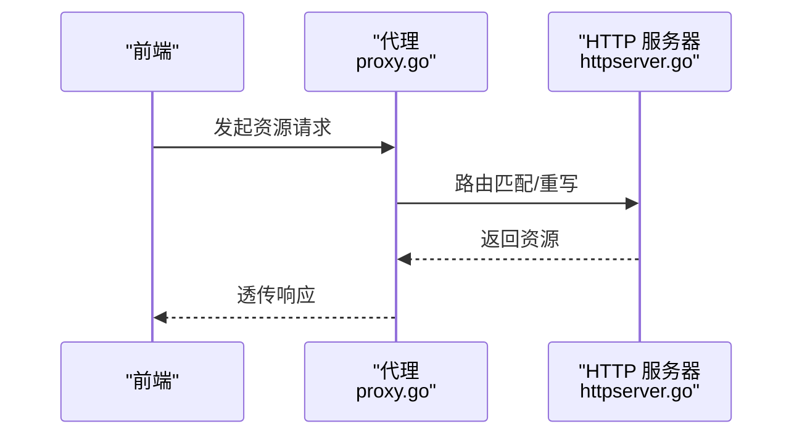
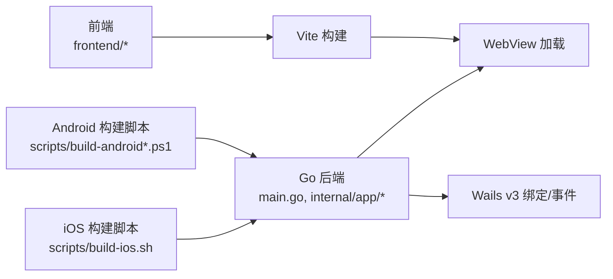

# 移动端平台适配

<cite>
**本文引用的文件**   
- [main.go](file://main.go)
- [app.go](file://internal/app/app.go)
- [config.go](file://internal/app/config.go)
- [httpserver.go](file://internal/app/httpserver.go)
- [fileaccess.go](file://internal/app/fileaccess.go)
- [fileaccess_android.go](file://internal/app/fileaccess_android.go)
- [pathmgr.go](file://internal/app/pathmgr.go)
- [pathmgr_android.go](file://internal/app/pathmgr_android.go)
- [mpr_on.go](file://internal/app/mpr_on.go)
- [mpr_off.go](file://internal/app/mpr_off.go)
- [proxy.go](file://internal/app/proxy.go)
- [build-android.ps1](file://scripts/build-android.ps1)
- [build-ios.sh](file://scripts/build-ios.sh)
- [build-android-so.ps1](file://scripts/build-android-so.ps1)
- [wails build.ps1](file://scripts/wails/build.ps1)
- [wails release.ps1](file://scripts/wails/release.ps1)
- [Taskfile.yml](file://Taskfile.yml)
- [go.mod](file://go.mod)
- [index.html](file://frontend/index.html)
- [vite.config.ts](file://frontend/vite.config.ts)
- [platform.ts](file://frontend/src/core/platform.ts)
- [fileservice.ts](file://frontend/src/core/fileservice.ts)
- [ar-scene.ts](file://frontend/src/scene/ar/ar-scene.ts)
- [ar-camera.ts](file://frontend/src/scene/ar/ar-camera.ts)
- [invertablePointersInput.ts](file://frontend/src/scene/camera/invertablePointersInput.ts)
- [Android 环境下 Wails v3 隐患清单.md](file://docs/research/Android 环境下 Wails v3 隐患清单.md)
- [Wails v3 源码分析总结.md](file://docs/research/Wails v3 源码分析总结.md)
- [Wails v3-binding.md](file://docs/research/Wails v3-binding.md)
- [Wails v3-events system.md](file://docs/research/Wails v3-events system.md)
- [ADR-133 Android MPR 差距.md](file://docs/adr/adr-133-android-mpr-gap.md)
</cite>

## 目录
1. [简介](#简介)
2. [项目结构](#项目结构)
3. [核心组件](#核心组件)
4. [架构总览](#架构总览)
5. [详细组件分析](#详细组件分析)
6. [依赖分析](#依赖分析)
7. [性能考虑](#性能考虑)
8. [故障排除指南](#故障排除指南)
9. [结论](#结论)
10. [附录](#附录)

## 简介
本文件面向移动端（Android、iOS）平台适配，聚焦以下目标：
- 说明受限文件系统访问与路径管理在移动端的实现差异
- 解释触摸事件处理与输入抽象
- 设备传感器与 AR 相机集成方案
- 后台运行限制与网络代理策略
- 构建流程：交叉编译、签名打包、应用商店发布准备
- 移动端性能优化：内存、电池续航、渲染调优
- 调试方法与排障：日志收集、性能分析工具使用
- 提供实际配置示例与最佳实践建议

## 项目结构
本项目采用“Go 后端 + Web 前端”的混合架构，通过 Wails v3 桥接。移动端适配的关键点集中在 Go 后端的平台差异化实现与前端对平台能力的感知与调用。

图表来源
- [main.go:1-200](file://main.go#L1-L200)
- [app.go:1-200](file://internal/app/app.go#L1-L200)
- [httpserver.go:1-200](file://internal/app/httpserver.go#L1-L200)
- [fileaccess.go:1-200](file://internal/app/fileaccess.go#L1-L200)
- [fileaccess_android.go:1-200](file://internal/app/fileaccess_android.go#L1-L200)
- [pathmgr.go:1-200](file://internal/app/pathmgr.go#L1-L200)
- [pathmgr_android.go:1-200](file://internal/app/pathmgr_android.go#L1-L200)
- [proxy.go:1-200](file://internal/app/proxy.go#L1-L200)
- [mpr_on.go:1-200](file://internal/app/mpr_on.go#L1-L200)
- [mpr_off.go:1-200](file://internal/app/mpr_off.go#L1-L200)
- [index.html:1-200](file://frontend/index.html#L1-L200)
- [vite.config.ts:1-200](file://frontend/vite.config.ts#L1-L200)
- [platform.ts:1-200](file://frontend/src/core/platform.ts#L1-L200)
- [fileservice.ts:1-200](file://frontend/src/core/fileservice.ts#L1-L200)
- [ar-scene.ts:1-200](file://frontend/src/scene/ar/ar-scene.ts#L1-L200)
- [ar-camera.ts:1-200](file://frontend/src/scene/ar/ar-camera.ts#L1-L200)
- [invertablePointersInput.ts:1-200](file://frontend/src/scene/camera/invertablePointersInput.ts#L1-L200)

章节来源
- [main.go:1-200](file://main.go#L1-L200)
- [app.go:1-200](file://internal/app/app.go#L1-L200)
- [index.html:1-200](file://frontend/index.html#L1-L200)
- [vite.config.ts:1-200](file://frontend/vite.config.ts#L1-L200)

## 核心组件
- 平台检测与能力暴露
  - 前端通过平台模块识别移动端环境，并据此启用或降级功能。
  - 参考路径：[platform.ts](file://frontend/src/core/platform.ts)
- 文件服务与跨端文件访问
  - 前端文件服务封装统一接口；Go 后端提供桌面与 Android 两套实现，以适配受限沙盒与存储权限。
  - 参考路径：
    - [fileservice.ts](file://frontend/src/core/fileservice.ts)
    - [fileaccess.go](file://internal/app/fileaccess.go)
    - [fileaccess_android.go](file://internal/app/fileaccess_android.go)
- 路径管理与资源定位
  - 移动端路径解析需考虑包内资源、外部存储与下载目录等差异。
  - 参考路径：
    - [pathmgr.go](file://internal/app/pathmgr.go)
    - [pathmgr_android.go](file://internal/app/pathmgr_android.go)
- 网络与代理
  - 内置代理用于解决跨域与本地资源加载问题，移动端需关注代理绑定与证书信任。
  - 参考路径：
    - [httpserver.go](file://internal/app/httpserver.go)
    - [proxy.go](file://internal/app/proxy.go)
- AR 与传感器
  - 前端 AR 场景与相机模块负责初始化、生命周期与渲染管线对接。
  - 参考路径：
    - [ar-scene.ts](file://frontend/src/scene/ar/ar-scene.ts)
    - [ar-camera.ts](file://frontend/src/scene/ar/ar-camera.ts)
- 输入与触摸
  - 指针输入抽象支持鼠标与触摸的统一处理，便于移动端交互一致性。
  - 参考路径：
    - [invertablePointersInput.ts](file://frontend/src/scene/camera/invertablePointersInput.ts)

章节来源
- [platform.ts:1-200](file://frontend/src/core/platform.ts#L1-L200)
- [fileservice.ts:1-200](file://frontend/src/core/fileservice.ts#L1-L200)
- [fileaccess.go:1-200](file://internal/app/fileaccess.go#L1-L200)
- [fileaccess_android.go:1-200](file://internal/app/fileaccess_android.go#L1-L200)
- [pathmgr.go:1-200](file://internal/app/pathmgr.go#L1-L200)
- [pathmgr_android.go:1-200](file://internal/app/pathmgr_android.go#L1-L200)
- [httpserver.go:1-200](file://internal/app/httpserver.go#L1-L200)
- [proxy.go:1-200](file://internal/app/proxy.go#L1-L200)
- [ar-scene.ts:1-200](file://frontend/src/scene/ar/ar-scene.ts#L1-L200)
- [ar-camera.ts:1-200](file://frontend/src/scene/ar/ar-camera.ts#L1-L200)
- [invertablePointersInput.ts:1-200](file://frontend/src/scene/camera/invertablePointersInput.ts#L1-L200)

## 架构总览
下图展示从前端到 Go 后端的调用链路与平台差异化分支。

图表来源
- [fileservice.ts:1-200](file://frontend/src/core/fileservice.ts#L1-L200)
- [platform.ts:1-200](file://frontend/src/core/platform.ts#L1-L200)
- [app.go:1-200](file://internal/app/app.go#L1-L200)
- [fileaccess.go:1-200](file://internal/app/fileaccess.go#L1-L200)
- [fileaccess_android.go:1-200](file://internal/app/fileaccess_android.go#L1-L200)
- [pathmgr.go:1-200](file://internal/app/pathmgr.go#L1-L200)
- [pathmgr_android.go:1-200](file://internal/app/pathmgr_android.go#L1-L200)
- [httpserver.go:1-200](file://internal/app/httpserver.go#L1-L200)
- [proxy.go:1-200](file://internal/app/proxy.go#L1-L200)

## 详细组件分析

### 组件A：文件访问与路径管理（Android 特殊实现）
- 设计要点
  - 通过平台标签区分实现，Android 侧遵循沙盒与存储权限模型。
  - 路径管理在 Android 上需要处理包内资源、外部存储与下载目录。
- 关键流程
  - 前端发起文件操作 -> Go 后端根据平台选择 fileaccess_* 实现 -> pathmgr_* 进行路径规范化 -> 返回结果给前端。

图表来源
- [fileaccess.go:1-200](file://internal/app/fileaccess.go#L1-L200)
- [fileaccess_android.go:1-200](file://internal/app/fileaccess_android.go#L1-L200)
- [pathmgr.go:1-200](file://internal/app/pathmgr.go#L1-L200)
- [pathmgr_android.go:1-200](file://internal/app/pathmgr_android.go#L1-L200)

章节来源
- [fileaccess.go:1-200](file://internal/app/fileaccess.go#L1-L200)
- [fileaccess_android.go:1-200](file://internal/app/fileaccess_android.go#L1-L200)
- [pathmgr.go:1-200](file://internal/app/pathmgr.go#L1-L200)
- [pathmgr_android.go:1-200](file://internal/app/pathmgr_android.go#L1-L200)

### 组件B：AR 场景与相机（移动端传感器集成）
- 设计要点
  - 前端 AR 场景负责生命周期管理、渲染循环与资源清理。
  - AR 相机模块负责摄像头权限、预览帧与坐标系对齐。
- 典型调用序列
  - 初始化 AR 场景 -> 请求相机权限 -> 启动预览 -> 绑定渲染目标 -> 每帧更新投影矩阵。

图表来源
- [ar-scene.ts:1-200](file://frontend/src/scene/ar/ar-scene.ts#L1-L200)
- [ar-camera.ts:1-200](file://frontend/src/scene/ar/ar-camera.ts#L1-L200)

章节来源
- [ar-scene.ts:1-200](file://frontend/src/scene/ar/ar-scene.ts#L1-L200)
- [ar-camera.ts:1-200](file://frontend/src/scene/ar/ar-camera.ts#L1-L200)

### 组件C：触摸与指针输入（移动端交互）
- 设计要点
  - 将鼠标与触摸事件统一为指针事件，简化交互逻辑。
  - 支持多点触控、手势识别与坐标转换。
- 关键点
  - 事件去抖与节流
  - 屏幕方向变化时的坐标映射
  - 与 AR 相机的遮挡关系处理

图表来源
- [invertablePointersInput.ts:1-200](file://frontend/src/scene/camera/invertablePointersInput.ts#L1-L200)
- [ar-scene.ts:1-200](file://frontend/src/scene/ar/ar-scene.ts#L1-L200)

章节来源
- [invertablePointersInput.ts:1-200](file://frontend/src/scene/camera/invertablePointersInput.ts#L1-L200)
- [ar-scene.ts:1-200](file://frontend/src/scene/ar/ar-scene.ts#L1-L200)

### 组件D：网络代理与跨域（移动端安全与可用性）
- 设计要点
  - 本地代理用于静态资源加载与跨域规避。
  - Android 下需注意 HTTPS 证书信任与 WebView 行为差异。
- 关键流程
  - 前端请求 -> 代理拦截 -> 本地资源映射或转发 -> 返回响应。

图表来源
- [proxy.go:1-200](file://internal/app/proxy.go#L1-L200)
- [httpserver.go:1-200](file://internal/app/httpserver.go#L1-L200)

章节来源
- [proxy.go:1-200](file://internal/app/proxy.go#L1-L200)
- [httpserver.go:1-200](file://internal/app/httpserver.go#L1-L200)

## 依赖分析
- 运行时依赖
  - Wails v3 作为桥接框架，提供前端与 Go 方法的绑定与事件系统。
  - 前端构建由 Vite 驱动，生成静态资源供 WebView 加载。
- 平台差异
  - Android 特有实现位于 internal/app/*_android.go 与 scripts/build-android*.ps1。
  - iOS 构建脚本位于 scripts/build-ios.sh。

图表来源
- [main.go:1-200](file://main.go#L1-L200)
- [app.go:1-200](file://internal/app/app.go#L1-L200)
- [vite.config.ts:1-200](file://frontend/vite.config.ts#L1-L200)
- [build-android.ps1:1-200](file://scripts/build-android.ps1#L1-L200)
- [build-ios.sh:1-200](file://scripts/build-ios.sh#L1-L200)

章节来源
- [go.mod:1-200](file://go.mod#L1-L200)
- [vite.config.ts:1-200](file://frontend/vite.config.ts#L1-L200)
- [build-android.ps1:1-200](file://scripts/build-android.ps1#L1-L200)
- [build-ios.sh:1-200](file://scripts/build-ios.sh#L1-L200)

## 性能考虑
- 内存管理
  - 及时释放 AR 相机与纹理资源，避免长时间占用导致 OOM。
  - 控制纹理尺寸与数量，优先使用压缩格式。
- 电池续航优化
  - 降低渲染分辨率与刷新率，按需暂停渲染。
  - 减少频繁的网络请求与磁盘 I/O，合并批量操作。
- 渲染性能调优
  - 合理设置阴影、反射与后处理强度。
  - 利用 GPU 缓存与批处理，减少状态切换。
- 网络与代理
  - 启用缓存与断点续传，避免重复下载。
  - 代理层增加超时与重试策略，提升稳定性。

[本节为通用指导，不直接分析具体文件]

## 故障排除指南
- 常见问题
  - 文件访问失败：检查 Android 存储权限与路径解析逻辑。
  - AR 相机无法启动：确认权限授予与设备兼容性。
  - 代理跨域错误：检查代理规则与证书信任。
- 日志收集
  - 前端控制台与网络面板记录请求与错误。
  - Go 后端日志输出至标准输出或文件，结合平台日志查看。
- 性能分析工具
  - 使用浏览器开发者工具的性能面板分析 JS 执行与渲染耗时。
  - 使用 Android Studio Profiler 分析 CPU/GPU/内存。
- 参考文档
  - 移动端 Wails v3 隐患清单与源码分析有助于理解平台差异与已知问题。

章节来源
- [Android 环境下 Wails v3 隐患清单.md:1-200](file://docs/research/Android 环境下 Wails v3 隐患清单.md#L1-L200)
- [Wails v3 源码分析总结.md:1-200](file://docs/research/Wails v3 源码分析总结.md#L1-L200)
- [Wails v3-binding.md:1-200](file://docs/research/Wails v3-binding.md#L1-L200)
- [Wails v3-events system.md:1-200](file://docs/research/Wails v3-events system.md#L1-L200)

## 结论
移动端适配的核心在于：
- 明确平台差异并通过条件分支与专用实现隔离风险
- 在前端与后端之间建立清晰的职责边界与稳定接口
- 针对 AR、文件访问、网络代理等关键路径进行专项优化与测试
- 借助构建脚本与 CI 流水线保障多端一致性与可复现性

[本节为总结，不直接分析具体文件]

## 附录

### 构建流程与发布准备
- Android
  - 使用脚本进行交叉编译与打包，注意签名与混淆配置。
  - 参考路径：
    - [build-android.ps1](file://scripts/build-android.ps1)
    - [build-android-so.ps1](file://scripts/build-android-so.ps1)
    - [wails build.ps1](file://scripts/wails/build.ps1)
    - [wails release.ps1](file://scripts/wails/release.ps1)
- iOS
  - 使用脚本进行交叉编译与打包，注意证书与描述文件配置。
  - 参考路径：
    - [build-ios.sh](file://scripts/build-ios.sh)
- 任务编排
  - 使用 Taskfile 统一管理构建、测试与发布任务。
  - 参考路径：
    - [Taskfile.yml](file://Taskfile.yml)

章节来源
- [build-android.ps1:1-200](file://scripts/build-android.ps1#L1-L200)
- [build-android-so.ps1:1-200](file://scripts/build-android-so.ps1#L1-L200)
- [build-ios.sh:1-200](file://scripts/build-ios.sh#L1-L200)
- [wails build.ps1:1-200](file://scripts/wails/build.ps1#L1-L200)
- [wails release.ps1:1-200](file://scripts/wails/release.ps1#L1-L200)
- [Taskfile.yml:1-200](file://Taskfile.yml#L1-L200)

### 最佳实践建议
- 代码组织
  - 按平台拆分实现，保持公共接口稳定。
- 测试覆盖
  - 针对 Android/iOS 关键路径编写单测与集成测试。
- 文档与审计
  - 持续更新 ADR 与研究报告，沉淀平台差异与解决方案。
- 安全与合规
  - 严格最小权限原则，谨慎处理用户数据与网络通信。

[本节为通用建议，不直接分析具体文件]