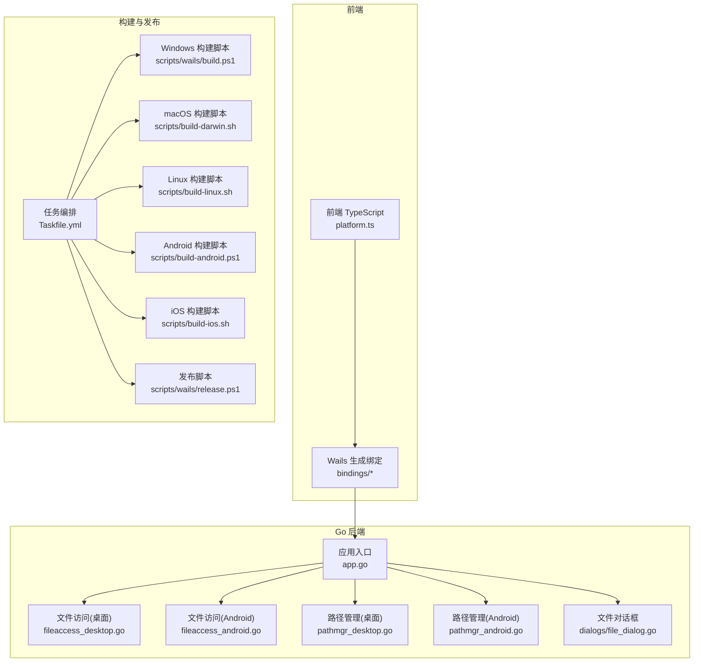
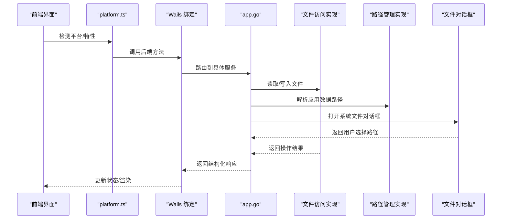
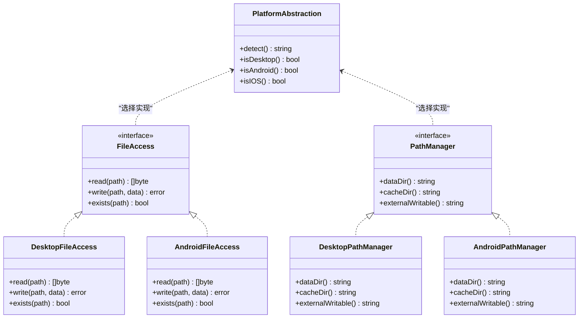
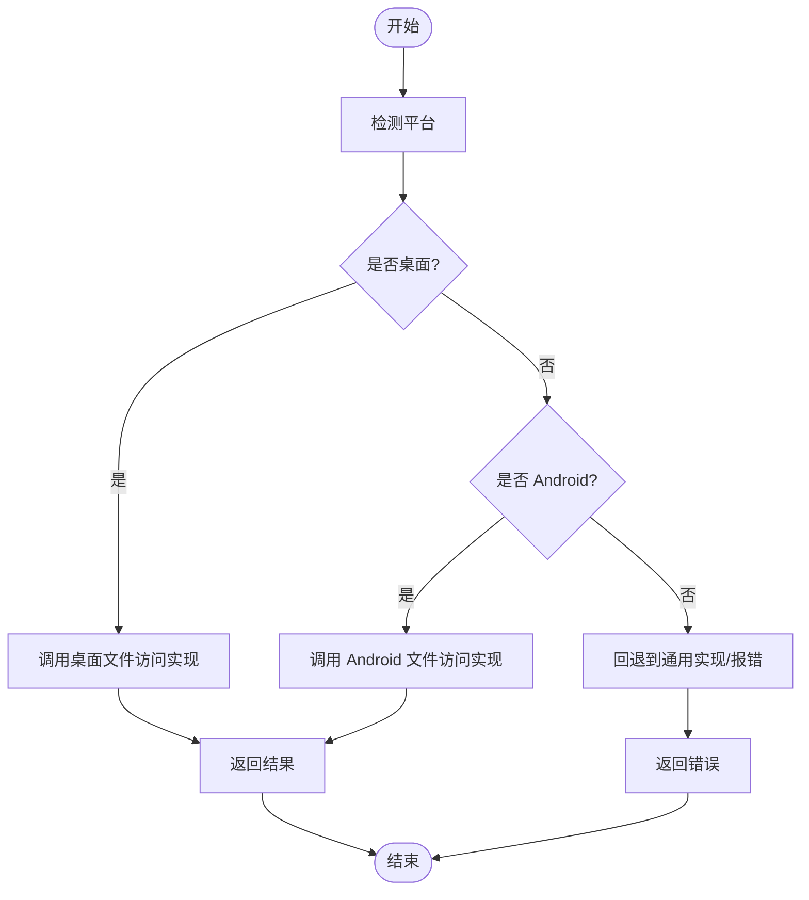
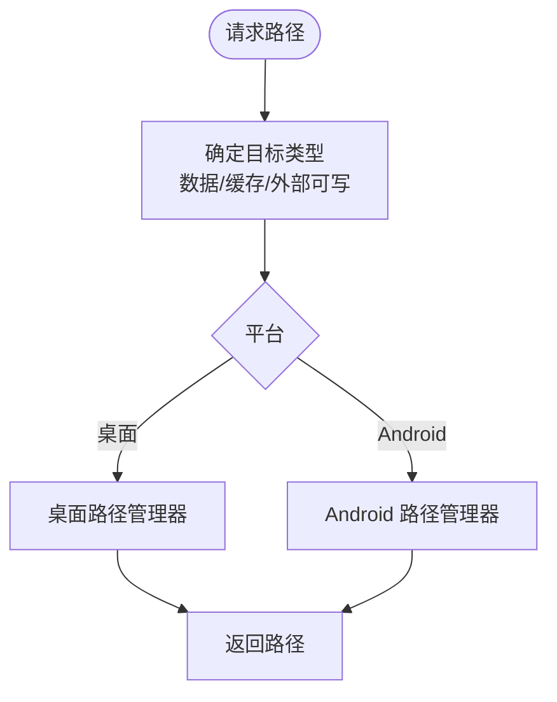
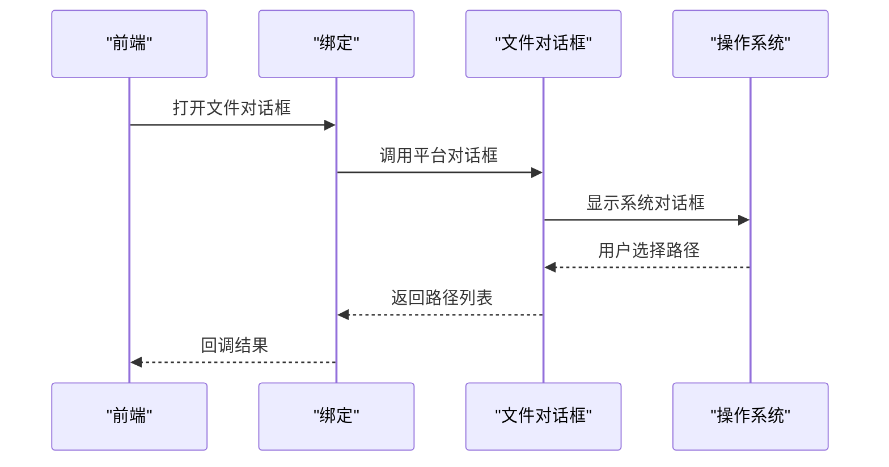
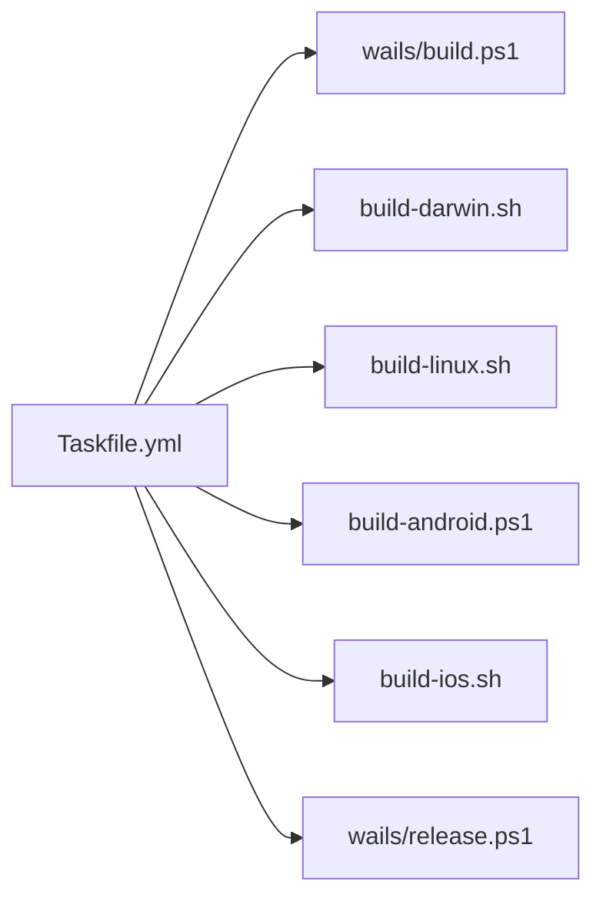
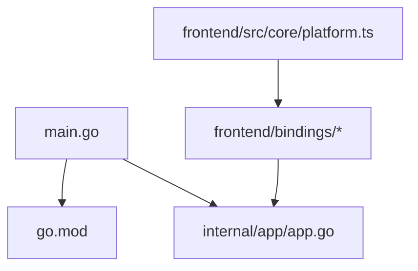

# 跨平台支持

<cite>
**本文引用的文件**   
- [main.go](file://main.go)
- [go.mod](file://go.mod)
- [internal/app/app.go](file://internal/app/app.go)
- [internal/app/fileaccess_desktop.go](file://internal/app/fileaccess_desktop.go)
- [internal/app/fileaccess_android.go](file://internal/app/fileaccess_android.go)
- [internal/app/pathmgr_desktop.go](file://internal/app/pathmgr_desktop.go)
- [internal/app/pathmgr_android.go](file://internal/app/pathmgr_android.go)
- [internal/dialogs/file_dialog.go](file://internal/dialogs/file_dialog.go)
- [frontend/src/core/platform.ts](file://frontend/src/core/platform.ts)
- [scripts/build-android.ps1](file://scripts/build-android.ps1)
- [scripts/build-darwin.sh](file://scripts/build-darwin.sh)
- [scripts/build-linux.sh](file://scripts/build-linux.sh)
- [scripts/build-ios.sh](file://scripts/build-ios.sh)
- [scripts/wails/build.ps1](file://scripts/wails/build.ps1)
- [scripts/wails/release.ps1](file://scripts/wails/release.ps1)
- [Taskfile.yml](file://Taskfile.yml)
- [docs/research/Android 环境下 Wails v3 隐患清单.md](file://docs/research/Android 环境下 Wails v3 隐患清单.md)
- [docs/research/Wails v3-architecture.md](file://docs/research/Wails v3-architecture.md)
</cite>

## 目录
1. [简介](#简介)
2. [项目结构](#项目结构)
3. [核心组件](#核心组件)
4. [架构总览](#架构总览)
5. [详细组件分析](#详细组件分析)
6. [依赖关系分析](#依赖关系分析)
7. [性能考虑](#性能考虑)
8. [故障排除指南](#故障排除指南)
9. [结论](#结论)
10. [附录](#附录)

## 简介
本文件面向使用 Wails v3 的跨平台开发者，系统性阐述桌面端（Windows、macOS、Linux）与移动端（Android、iOS）的适配策略、平台特定能力实现、构建与部署流程、性能优化要点以及兼容性测试与排障方法。文档基于仓库中的 Go 后端、前端桥接层与脚本体系进行归纳总结，帮助读者快速理解并落地跨平台方案。

## 项目结构
本项目采用“Go 后端 + Web 前端”的 Wails v3 架构：
- Go 后端负责系统级能力（文件系统、路径管理、对话框、HTTP 代理等），并通过 Wails 绑定暴露给前端。
- 前端通过 TypeScript 生成的绑定调用后端能力，并在运行时根据平台差异做分支处理。
- 构建与发布由脚本与任务编排工具统一驱动，覆盖桌面与移动多目标。

图表来源
- [internal/app/app.go](file://internal/app/app.go)
- [internal/app/fileaccess_desktop.go](file://internal/app/fileaccess_desktop.go)
- [internal/app/fileaccess_android.go](file://internal/app/fileaccess_android.go)
- [internal/app/pathmgr_desktop.go](file://internal/app/pathmgr_desktop.go)
- [internal/app/pathmgr_android.go](file://internal/app/pathmgr_android.go)
- [internal/dialogs/file_dialog.go](file://internal/dialogs/file_dialog.go)
- [frontend/src/core/platform.ts](file://frontend/src/core/platform.ts)
- [Taskfile.yml](file://Taskfile.yml)
- [scripts/wails/build.ps1](file://scripts/wails/build.ps1)
- [scripts/build-darwin.sh](file://scripts/build-darwin.sh)
- [scripts/build-linux.sh](file://scripts/build-linux.sh)
- [scripts/build-android.ps1](file://scripts/build-android.ps1)
- [scripts/build-ios.sh](file://scripts/build-ios.sh)
- [scripts/wails/release.ps1](file://scripts/wails/release.ps1)

章节来源
- [main.go](file://main.go)
- [go.mod](file://go.mod)
- [internal/app/app.go](file://internal/app/app.go)
- [frontend/src/core/platform.ts](file://frontend/src/core/platform.ts)
- [Taskfile.yml](file://Taskfile.yml)

## 核心组件
- 应用初始化与生命周期
  - 入口与 Wails 初始化在应用主文件中完成，负责注册模块、事件与窗口配置。
- 平台抽象与条件编译
  - 通过 Go 构建标签区分桌面与 Android 实现；前端通过 platform.ts 检测运行环境以选择不同行为。
- 文件系统访问
  - 桌面端直接访问本地文件系统；Android 端通过系统存储 API 或沙箱路径访问。
- 路径管理
  - 桌面端使用用户目录与可写路径；Android 端使用应用私有目录与外部存储。
- 对话框与系统集成
  - 提供跨平台文件对话框封装，内部按平台调用原生能力。
- 构建与发布
  - 使用 Taskfile 统一编排，结合各平台脚本完成交叉编译、签名与打包。

章节来源
- [internal/app/app.go](file://internal/app/app.go)
- [internal/app/fileaccess_desktop.go](file://internal/app/fileaccess_desktop.go)
- [internal/app/fileaccess_android.go](file://internal/app/fileaccess_android.go)
- [internal/app/pathmgr_desktop.go](file://internal/app/pathmgr_desktop.go)
- [internal/app/pathmgr_android.go](file://internal/app/pathmgr_android.go)
- [internal/dialogs/file_dialog.go](file://internal/dialogs/file_dialog.go)
- [frontend/src/core/platform.ts](file://frontend/src/core/platform.ts)

## 架构总览
下图展示了从前端到后端的调用链路与平台差异化实现的位置。

图表来源
- [frontend/src/core/platform.ts](file://frontend/src/core/platform.ts)
- [internal/app/app.go](file://internal/app/app.go)
- [internal/app/fileaccess_desktop.go](file://internal/app/fileaccess_desktop.go)
- [internal/app/fileaccess_android.go](file://internal/app/fileaccess_android.go)
- [internal/app/pathmgr_desktop.go](file://internal/app/pathmgr_desktop.go)
- [internal/app/pathmgr_android.go](file://internal/app/pathmgr_android.go)
- [internal/dialogs/file_dialog.go](file://internal/dialogs/file_dialog.go)

## 详细组件分析

### 平台抽象与条件编译
- 后端通过 Go 构建标签将桌面与 Android 的实现分离，保证同一接口在不同平台有不同行为。
- 前端通过 platform.ts 判断运行环境，决定 UI 交互与功能开关。

图表来源
- [frontend/src/core/platform.ts](file://frontend/src/core/platform.ts)
- [internal/app/fileaccess_desktop.go](file://internal/app/fileaccess_desktop.go)
- [internal/app/fileaccess_android.go](file://internal/app/fileaccess_android.go)
- [internal/app/pathmgr_desktop.go](file://internal/app/pathmgr_desktop.go)
- [internal/app/pathmgr_android.go](file://internal/app/pathmgr_android.go)

章节来源
- [frontend/src/core/platform.ts](file://frontend/src/core/platform.ts)
- [internal/app/fileaccess_desktop.go](file://internal/app/fileaccess_desktop.go)
- [internal/app/fileaccess_android.go](file://internal/app/fileaccess_android.go)
- [internal/app/pathmgr_desktop.go](file://internal/app/pathmgr_desktop.go)
- [internal/app/pathmgr_android.go](file://internal/app/pathmgr_android.go)

### 文件系统访问
- 桌面端：直接读写本地文件系统，适合大文件与批量操作。
- Android 端：受限于沙箱与权限模型，需通过系统 API 或应用私有目录访问。

图表来源
- [internal/app/fileaccess_desktop.go](file://internal/app/fileaccess_desktop.go)
- [internal/app/fileaccess_android.go](file://internal/app/fileaccess_android.go)

章节来源
- [internal/app/fileaccess_desktop.go](file://internal/app/fileaccess_desktop.go)
- [internal/app/fileaccess_android.go](file://internal/app/fileaccess_android.go)

### 路径管理
- 桌面端：使用用户目录与应用数据目录，便于持久化与共享。
- Android 端：使用应用私有目录与外部存储，注意权限与路径可见性。

图表来源
- [internal/app/pathmgr_desktop.go](file://internal/app/pathmgr_desktop.go)
- [internal/app/pathmgr_android.go](file://internal/app/pathmgr_android.go)

章节来源
- [internal/app/pathmgr_desktop.go](file://internal/app/pathmgr_desktop.go)
- [internal/app/pathmgr_android.go](file://internal/app/pathmgr_android.go)

### 对话框与系统集成
- 提供统一的文件对话框接口，内部按平台调用原生能力，确保一致的交互体验。

图表来源
- [internal/dialogs/file_dialog.go](file://internal/dialogs/file_dialog.go)

章节来源
- [internal/dialogs/file_dialog.go](file://internal/dialogs/file_dialog.go)

### 构建与部署流程
- 任务编排：通过 Taskfile 统一入口，组织各平台构建与发布步骤。
- 桌面端：
  - Windows：PowerShell 脚本执行 Wails 构建与资源打包。
  - macOS：Shell 脚本执行交叉编译、签名与归档。
  - Linux：Shell 脚本执行编译与打包。
- 移动端：
  - Android：PowerShell 脚本触发 NDK/Gradle 构建与 APK/AAB 输出。
  - iOS：Shell 脚本执行 Xcode 构建与签名。
- 发布：
  - 使用发布脚本进行产物整理、版本标记与上传。

图表来源
- [Taskfile.yml](file://Taskfile.yml)
- [scripts/wails/build.ps1](file://scripts/wails/build.ps1)
- [scripts/build-darwin.sh](file://scripts/build-darwin.sh)
- [scripts/build-linux.sh](file://scripts/build-linux.sh)
- [scripts/build-android.ps1](file://scripts/build-android.ps1)
- [scripts/build-ios.sh](file://scripts/build-ios.sh)
- [scripts/wails/release.ps1](file://scripts/wails/release.ps1)

章节来源
- [Taskfile.yml](file://Taskfile.yml)
- [scripts/wails/build.ps1](file://scripts/wails/build.ps1)
- [scripts/build-darwin.sh](file://scripts/build-darwin.sh)
- [scripts/build-linux.sh](file://scripts/build-linux.sh)
- [scripts/build-android.ps1](file://scripts/build-android.ps1)
- [scripts/build-ios.sh](file://scripts/build-ios.sh)
- [scripts/wails/release.ps1](file://scripts/wails/release.ps1)

## 依赖关系分析
- 应用入口 main.go 负责启动 Wails 应用并加载后端模块。
- go.mod 声明 Wails v3 及第三方依赖，确保跨平台构建一致性。
- 前端 bindings 由 Wails 代码生成，提供 TS 侧对 Go 方法的强类型调用。

图表来源
- [main.go](file://main.go)
- [go.mod](file://go.mod)
- [internal/app/app.go](file://internal/app/app.go)
- [frontend/src/core/platform.ts](file://frontend/src/core/platform.ts)

章节来源
- [main.go](file://main.go)
- [go.mod](file://go.mod)
- [internal/app/app.go](file://internal/app/app.go)
- [frontend/src/core/platform.ts](file://frontend/src/core/platform.ts)

## 性能考虑
- 内存管理
  - 避免在前端与后端之间频繁传递大对象，优先使用流式或分块传输。
  - 在 Android 上减少 JNI 与 WebView 之间的数据拷贝，必要时使用零拷贝或映射方式。
- I/O 优化
  - 桌面端使用异步 I/O 与缓冲策略；Android 端利用系统提供的缓存目录与后台任务。
- 渲染与计算
  - 合理拆分帧循环与重绘区域，降低 GPU/CPU 压力；移动端关注功耗与热节流。
- 网络与代理
  - 使用 HTTP 代理时启用连接复用与压缩，减少带宽占用。

[本节为通用指导，不直接分析具体文件]

## 故障排除指南
- 常见问题定位
  - 检查 platform.ts 的平台检测结果是否正确。
  - 核对文件访问与路径管理在不同平台的实现是否一致。
  - 确认对话框返回值是否符合预期格式。
- 构建问题
  - 验证 Taskfile 与各平台脚本的环境变量与工具链路径。
  - 检查签名证书与密钥配置，确保发布流程可用。
- 移动端特有问题
  - 参考 Android 环境下 Wails v3 隐患清单，排查 WebView 限制、权限与沙箱路径问题。

章节来源
- [frontend/src/core/platform.ts](file://frontend/src/core/platform.ts)
- [internal/app/fileaccess_desktop.go](file://internal/app/fileaccess_desktop.go)
- [internal/app/fileaccess_android.go](file://internal/app/fileaccess_android.go)
- [internal/app/pathmgr_desktop.go](file://internal/app/pathmgr_desktop.go)
- [internal/app/pathmgr_android.go](file://internal/app/pathmgr_android.go)
- [internal/dialogs/file_dialog.go](file://internal/dialogs/file_dialog.go)
- [docs/research/Android 环境下 Wails v3 隐患清单.md](file://docs/research/Android 环境下 Wails v3 隐患清单.md)

## 结论
通过平台抽象与条件编译，项目在桌面与移动端实现了统一的业务接口与用户体验。借助 Taskfile 与各平台脚本，构建与发布流程具备良好可扩展性与自动化程度。建议在后续迭代中持续完善移动端适配细节，强化性能监控与异常上报，提升跨平台稳定性与可维护性。

[本节为总结性内容，不直接分析具体文件]

## 附录
- 参考资料
  - Wails v3 架构说明：用于理解整体设计与前后端通信机制。
  - Android 环境下 Wails v3 隐患清单：聚焦移动端 WebView 与系统限制。

章节来源
- [docs/research/Wails v3-architecture.md](file://docs/research/Wails v3-architecture.md)
- [docs/research/Android 环境下 Wails v3 隐患清单.md](file://docs/research/Android 环境下 Wails v3 隐患清单.md)