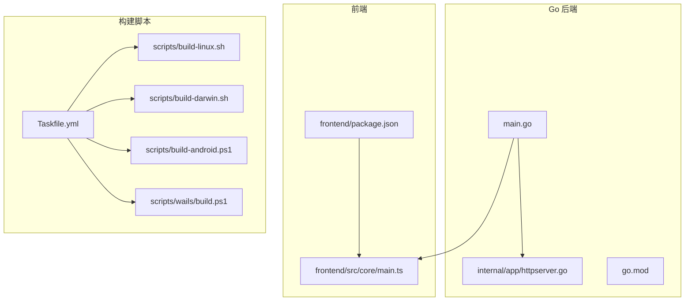
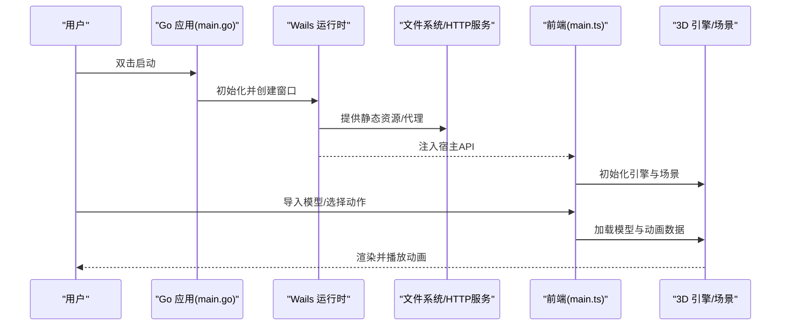
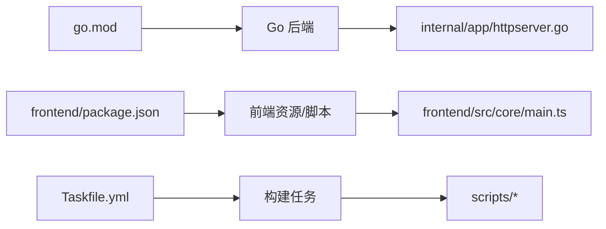

# 快速开始

<cite>
**本文引用的文件**   
- [README.md](file://README.md)
- [main.go](file://main.go)
- [go.mod](file://go.mod)
- [package.json](file://package.json)
- [frontend/package.json](file://frontend/package.json)
- [Taskfile.yml](file://Taskfile.yml)
- [scripts/build-linux.sh](file://scripts/build-linux.sh)
- [scripts/build-darwin.sh](file://scripts/build-darwin.sh)
- [scripts/build-android.ps1](file://scripts/build-android.ps1)
- [scripts/wails/build.ps1](file://scripts/wails/build.ps1)
- [internal/app/httpserver.go](file://internal/app/httpserver.go)
- [frontend/src/core/main.ts](file://frontend/src/core/main.ts)
</cite>

## 目录
1. [简介](#简介)
2. [项目结构](#项目结构)
3. [核心组件](#核心组件)
4. [架构总览](#架构总览)
5. [详细组件分析](#详细组件分析)
6. [依赖分析](#依赖分析)
7. [性能注意事项](#性能注意事项)
8. [故障排除指南](#故障排除指南)
9. [结论](#结论)
10. [附录](#附录)

## 简介
本快速开始指南面向首次接触 MikuMikuAR 的用户，帮助你在 Windows、macOS、Linux 上完成环境搭建、构建与运行，并通过一个“导入模型并播放动画”的示例体验核心功能。文档同时提供常见问题排查建议与平台特定说明，力求让新用户在最短时间内上手。

## 项目结构
仓库采用前后端分离的桌面应用架构：
- Go 后端（Wails v3）负责系统能力、文件访问、HTTP 服务、原生集成等
- 前端基于 TypeScript/Vite 构建，使用 Babylon.js + MMD 生态进行 3D 渲染与动作播放
- 脚本层提供跨平台构建与发布流程

图表来源
- [main.go:1-200](file://main.go#L1-L200)
- [internal/app/httpserver.go:1-200](file://internal/app/httpserver.go#L1-L200)
- [frontend/src/core/main.ts:1-200](file://frontend/src/core/main.ts#L1-L200)
- [Taskfile.yml:1-200](file://Taskfile.yml#L1-L200)

章节来源
- [README.md:1-200](file://README.md#L1-L200)
- [main.go:1-200](file://main.go#L1-L200)
- [go.mod:1-200](file://go.mod#L1-L200)
- [package.json:1-200](file://package.json#L1-L200)
- [frontend/package.json:1-200](file://frontend/package.json#L1-L200)
- [Taskfile.yml:1-200](file://Taskfile.yml#L1-L200)

## 核心组件
- 应用入口与绑定
  - Go 侧通过 Wails 暴露给前端的 API 与事件通道
  - 前端在初始化时加载运行时与核心模块
- HTTP 服务
  - 为前端资源与本地代理提供静态/反向代理服务
- 构建与打包
  - Taskfile 统一任务编排；各平台脚本封装具体构建命令

章节来源
- [main.go:1-200](file://main.go#L1-L200)
- [internal/app/httpserver.go:1-200](file://internal/app/httpserver.go#L1-L200)
- [frontend/src/core/main.ts:1-200](file://frontend/src/core/main.ts#L1-L200)
- [Taskfile.yml:1-200](file://Taskfile.yml#L1-L200)

## 架构总览
下图展示了从启动到渲染的关键路径：Go 主进程启动 Wails 应用，创建窗口并托管前端资源；前端初始化后加载 3D 引擎与场景管理器，随后由用户操作触发模型加载与动画播放。

图表来源
- [main.go:1-200](file://main.go#L1-L200)
- [internal/app/httpserver.go:1-200](file://internal/app/httpserver.go#L1-L200)
- [frontend/src/core/main.ts:1-200](file://frontend/src/core/main.ts#L1-L200)

## 详细组件分析

### 环境要求与准备
- 通用要求
  - Node.js 与 npm（用于前端构建）
  - Go 工具链（用于后端构建）
  - 平台相关编译器/SDK（见各平台小节）
- 推荐
  - 稳定的网络环境以拉取依赖
  - 磁盘空间预留（含构建产物与缓存）

章节来源
- [README.md:1-200](file://README.md#L1-L200)
- [go.mod:1-200](file://go.mod#L1-L200)
- [frontend/package.json:1-200](file://frontend/package.json#L1-L200)

### 源码获取
- 克隆或下载仓库至本地工作目录
- 确认根目录包含 package.json、go.mod、Taskfile.yml 等关键文件

章节来源
- [README.md:1-200](file://README.md#L1-L200)
- [package.json:1-200](file://package.json#L1-L200)
- [go.mod:1-200](file://go.mod#L1-L200)
- [Taskfile.yml:1-200](file://Taskfile.yml#L1-L200)

### 依赖安装
- 前端依赖
  - 进入 frontend 子目录执行包管理器安装
- Go 依赖
  - 在仓库根目录执行 Go 依赖拉取

章节来源
- [frontend/package.json:1-200](file://frontend/package.json#L1-L200)
- [go.mod:1-200](file://go.mod#L1-L200)

### 构建与运行（通用）
- 使用 Taskfile 统一任务
  - 开发模式：构建前端并启动应用
  - 生产构建：生成可分发产物
- 若未安装 Task Runner，可直接调用平台脚本或 Wails CLI

章节来源
- [Taskfile.yml:1-200](file://Taskfile.yml#L1-L200)
- [scripts/wails/build.ps1:1-200](file://scripts/wails/build.ps1#L1-L200)

### 第一个示例：导入模型并播放动画
- 打开应用后，在界面中选择“导入模型”，定位到你的 PMX/PMD 模型文件
- 在动作面板中选择一个 VMD 动画文件并播放
- 观察角色模型加载与动画播放效果

提示
- 确保模型与动画文件格式正确且路径可访问
- 如遇纹理缺失，检查材质贴图路径是否正确

章节来源
- [frontend/src/core/main.ts:1-200](file://frontend/src/core/main.ts#L1-L200)
- [internal/app/httpserver.go:1-200](file://internal/app/httpserver.go#L1-L200)

### 平台特定安装与构建

#### Windows
- 前置条件
  - 已安装 Node.js、npm、Go 工具链
  - 可选：Visual Studio Build Tools（取决于 Wails 构建需求）
- 常用命令
  - 安装依赖：在 frontend 目录执行包管理器安装
  - 构建/运行：使用 Taskfile 任务或 Wails 构建脚本
- 参考脚本
  - scripts/wails/build.ps1

章节来源
- [scripts/wails/build.ps1:1-200](file://scripts/wails/build.ps1#L1-L200)
- [Taskfile.yml:1-200](file://Taskfile.yml#L1-L200)

#### macOS
- 前置条件
  - 已安装 Node.js、npm、Go 工具链
  - Xcode Command Line Tools
- 常用命令
  - 安装依赖：在 frontend 目录执行包管理器安装
  - 构建/运行：使用 Taskfile 任务或 Darwin 构建脚本
- 参考脚本
  - scripts/build-darwin.sh

章节来源
- [scripts/build-darwin.sh:1-200](file://scripts/build-darwin.sh#L1-L200)
- [Taskfile.yml:1-200](file://Taskfile.yml#L1-L200)

#### Linux
- 前置条件
  - 已安装 Node.js、npm、Go 工具链
  - 常见系统库（如 GTK/WebKit 相关，视 Wails 目标而定）
- 常用命令
  - 安装依赖：在 frontend 目录执行包管理器安装
  - 构建/运行：使用 Taskfile 任务或 Linux 构建脚本
- 参考脚本
  - scripts/build-linux.sh

章节来源
- [scripts/build-linux.sh:1-200](file://scripts/build-linux.sh#L1-L200)
- [Taskfile.yml:1-200](file://Taskfile.yml#L1-L200)

#### Android（实验性）
- 前置条件
  - Android SDK/NDK、Java JDK、Node.js、npm、Go
- 常用命令
  - 使用 Android 构建脚本进行打包
- 参考脚本
  - scripts/build-android.ps1

章节来源
- [scripts/build-android.ps1:1-200](file://scripts/build-android.ps1#L1-L200)

## 依赖分析
- 语言与运行时
  - Go 后端依赖由 go.mod 管理
  - 前端依赖由 frontend/package.json 管理
- 构建编排
  - Taskfile.yml 作为统一入口，聚合多平台脚本
- 外部服务
  - 内置 HTTP 服务用于资源托管与代理

图表来源
- [go.mod:1-200](file://go.mod#L1-L200)
- [frontend/package.json:1-200](file://frontend/package.json#L1-L200)
- [Taskfile.yml:1-200](file://Taskfile.yml#L1-L200)
- [internal/app/httpserver.go:1-200](file://internal/app/httpserver.go#L1-L200)
- [frontend/src/core/main.ts:1-200](file://frontend/src/core/main.ts#L1-L200)

章节来源
- [go.mod:1-200](file://go.mod#L1-L200)
- [frontend/package.json:1-200](file://frontend/package.json#L1-L200)
- [Taskfile.yml:1-200](file://Taskfile.yml#L1-L200)

## 性能注意事项
- 首次构建时间较长属正常现象，后续增量构建会更快
- 大模型与高分辨率纹理会增加内存与显存占用
- 建议在稳定网络环境下安装依赖，避免断点续传导致的不一致

[本节为通用指导，不直接分析具体文件]

## 故障排除指南
- 无法找到 Node.js/Go 命令
  - 确认 PATH 配置正确，重启终端后重试
- 前端依赖安装失败
  - 清理缓存后重试；检查网络代理设置
- 构建失败（缺少系统库/编译器）
  - 根据平台提示安装对应工具链与依赖
- 模型/动画无响应或报错
  - 检查文件格式与路径；确认资源未被安全软件拦截
- 端口冲突或资源加载失败
  - 检查是否已有进程占用端口；确认 HTTP 服务正常启动

章节来源
- [internal/app/httpserver.go:1-200](file://internal/app/httpserver.go#L1-L200)
- [frontend/src/core/main.ts:1-200](file://frontend/src/core/main.ts#L1-L200)

## 结论
通过以上步骤，你可以在 Windows、macOS、Linux 上完成 MikuMikuAR 的环境搭建与构建运行，并快速体验导入模型与播放动画的核心流程。遇到问题时，可参考故障排除部分逐项排查。

[本节为总结性内容，不直接分析具体文件]

## 附录
- 更多文档与版本说明请参考仓库中的 docs 目录与 README 系列文件
- 如需参与贡献，请查阅仓库内工程化与测试相关说明

[本节为补充信息，不直接分析具体文件]