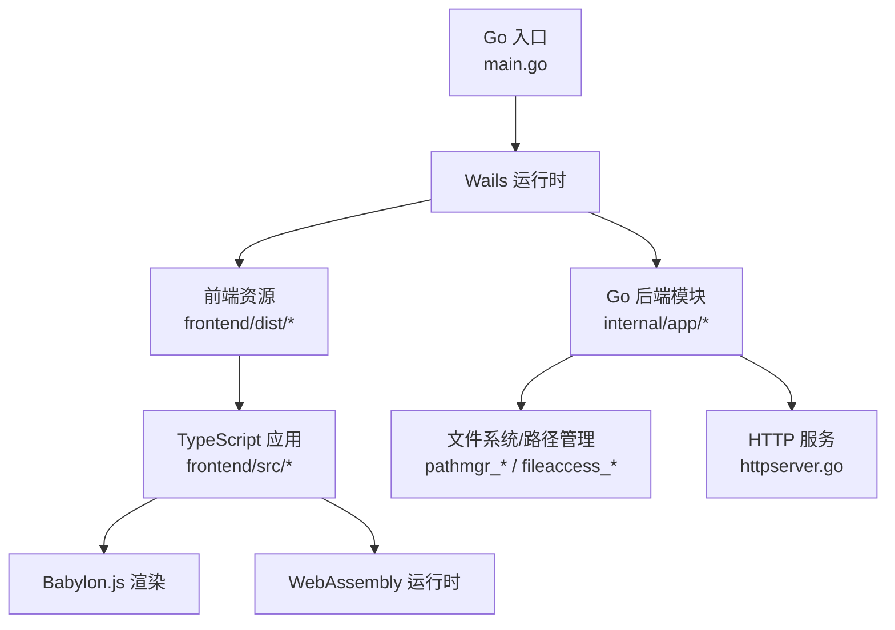
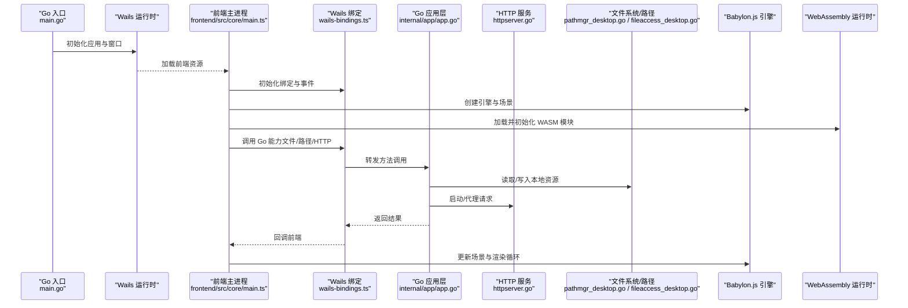
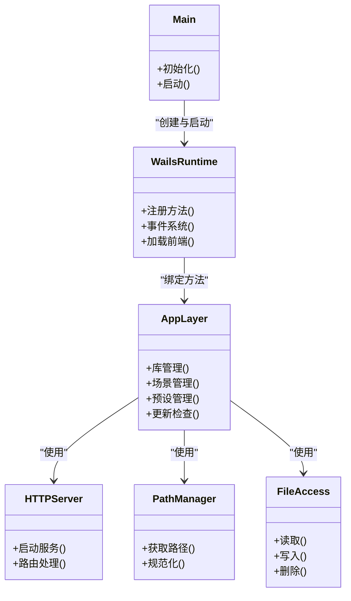
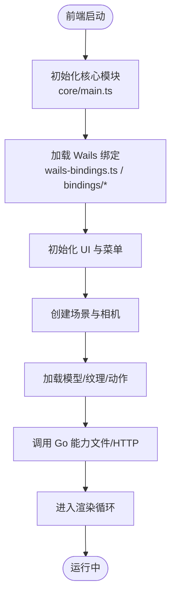
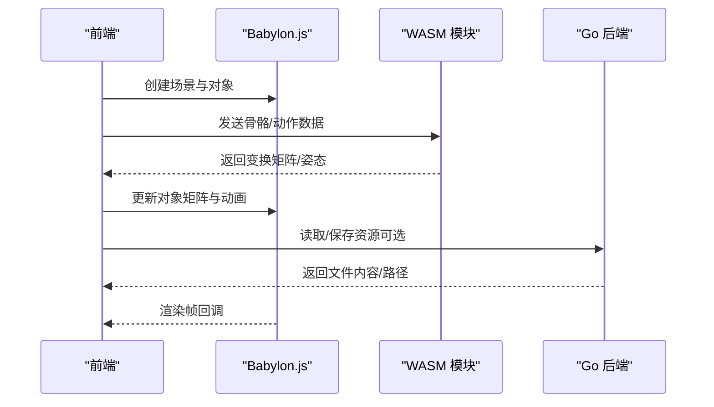
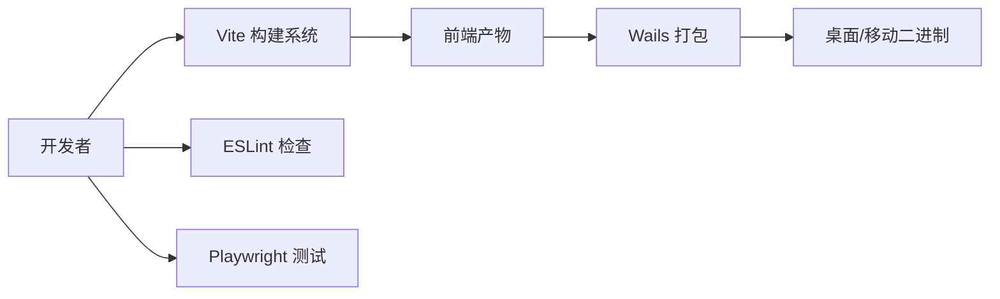
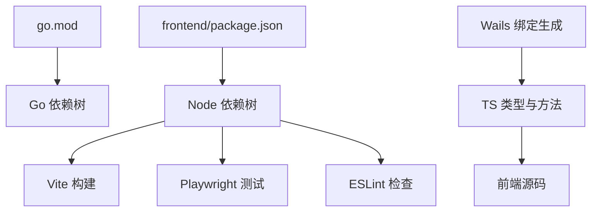

# 技术栈

<cite>
**本文引用的文件**   
- [main.go](file://main.go)
- [go.mod](file://go.mod)
- [frontend/package.json](file://frontend/package.json)
- [frontend/vite.config.ts](file://frontend/vite.config.ts)
- [frontend/playwright.config.ts](file://frontend/playwright.config.ts)
- [frontend/eslint.config.js](file://frontend/eslint.config.js)
- [frontend/src/core/main.ts](file://frontend/src/core/main.ts)
- [frontend/src/core/wails-bindings.ts](file://frontend/src/core/wails-bindings.ts)
- [frontend/bindings/mikumikuar/internal/app/index.ts](file://frontend/bindings/mikumikuar/internal/app/index.ts)
- [internal/app/app.go](file://internal/app/app.go)
- [internal/app/httpserver.go](file://internal/app/httpserver.go)
- [internal/app/pathmgr_desktop.go](file://internal/app/pathmgr_desktop.go)
- [internal/app/fileaccess_desktop.go](file://internal/app/fileaccess_desktop.go)
- [scripts/build-android.ps1](file://scripts/build-android.ps1)
- [scripts/build-linux.sh](file://scripts/build-linux.sh)
- [scripts/build-darwin.sh](file://scripts/build-darwin.sh)
- [scripts/build-ios.sh](file://scripts/build-ios.sh)
</cite>

## 目录
1. [简介](#简介)
2. [项目结构](#项目结构)
3. [核心组件](#核心组件)
4. [架构总览](#架构总览)
5. [详细组件分析](#详细组件分析)
6. [依赖关系分析](#依赖关系分析)
7. [性能考量](#性能考量)
8. [故障排查指南](#故障排查指南)
9. [结论](#结论)
10. [附录](#附录)

## 简介
本章节面向开发者，系统性梳理 MikuMikuAR 的技术选型与协作方式。项目采用 Go 语言作为后端、TypeScript 作为前端、Wails v3 作为跨平台桌面框架，结合 Babylon.js 3D 渲染引擎与 WebAssembly 运行时，构建出高性能的桌面应用。开发工具链包含 Vite 构建系统、Playwright 端到端测试、ESLint 代码检查等，确保工程化质量与可维护性。

## 项目结构
仓库采用前后端分离的组织方式：
- 根目录 main.go 为 Wails 应用的入口，负责初始化窗口、注册 Go 侧能力并启动前端资源服务。
- internal/ 下为 Go 后端实现，包括应用生命周期、HTTP 服务、路径管理、文件访问、库与场景预设等。
- frontend/ 为 TypeScript 前端工程，使用 Vite 构建，通过 Wails 绑定调用 Go 能力，并在浏览器内核中运行 Babylon.js 渲染。
- scripts/ 提供多平台构建脚本（Windows PowerShell、Linux/macOS Shell）。
- docs/ 包含架构决策记录（ADR）、审计与发布说明等文档。

图表来源
- [main.go:1-200](file://main.go#L1-L200)
- [internal/app/app.go:1-200](file://internal/app/app.go#L1-L200)
- [internal/app/httpserver.go:1-200](file://internal/app/httpserver.go#L1-L200)
- [frontend/src/core/main.ts:1-200](file://frontend/src/core/main.ts#L1-L200)

章节来源
- [main.go:1-200](file://main.go#L1-L200)
- [internal/app/app.go:1-200](file://internal/app/app.go#L1-L200)
- [internal/app/httpserver.go:1-200](file://internal/app/httpserver.go#L1-L200)
- [frontend/src/core/main.ts:1-200](file://frontend/src/core/main.ts#L1-L200)

## 核心组件
本节聚焦关键技术选型及其职责：
- Go 后端：提供原生能力（文件访问、路径管理、HTTP 服务、更新机制、库与场景预设），并通过 Wails 暴露给前端。
- Wails v3：桥接 Go 与前端，生成 TypeScript 绑定，统一事件与 API 契约。
- TypeScript 前端：组织 UI、状态、菜单、场景、动作、物理、环境等模块，驱动渲染与交互。
- Babylon.js：3D 渲染引擎，负责场景图、材质、光照、后处理、动画与导出。
- WebAssembly：用于高性能计算（如骨骼物理、程序化动作、VMD 解析/写入）以弥补 JS 性能瓶颈。
- 构建与工具链：Vite 负责前端打包与热重载；Playwright 进行端到端测试；ESLint 保障代码质量。

章节来源
- [frontend/package.json:1-200](file://frontend/package.json#L1-L200)
- [frontend/vite.config.ts:1-200](file://frontend/vite.config.ts#L1-L200)
- [frontend/playwright.config.ts:1-200](file://frontend/playwright.config.ts#L1-L200)
- [frontend/eslint.config.js:1-200](file://frontend/eslint.config.js#L1-L200)
- [frontend/src/core/wails-bindings.ts:1-200](file://frontend/src/core/wails-bindings.ts#L1-L200)
- [frontend/bindings/mikumikuar/internal/app/index.ts:1-200](file://frontend/bindings/mikumikuar/internal/app/index.ts#L1-L200)

## 架构总览
下图展示从应用启动到渲染的关键流程：Go 入口初始化 Wails，加载前端资源，创建 WebView 并注入 Go 绑定；前端初始化 Babylon.js 引擎，加载模型与动作，必要时调用 WASM 执行高性能计算；Go 侧提供 HTTP 服务与文件系统能力，供前端在需要时访问本地资源或下载内容。

图表来源
- [main.go:1-200](file://main.go#L1-L200)
- [frontend/src/core/main.ts:1-200](file://frontend/src/core/main.ts#L1-L200)
- [frontend/src/core/wails-bindings.ts:1-200](file://frontend/src/core/wails-bindings.ts#L1-L200)
- [internal/app/app.go:1-200](file://internal/app/app.go#L1-L200)
- [internal/app/httpserver.go:1-200](file://internal/app/httpserver.go#L1-L200)
- [internal/app/pathmgr_desktop.go:1-200](file://internal/app/pathmgr_desktop.go#L1-L200)
- [internal/app/fileaccess_desktop.go:1-200](file://internal/app/fileaccess_desktop.go#L1-L200)

## 详细组件分析

### Go 后端与 Wails 集成
- 入口与生命周期：main.go 负责创建 Wails 应用实例、配置窗口与菜单、注册 Go 方法与事件，并启动前端资源服务。
- 应用层能力：internal/app/app.go 提供应用级功能（库、场景、预设、更新、监听等），并通过 Wails 暴露给前端。
- HTTP 服务：internal/app/httpserver.go 提供本地 HTTP 服务，用于静态资源托管或代理网络请求。
- 路径与文件：pathmgr_desktop.go 与 fileaccess_desktop.go 封装跨平台路径管理与文件访问逻辑，适配桌面与移动端差异。

图表来源
- [main.go:1-200](file://main.go#L1-L200)
- [internal/app/app.go:1-200](file://internal/app/app.go#L1-L200)
- [internal/app/httpserver.go:1-200](file://internal/app/httpserver.go#L1-L200)
- [internal/app/pathmgr_desktop.go:1-200](file://internal/app/pathmgr_desktop.go#L1-L200)
- [internal/app/fileaccess_desktop.go:1-200](file://internal/app/fileaccess_desktop.go#L1-L200)

章节来源
- [main.go:1-200](file://main.go#L1-L200)
- [internal/app/app.go:1-200](file://internal/app/app.go#L1-L200)
- [internal/app/httpserver.go:1-200](file://internal/app/httpserver.go#L1-L200)
- [internal/app/pathmgr_desktop.go:1-200](file://internal/app/pathmgr_desktop.go#L1-L200)
- [internal/app/fileaccess_desktop.go:1-200](file://internal/app/fileaccess_desktop.go#L1-L200)

### TypeScript 前端与 Wails 绑定
- 前端主进程：frontend/src/core/main.ts 负责初始化全局状态、事件总线、UI 与渲染循环。
- Wails 绑定：frontend/src/core/wails-bindings.ts 与 frontend/bindings/mikumikuar/internal/app/index.ts 由 Wails 自动生成，定义 Go 方法的 TS 类型与调用入口。
- 模块划分：core、menus、scene、motion-algos、physics、outfit、web-loader 等模块按职责拆分，便于扩展与维护。

图表来源
- [frontend/src/core/main.ts:1-200](file://frontend/src/core/main.ts#L1-L200)
- [frontend/src/core/wails-bindings.ts:1-200](file://frontend/src/core/wails-bindings.ts#L1-L200)
- [frontend/bindings/mikumikuar/internal/app/index.ts:1-200](file://frontend/bindings/mikumikuar/internal/app/index.ts#L1-L200)

章节来源
- [frontend/src/core/main.ts:1-200](file://frontend/src/core/main.ts#L1-L200)
- [frontend/src/core/wails-bindings.ts:1-200](file://frontend/src/core/wails-bindings.ts#L1-L200)
- [frontend/bindings/mikumikuar/internal/app/index.ts:1-200](file://frontend/bindings/mikumikuar/internal/app/index.ts#L1-L200)

### 3D 渲染与 WebAssembly 协同
- 渲染引擎：Babylon.js 负责场景图、材质、光照、后处理、动画与导出，支撑 AR 模式与复杂场景。
- WASM 运行时：用于高性能计算（骨骼物理、程序化动作、VMD 解析/写入），减少 JS 主线程压力。
- 数据流：前端将关键参数序列化后传入 WASM，WASM 返回计算结果，前端再应用到场景对象。

图表来源
- [frontend/src/core/main.ts:1-200](file://frontend/src/core/main.ts#L1-L200)
- [internal/app/app.go:1-200](file://internal/app/app.go#L1-L200)

章节来源
- [frontend/src/core/main.ts:1-200](file://frontend/src/core/main.ts#L1-L200)
- [internal/app/app.go:1-200](file://internal/app/app.go#L1-L200)

### 构建系统与测试工具链
- Vite：前端构建与开发服务器，支持热重载、按需打包与插件生态。
- Playwright：端到端测试，覆盖 UI 交互、场景面板、导出截图等用例。
- ESLint：代码规范检查，提升一致性。
- 多平台构建脚本：scripts 下提供 Windows、Linux、macOS、iOS、Android 构建脚本，配合 Wails 编译产物。

图表来源
- [frontend/vite.config.ts:1-200](file://frontend/vite.config.ts#L1-L200)
- [frontend/playwright.config.ts:1-200](file://frontend/playwright.config.ts#L1-L200)
- [frontend/eslint.config.js:1-200](file://frontend/eslint.config.js#L1-L200)
- [scripts/build-android.ps1:1-200](file://scripts/build-android.ps1#L1-L200)
- [scripts/build-linux.sh:1-200](file://scripts/build-linux.sh#L1-L200)
- [scripts/build-darwin.sh:1-200](file://scripts/build-darwin.sh#L1-L200)
- [scripts/build-ios.sh:1-200](file://scripts/build-ios.sh#L1-L200)

章节来源
- [frontend/vite.config.ts:1-200](file://frontend/vite.config.ts#L1-L200)
- [frontend/playwright.config.ts:1-200](file://frontend/playwright.config.ts#L1-L200)
- [frontend/eslint.config.js:1-200](file://frontend/eslint.config.js#L1-L200)
- [scripts/build-android.ps1:1-200](file://scripts/build-android.ps1#L1-L200)
- [scripts/build-linux.sh:1-200](file://scripts/build-linux.sh#L1-L200)
- [scripts/build-darwin.sh:1-200](file://scripts/build-darwin.sh#L1-L200)
- [scripts/build-ios.sh:1-200](file://scripts/build-ios.sh#L1-L200)

## 依赖关系分析
- Go 依赖：go.mod 声明 Go 模块与第三方包版本，保证可重复构建。
- 前端依赖：frontend/package.json 声明 TypeScript、Babylon.js、Wails 绑定、测试与构建工具。
- 版本兼容策略：
  - Go 侧通过 go.mod 锁定依赖版本，避免上游变更导致的不兼容。
  - 前端通过 package.json 与 lock 文件锁定依赖，结合 CI 验证构建与测试。
  - Wails 绑定由构建阶段生成，确保 TS 类型与 Go 方法签名一致。

图表来源
- [go.mod:1-200](file://go.mod#L1-L200)
- [frontend/package.json:1-200](file://frontend/package.json#L1-200)

章节来源
- [go.mod:1-200](file://go.mod#L1-L200)
- [frontend/package.json:1-200](file://frontend/package.json#L1-200)

## 性能考量
- 渲染管线优化：合理使用后处理、反射探针、阴影贴图分辨率与环境贴图，平衡画质与帧率。
- WASM 计算卸载：将密集计算（骨骼物理、程序化动作、VMD 解析/写入）迁移至 WASM，降低主线程阻塞。
- 资源加载与缓存：对模型、纹理、动作进行懒加载与缓存，减少内存峰值与 IO 抖动。
- 事件与状态：通过观察者与状态机解耦，避免不必要的重绘与重算。
- 平台差异：针对桌面与移动端的路径与文件访问进行差异化实现，避免跨平台开销。

[本节为通用指导，不直接分析具体文件]

## 故障排查指南
- WASM 加载失败：确认 index_bg.wasm 等资源路径正确且未被拦截，检查 CORS 与本地资源服务。
- 纹理不显示：检查模型材质与纹理路径，确认资源已正确加载与绑定。
- 动作播放无响应：核对 VMD 解析与骨骼映射，确认 WASM 输出矩阵有效。
- 两套物理引擎并存性能差：统一物理后端，避免重复计算。
- 菜单快捷键冲突：审查快捷键注册表，避免静默覆盖。
- UI 硬编码中文无法切换语言：统一国际化键值，确保所有文本走 i18n 通道。

章节来源
- [frontend/src/core/wails-bindings.ts:1-200](file://frontend/src/core/wails-bindings.ts#L1-L200)
- [frontend/src/core/main.ts:1-200](file://frontend/src/core/main.ts#L1-L200)
- [internal/app/httpserver.go:1-200](file://internal/app/httpserver.go#L1-L200)

## 结论
本项目以 Go 与 Wails v3 为核心，结合 TypeScript 前端与 Babylon.js 渲染，辅以 WebAssembly 的高性能计算，形成稳定高效的桌面应用架构。Vite、Playwright、ESLint 等工具链保障了开发与交付质量。通过清晰的模块划分与依赖管理策略，项目在成熟度与可扩展性方面具备良好基础，适合持续演进与多平台部署。

## 附录
- 多平台构建脚本参考：
  - Android: [scripts/build-android.ps1](file://scripts/build-android.ps1)
  - Linux: [scripts/build-linux.sh](file://scripts/build-linux.sh)
  - macOS: [scripts/build-darwin.sh](file://scripts/build-darwin.sh)
  - iOS: [scripts/build-ios.sh](file://scripts/build-ios.sh)