# 核心特性

<cite>
**本文引用的文件**   
- [README.md](file://README.md)
- [main.go](file://main.go)
- [frontend/src/core/main.ts](file://frontend/src/core/main.ts)
- [frontend/src/scene/scene.ts](file://frontend/src/scene/scene.ts)
- [frontend/src/scene/ar/ar-scene.ts](file://frontend/src/scene/ar/ar-scene.ts)
- [frontend/src/scene/ar/ar-camera.ts](file://frontend/src/scene/ar/ar-camera.ts)
- [frontend/src/motion-algos/vmd-evaluator.ts](file://frontend/src/motion-algos/vmd-evaluator.ts)
- [frontend/src/motion-algos/procedural-motion.ts](file://frontend/src/motion-algos/procedural-motion.ts)
- [frontend/src/physics/physics-bridge.ts](file://frontend/src/physics/physics-bridge.ts)
- [frontend/src/physics/wind-physics.ts](file://frontend/src/physics/wind-physics.ts)
- [frontend/src/scene/env/env-bridge.ts](file://frontend/src/scene/env/env-bridge.ts)
- [frontend/src/core/i18n/locale.ts](file://frontend/src/core/i18n/locale.ts)
- [frontend/src/core/platform.ts](file://frontend/src/core/platform.ts)
- [internal/app/app.go](file://internal/app/app.go)
- [internal/app/pathmgr_desktop.go](file://internal/app/pathmgr_desktop.go)
- [internal/app/pathmgr_android.go](file://internal/app/pathmgr_android.go)
</cite>

## 目录
1. [简介](#简介)
2. [项目结构](#项目结构)
3. [核心特性总览](#核心特性总览)
4. [架构概览](#架构概览)
5. [详细特性分析](#详细特性分析)
6. [依赖关系分析](#依赖关系分析)
7. [性能与体验优化](#性能与体验优化)
8. [故障排查指南](#故障排查指南)
9. [结论](#结论)
10. [附录：使用场景与效果展示](#附录使用场景与效果展示)

## 简介
MikuMikuAR 是一个面向 MMD（MikuMikuDance）生态的增强现实与跨平台 3D 应用，提供从模型加载、动画播放到程序化动作、物理模拟与环境渲染的一体化能力。其特色包括：
- 增强现实：在真实环境中叠加 3D 角色与舞台，支持 AR 相机模式与透视融合。
- 多语言支持：内置国际化框架，覆盖多语种界面与提示。
- 跨平台兼容：基于 Wails v3 构建，统一桌面与移动端（Android/iOS）运行环境，并提供路径管理与资源访问适配。

本章节为总体介绍，不直接分析具体源码文件。

## 项目结构
仓库采用前后端分离与模块化组织：
- Go 后端（Wails）：负责应用生命周期、文件系统、平台差异、HTTP 服务、更新与库管理。
- TypeScript 前端：基于 Babylon.js/MMD 生态，实现场景、渲染、动画、物理、UI 与 AR 功能。
- 文档与 ADR：记录架构决策、审计与发布说明。

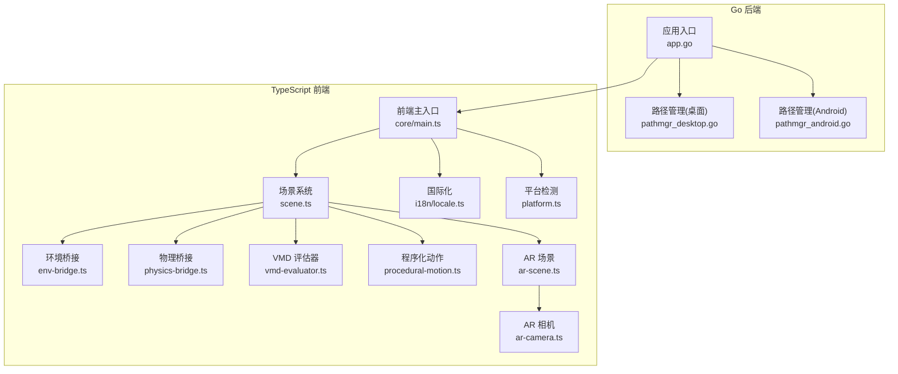

**图表来源** 
- [main.go:1-200](file://main.go#L1-L200)
- [frontend/src/core/main.ts:1-200](file://frontend/src/core/main.ts#L1-L200)
- [frontend/src/scene/scene.ts:1-200](file://frontend/src/scene/scene.ts#L1-L200)
- [frontend/src/scene/env/env-bridge.ts:1-200](file://frontend/src/scene/env/env-bridge.ts#L1-L200)
- [frontend/src/physics/physics-bridge.ts:1-200](file://frontend/src/physics/physics-bridge.ts#L1-L200)
- [frontend/src/motion-algos/vmd-evaluator.ts:1-200](file://frontend/src/motion-algos/vmd-evaluator.ts#L1-L200)
- [frontend/src/motion-algos/procedural-motion.ts:1-200](file://frontend/src/motion-algos/procedural-motion.ts#L1-L200)
- [frontend/src/scene/ar/ar-scene.ts:1-200](file://frontend/src/scene/ar/ar-scene.ts#L1-L200)
- [frontend/src/scene/ar/ar-camera.ts:1-200](file://frontend/src/scene/ar/ar-camera.ts#L1-L200)
- [frontend/src/core/i18n/locale.ts:1-200](file://frontend/src/core/i18n/locale.ts#L1-L200)
- [frontend/src/core/platform.ts:1-200](file://frontend/src/core/platform.ts#L1-L200)
- [internal/app/app.go:1-200](file://internal/app/app.go#L1-L200)
- [internal/app/pathmgr_desktop.go:1-200](file://internal/app/pathmgr_desktop.go#L1-L200)
- [internal/app/pathmgr_android.go:1-200](file://internal/app/pathmgr_android.go#L1-L200)

**章节来源**
- [README.md](file://README.md)
- [main.go:1-200](file://main.go#L1-L200)
- [frontend/src/core/main.ts:1-200](file://frontend/src/core/main.ts#L1-L200)
- [frontend/src/scene/scene.ts:1-200](file://frontend/src/scene/scene.ts#L1-L200)
- [internal/app/app.go:1-200](file://internal/app/app.go#L1-L200)

## 核心特性总览
- 3D 模型加载与渲染：支持 PMX/PMD 等格式，材质贴图、法线贴图、反射探针、SSR、天空盒、水面反射等高级渲染管线。
- VMD 动画播放：解析与回放 VMD 关键帧，支持骨骼、形态、摄像机轨迹同步。
- 程序化动作系统：基于算法的动作生成与混合，如自动舞蹈、呼吸、脚步检测、唇语同步等。
- 物理模拟引擎：WASM 骨骼物理、风场影响、布料与软体物理、IK 感知骨骼覆写。
- 环境渲染系统：天穹、云层、粒子、地面、光照、雾效、反射与幽灵粒子等。
- 增强现实：AR 相机模式、透视融合、场景对齐与遮挡处理。
- 多语言支持：国际化键值体系、运行时切换、错误消息本地化。
- 跨平台兼容：Wails v3 驱动，桌面与移动端统一 API，路径与资源访问适配。

本节为概念性概述，不直接分析具体源码文件。

## 架构概览
整体采用“前端场景中心 + 后端能力支撑”的架构：
- 前端以 Scene 为核心，协调渲染、动画、物理与环境子系统。
- 后端通过 Wails 暴露文件系统、路径管理、HTTP 代理、更新与库管理等能力。
- AR 模块作为场景扩展，注入相机与透视融合逻辑。
- 国际化与平台检测贯穿 UI 与业务层。

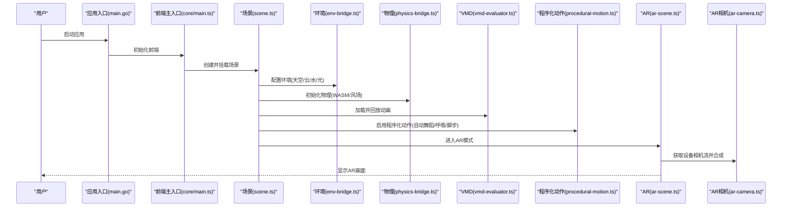

**图表来源** 
- [main.go:1-200](file://main.go#L1-L200)
- [frontend/src/core/main.ts:1-200](file://frontend/src/core/main.ts#L1-L200)
- [frontend/src/scene/scene.ts:1-200](file://frontend/src/scene/scene.ts#L1-L200)
- [frontend/src/scene/env/env-bridge.ts:1-200](file://frontend/src/scene/env/env-bridge.ts#L1-L200)
- [frontend/src/physics/physics-bridge.ts:1-200](file://frontend/src/physics/physics-bridge.ts#L1-L200)
- [frontend/src/motion-algos/vmd-evaluator.ts:1-200](file://frontend/src/motion-algos/vmd-evaluator.ts#L1-L200)
- [frontend/src/motion-algos/procedural-motion.ts:1-200](file://frontend/src/motion-algos/procedural-motion.ts#L1-L200)
- [frontend/src/scene/ar/ar-scene.ts:1-200](file://frontend/src/scene/ar/ar-scene.ts#L1-L200)
- [frontend/src/scene/ar/ar-camera.ts:1-200](file://frontend/src/scene/ar/ar-camera.ts#L1-L200)

## 详细特性分析

### 3D 模型加载与渲染
- 功能描述：加载 PMX/PMD 模型，应用材质、纹理、法线贴图；支持反射探针、SSR、天空盒、水面反射等后处理与渲染增强。
- 技术实现：
  - 场景管理器负责模型实例化与材质绑定。
  - 渲染子系统集成反射探针与 SSR，提升金属与水面表现。
  - 环境桥接统一管理天空、光照、雾效与地面。
- 用户体验价值：高保真视觉呈现，适合舞台演出、虚拟偶像直播与内容创作。

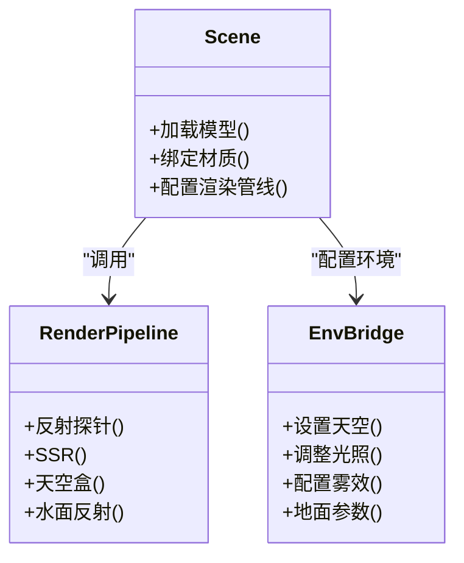

**图表来源** 
- [frontend/src/scene/scene.ts:1-200](file://frontend/src/scene/scene.ts#L1-L200)
- [frontend/src/scene/env/env-bridge.ts:1-200](file://frontend/src/scene/env/env-bridge.ts#L1-L200)

**章节来源**
- [frontend/src/scene/scene.ts:1-200](file://frontend/src/scene/scene.ts#L1-L200)
- [frontend/src/scene/env/env-bridge.ts:1-200](file://frontend/src/scene/env/env-bridge.ts#L1-L200)

### VMD 动画播放
- 功能描述：解析 VMD 关键帧数据，回放骨骼、形态与摄像机轨迹，支持时间轴控制与循环。
- 技术实现：
  - VMD 评估器负责解析与插值计算。
  - 场景将评估结果应用到模型骨骼与形态目标。
- 用户体验价值：无缝衔接传统 MMD 工作流，快速预览与导出动画成果。

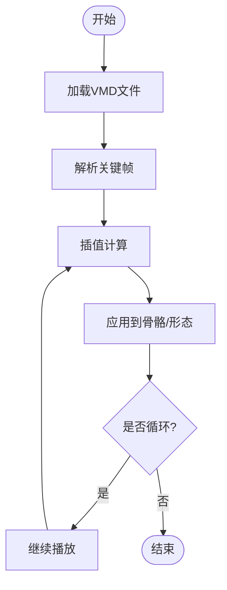

**图表来源** 
- [frontend/src/motion-algos/vmd-evaluator.ts:1-200](file://frontend/src/motion-algos/vmd-evaluator.ts#L1-L200)
- [frontend/src/scene/scene.ts:1-200](file://frontend/src/scene/scene.ts#L1-L200)

**章节来源**
- [frontend/src/motion-algos/vmd-evaluator.ts:1-200](file://frontend/src/motion-algos/vmd-evaluator.ts#L1-L200)
- [frontend/src/scene/scene.ts:1-200](file://frontend/src/scene/scene.ts#L1-L200)

### 程序化动作系统
- 功能描述：基于算法生成或混合动作，如自动舞蹈、呼吸、脚步检测、视线追踪、IK 感知骨骼覆写等。
- 技术实现：
  - 程序化动作模块提供多种算法（肢体、躯干、情绪、空闲姿态）。
  - 与物理和骨骼覆写系统集成，确保动作自然且符合约束。
- 用户体验价值：无需手工制作复杂动画即可实现生动表演，降低创作门槛。

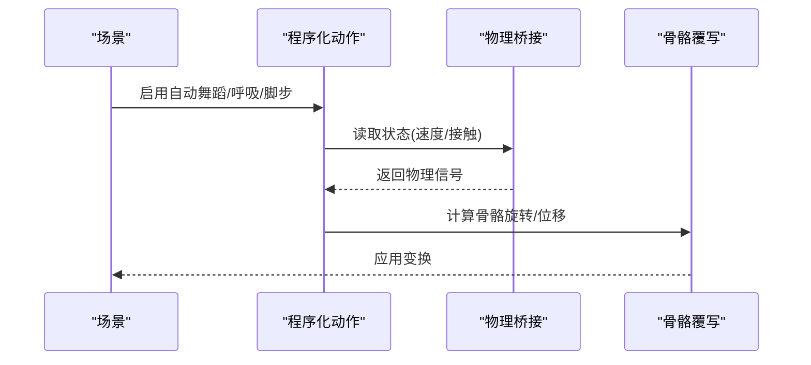

**图表来源** 
- [frontend/src/motion-algos/procedural-motion.ts:1-200](file://frontend/src/motion-algos/procedural-motion.ts#L1-L200)
- [frontend/src/physics/physics-bridge.ts:1-200](file://frontend/src/physics/physics-bridge.ts#L1-L200)
- [frontend/src/scene/scene.ts:1-200](file://frontend/src/scene/scene.ts#L1-L200)

**章节来源**
- [frontend/src/motion-algos/procedural-motion.ts:1-200](file://frontend/src/motion-algos/procedural-motion.ts#L1-L200)
- [frontend/src/physics/physics-bridge.ts:1-200](file://frontend/src/physics/physics-bridge.ts#L1-L200)
- [frontend/src/scene/scene.ts:1-200](file://frontend/src/scene/scene.ts#L1-L200)

### 物理模拟引擎
- 功能描述：WASM 骨骼物理、风场影响、布料与软体物理、IK 感知骨骼覆写，提供稳定且高性能的动态效果。
- 技术实现：
  - 物理桥接封装 WASM 内核调用与参数调优。
  - 风场物理根据环境风力影响头发、裙摆等部件。
- 用户体验价值：更真实的次级运动与互动反馈，提升沉浸感。

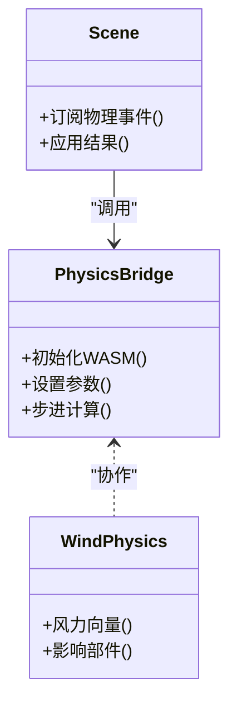

**图表来源** 
- [frontend/src/physics/physics-bridge.ts:1-200](file://frontend/src/physics/physics-bridge.ts#L1-L200)
- [frontend/src/physics/wind-physics.ts:1-200](file://frontend/src/physics/wind-physics.ts#L1-L200)
- [frontend/src/scene/scene.ts:1-200](file://frontend/src/scene/scene.ts#L1-L200)

**章节来源**
- [frontend/src/physics/physics-bridge.ts:1-200](file://frontend/src/physics/physics-bridge.ts#L1-L200)
- [frontend/src/physics/wind-physics.ts:1-200](file://frontend/src/physics/wind-physics.ts#L1-L200)
- [frontend/src/scene/scene.ts:1-200](file://frontend/src/scene/scene.ts#L1-L200)

### 环境渲染系统
- 功能描述：天空盒、云层、粒子、地面、光照、雾效、反射与幽灵粒子等，构成完整的舞台环境。
- 技术实现：
  - 环境桥接集中管理预设与实时调节。
  - 渲染管线集成反射探针与水面反射，提升真实感。
- 用户体验价值：一键切换高质量场景，满足直播、录制与创作需求。

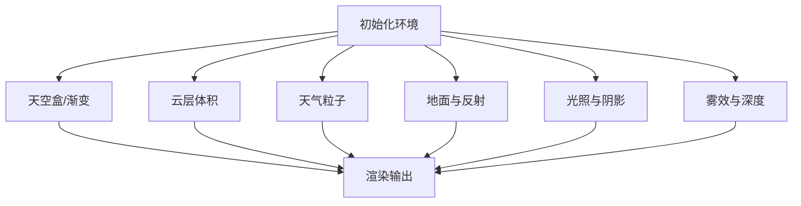

**图表来源** 
- [frontend/src/scene/env/env-bridge.ts:1-200](file://frontend/src/scene/env/env-bridge.ts#L1-L200)
- [frontend/src/scene/scene.ts:1-200](file://frontend/src/scene/scene.ts#L1-L200)

**章节来源**
- [frontend/src/scene/env/env-bridge.ts:1-200](file://frontend/src/scene/env/env-bridge.ts#L1-L200)
- [frontend/src/scene/scene.ts:1-200](file://frontend/src/scene/scene.ts#L1-L200)

### 增强现实（AR）
- 功能描述：在真实环境中叠加 3D 角色与舞台，支持 AR 相机模式、透视融合与场景对齐。
- 技术实现：
  - AR 场景模块接管渲染目标与相机流。
  - AR 相机模块处理设备摄像头权限、分辨率与帧率。
- 用户体验价值：线下活动、直播与互动体验中实现虚实结合，增强观众参与感。

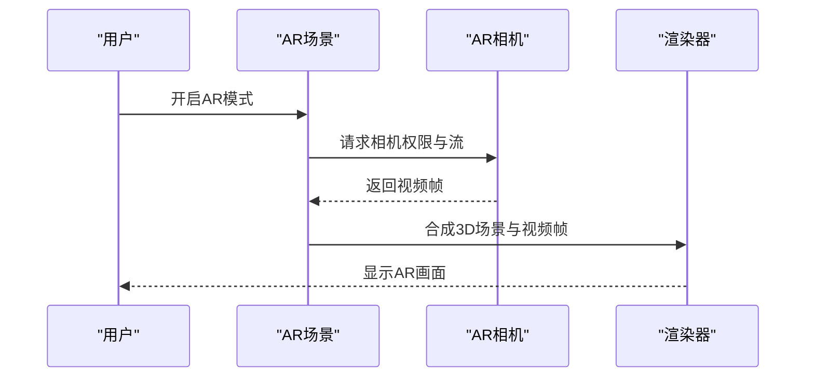

**图表来源** 
- [frontend/src/scene/ar/ar-scene.ts:1-200](file://frontend/src/scene/ar/ar-scene.ts#L1-L200)
- [frontend/src/scene/ar/ar-camera.ts:1-200](file://frontend/src/scene/ar/ar-camera.ts#L1-L200)
- [frontend/src/scene/scene.ts:1-200](file://frontend/src/scene/scene.ts#L1-L200)

**章节来源**
- [frontend/src/scene/ar/ar-scene.ts:1-200](file://frontend/src/scene/ar/ar-scene.ts#L1-L200)
- [frontend/src/scene/ar/ar-camera.ts:1-200](file://frontend/src/scene/ar/ar-camera.ts#L1-L200)
- [frontend/src/scene/scene.ts:1-200](file://frontend/src/scene/scene.ts#L1-L200)

### 多语言支持（i18n）
- 功能描述：提供多语种界面与错误消息，支持运行时切换语言。
- 技术实现：
  - 国际化模块维护键值映射与加载策略。
  - UI 组件通过 t() 函数获取本地化文本。
- 用户体验价值：面向全球用户，提升可访问性与易用性。

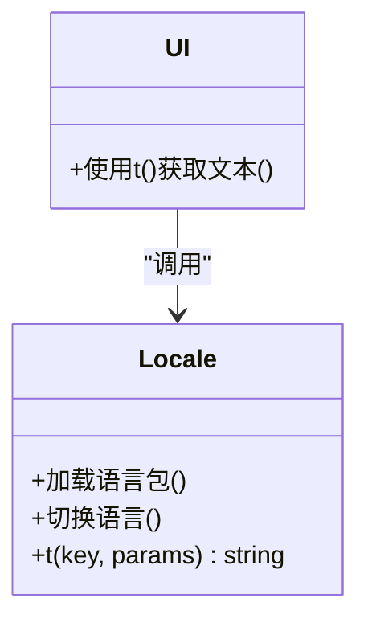

**图表来源** 
- [frontend/src/core/i18n/locale.ts:1-200](file://frontend/src/core/i18n/locale.ts#L1-L200)

**章节来源**
- [frontend/src/core/i18n/locale.ts:1-200](file://frontend/src/core/i18n/locale.ts#L1-L200)

### 跨平台兼容性
- 功能描述：基于 Wails v3 统一桌面与移动端运行环境，提供路径管理与资源访问适配。
- 技术实现：
  - 应用入口初始化平台差异与窗口管理。
  - 路径管理针对桌面与 Android 分别实现。
- 用户体验价值：一次开发，多端部署，降低维护成本。

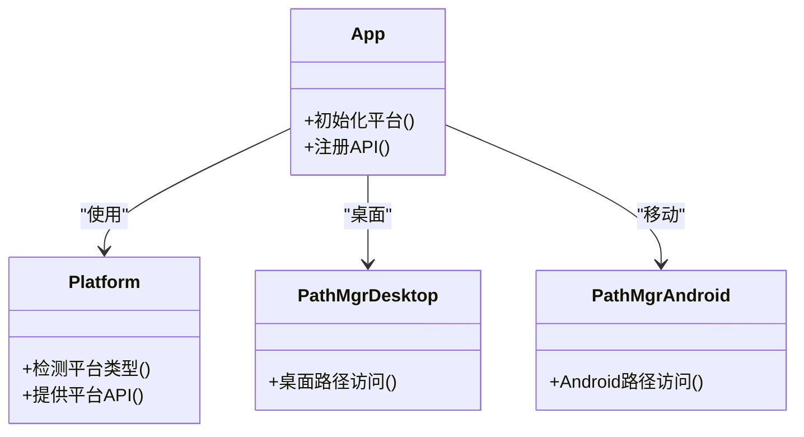

**图表来源** 
- [internal/app/app.go:1-200](file://internal/app/app.go#L1-L200)
- [frontend/src/core/platform.ts:1-200](file://frontend/src/core/platform.ts#L1-L200)
- [internal/app/pathmgr_desktop.go:1-200](file://internal/app/pathmgr_desktop.go#L1-L200)
- [internal/app/pathmgr_android.go:1-200](file://internal/app/pathmgr_android.go#L1-L200)

**章节来源**
- [internal/app/app.go:1-200](file://internal/app/app.go#L1-L200)
- [frontend/src/core/platform.ts:1-200](file://frontend/src/core/platform.ts#L1-L200)
- [internal/app/pathmgr_desktop.go:1-200](file://internal/app/pathmgr_desktop.go#L1-L200)
- [internal/app/pathmgr_android.go:1-200](file://internal/app/pathmgr_android.go#L1-L200)

## 依赖关系分析
- 前端模块间耦合度适中，Scene 作为协调者，通过桥接层与外部子系统交互。
- 后端通过 Wails 暴露能力，避免前端直接访问系统资源。
- 潜在风险：AR 与渲染管线对硬件要求较高，需关注内存与 GPU 占用。

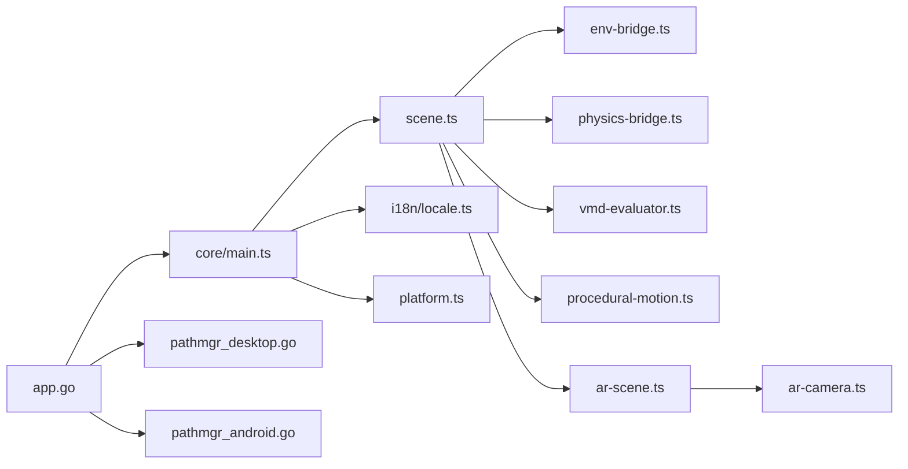

**图表来源** 
- [frontend/src/core/main.ts:1-200](file://frontend/src/core/main.ts#L1-L200)
- [frontend/src/scene/scene.ts:1-200](file://frontend/src/scene/scene.ts#L1-L200)
- [frontend/src/scene/env/env-bridge.ts:1-200](file://frontend/src/scene/env/env-bridge.ts#L1-L200)
- [frontend/src/physics/physics-bridge.ts:1-200](file://frontend/src/physics/physics-bridge.ts#L1-L200)
- [frontend/src/motion-algos/vmd-evaluator.ts:1-200](file://frontend/src/motion-algos/vmd-evaluator.ts#L1-L200)
- [frontend/src/motion-algos/procedural-motion.ts:1-200](file://frontend/src/motion-algos/procedural-motion.ts#L1-L200)
- [frontend/src/scene/ar/ar-scene.ts:1-200](file://frontend/src/scene/ar/ar-scene.ts#L1-L200)
- [frontend/src/scene/ar/ar-camera.ts:1-200](file://frontend/src/scene/ar/ar-camera.ts#L1-L200)
- [frontend/src/core/i18n/locale.ts:1-200](file://frontend/src/core/i18n/locale.ts#L1-L200)
- [frontend/src/core/platform.ts:1-200](file://frontend/src/core/platform.ts#L1-L200)
- [internal/app/app.go:1-200](file://internal/app/app.go#L1-L200)
- [internal/app/pathmgr_desktop.go:1-200](file://internal/app/pathmgr_desktop.go#L1-L200)
- [internal/app/pathmgr_android.go:1-200](file://internal/app/pathmgr_android.go#L1-L200)

**章节来源**
- [frontend/src/core/main.ts:1-200](file://frontend/src/core/main.ts#L1-L200)
- [frontend/src/scene/scene.ts:1-200](file://frontend/src/scene/scene.ts#L1-L200)
- [internal/app/app.go:1-200](file://internal/app/app.go#L1-L200)

## 性能与体验优化
- 渲染优化：按需启用 SSR 与反射探针，合理设置分辨率与抗锯齿。
- 物理优化：限制骨骼数量与步长，使用 WASM 并行计算。
- 资源管理：延迟加载纹理与模型，减少首屏开销。
- 用户体验：提供预设与快捷开关，平衡画质与流畅度。

本节为通用指导，不直接分析具体源码文件。

## 故障排查指南
- 常见问题定位：
  - 模型加载失败：检查文件格式与路径权限。
  - VMD 无响应：确认关键帧数据完整性与时间轴范围。
  - AR 无法启动：验证相机权限与浏览器/系统支持。
  - 物理抖动：调整步长与阻尼参数。
- 建议步骤：
  - 查看控制台日志与错误堆栈。
  - 逐步禁用高级渲染特性进行隔离测试。
  - 在不同平台复现问题，对比行为差异。

本节为通用指导，不直接分析具体源码文件。

## 结论
MikuMikuAR 通过模块化架构与跨平台能力，将 MMD 生态与增强现实深度融合，提供从模型渲染、动画播放到程序化动作与物理模拟的全链路解决方案。其多语言支持与丰富的环境渲染选项，使其适用于直播、演出、教育与内容创作等多类场景。

本节为总结性内容，不直接分析具体源码文件。

## 附录：使用场景与效果展示
- 虚拟偶像直播：结合 AR 与高质量环境渲染，打造沉浸式舞台。
- 教育演示：利用程序化动作与物理模拟，直观展示生物力学与动画原理。
- 线下互动：在商场或展会中通过 AR 叠加角色与特效，吸引观众参与。
- 内容创作：快速导入 VMD 与 PMX，配合环境预设与后期效果，高效产出作品。

本节为概念性内容，不直接分析具体源码文件。