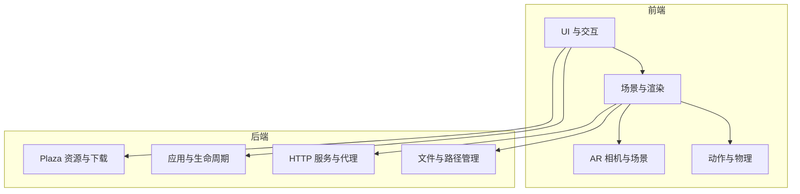
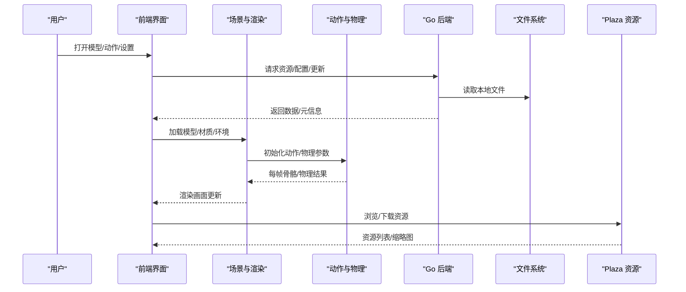
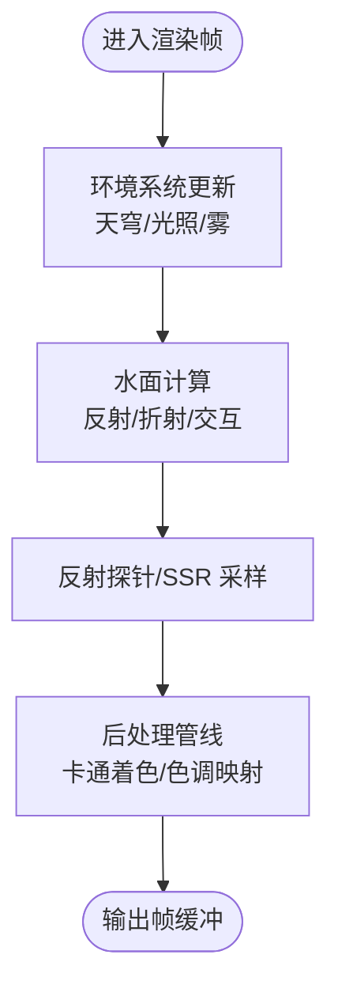
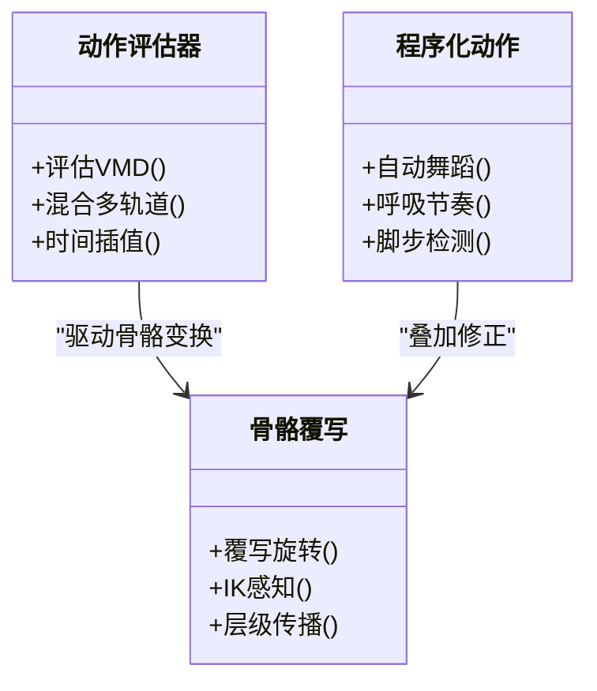
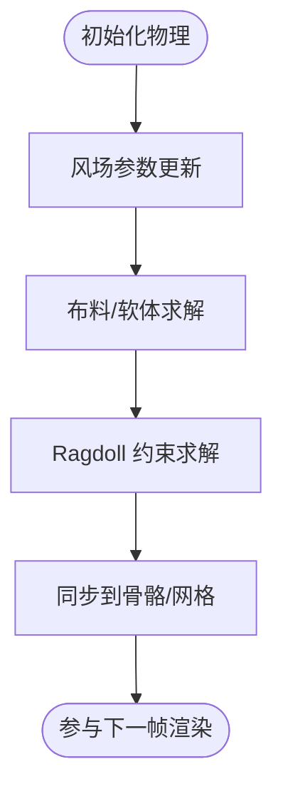
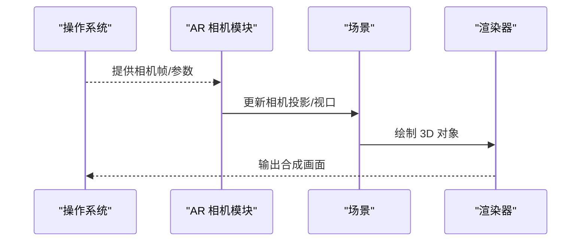
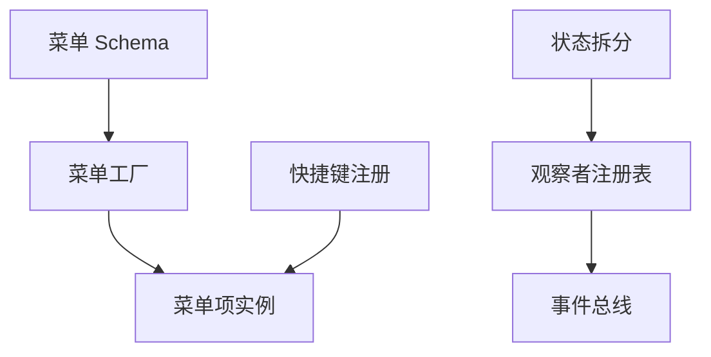
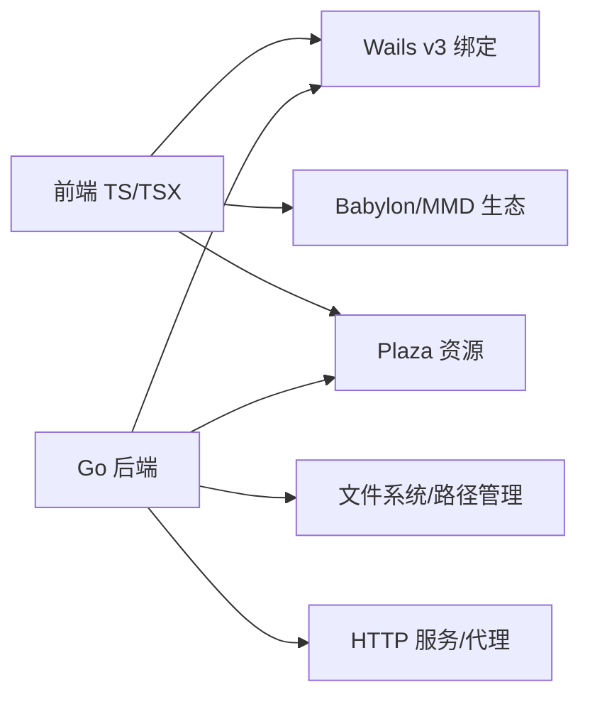

# 项目介绍

<cite>
**本文引用的文件**   
- [README.md](file://README.md)
- [main.go](file://main.go)
- [architecture.md](file://docs/architecture.md)
- [adr-021-procedural-motion.md](file://docs/adr/adr-021-procedural-motion.md)
- [adr-055-ar-camera-mode.md](file://docs/adr/adr-055-ar-camera-mode.md)
- [adr-024-rendering-enhancement-phase2-ssr-reflectionprobe.md](file://docs/adr/adr-024-rendering-enhancement-phase2-ssr-reflectionprobe.md)
- [adr-028-wind-system-unification.md](file://docs/adr/adr-028-wind-system-unification.md)
- [adr-061-advanced-bone-systems.md](file://docs/adr/adr-061-advanced-bone-systems.md)
- [adr-061.1-ragdoll-fidelity.md](file://docs/adr/adr-061.1-ragdoll-fidelity.md)
- [adr-076-cel-shading-postprocess-mode.md](file://docs/adr/adr-076-cel-shading-postprocess-mode.md)
- [adr-093-menu-declarative-schema.md](file://docs/adr/adr-093-menu-declarative-schema.md)
- [adr-108-animation-retargeter.md](file://docs/adr/adr-108-animation-retargeter.md)
- [adr-110-immdmodel-upstream-pr.md](file://docs/adr/adr-110-immdmodel-upstream-pr.md)
- [adr-116-bone-override-ui-redesign.md](file://docs/adr/adr-116-bone-override-ui-redesign.md)
- [adr-122-ik-aware-bone-override.md](file://docs/adr/adr-122-ik-aware-bone-override.md)
- [adr-139-observer-registry.md](file://docs/adr/adr-139-observer-registry.md)
- [adr-141-state-split.md](file://docs/adr/adr-141-state-split.md)
- [adr-143-unification-remaining.md](file://docs/adr/adr-143-unification-remaining.md)
- [adr-145-motion-presets.md](file://docs/adr/adr-145-motion-presets.md)
- [adr-146-function-duplication-triage.md](file://docs/adr/adr-146-function-duplication-triage.md)
- [v1.5.0.md](file://docs/releases/v1.5.0.md)
- [v1.5.3.md](file://docs/releases/v1.5.3.md)
- [AGENTS.md](file://AGENTS.md)
</cite>

## 目录
1. [引言](#引言)
2. [项目结构](#项目结构)
3. [核心组件](#核心组件)
4. [架构总览](#架构总览)
5. [详细组件分析](#详细组件分析)
6. [依赖分析](#依赖分析)
7. [性能考量](#性能考量)
8. [故障排查指南](#故障排查指南)
9. [结论](#结论)
10. [附录](#附录)

## 引言
MikuMikuAR 是一个基于 Wails v3 的跨平台桌面应用程序，聚焦于 MMD（MikuMikuDance）生态中的 3D 角色动画播放与增强现实体验。项目以高性能渲染、实时物理模拟与程序化动作为核心能力，面向虚拟偶像表演、3D 内容创作与 AR 展示等场景，提供从模型加载、动作编排到环境渲染的一体化工作流。

项目的愿景是：在保持对 PMX/VMD 等主流格式良好兼容的同时，通过现代前端图形栈与原生桥接能力，为创作者与观众提供更流畅、更可控、更具表现力的 3D 动画与 AR 体验。

- 技术定位：Wails v3 + 前端图形引擎（Babylon.js/MMD 相关）+ Go 后端服务
- 目标用户：虚拟偶像运营者、3D 内容创作者、AR 展示策划与开发者
- 核心价值：高性能渲染、实时物理、程序化动作、AR 相机模式、统一菜单与状态管理

章节来源
- [README.md](file://README.md)
- [AGENTS.md](file://AGENTS.md)

## 项目结构
仓库采用前后端分离的组织方式：
- 前端（TypeScript/TSX）：负责 UI、交互、渲染管线、动作与物理逻辑、AR 相机控制等
- 后端（Go）：提供文件系统访问、配置、更新、Plaza 资源、缩略图生成、HTTP 服务等能力
- 文档（docs）：包含 ADR（架构决策记录）、审计、发布说明、研究笔记等
- 脚本（scripts）：构建、打包、资源生成与质量检查工具链

图表来源
- [main.go:1-200](file://main.go#L1-L200)
- [architecture.md:1-200](file://docs/architecture.md#L1-L200)

章节来源
- [main.go:1-200](file://main.go#L1-L200)
- [architecture.md:1-200](file://docs/architecture.md#L1-L200)

## 核心组件
- 渲染与环境系统：支持天穹、地面、反射、体积云、水面、粒子等，具备 SSR、反射探针、卡通着色后处理等增强特性
- 动作与骨骼系统：VMD 解析与回放、IK 感知、骨骼覆写、动作重定向、程序化动作（自动舞蹈、呼吸、脚步检测等）
- 物理系统：风场、布料/软体、刚体/布娃娃（Ragdoll），与 WASM 层协同优化
- AR 相机模式：设备相机接入、透视校正、虚实融合
- 菜单与状态：声明式菜单、统一状态拆分、观察者注册表、快捷键注册
- 资源与库：Plaza 站点集成、缩略图流式加载、会话存储、预设体系

章节来源
- [adr-024-rendering-enhancement-phase2-ssr-reflectionprobe.md](file://docs/adr/adr-024-rendering-enhancement-phase2-ssr-reflectionprobe.md)
- [adr-028-wind-system-unification.md](file://docs/adr/adr-028-wind-system-unification.md)
- [adr-061-advanced-bone-systems.md](file://docs/adr/adr-061-advanced-bone-systems.md)
- [adr-061.1-ragdoll-fidelity.md](file://docs/adr/adr-061.1-ragdoll-fidelity.md)
- [adr-076-cel-shading-postprocess-mode.md](file://docs/adr/adr-076-cel-shading-postprocess-mode.md)
- [adr-093-menu-declarative-schema.md](file://docs/adr/adr-093-menu-declarative-schema.md)
- [adr-108-animation-retargeter.md](file://docs/adr/adr-108-animation-retargeter.md)
- [adr-116-bone-override-ui-redesign.md](file://docs/adr/adr-116-bone-override-ui-redesign.md)
- [adr-122-ik-aware-bone-override.md](file://docs/adr/adr-122-ik-aware-bone-override.md)
- [adr-139-observer-registry.md](file://docs/adr/adr-139-observer-registry.md)
- [adr-141-state-split.md](file://docs/adr/adr-141-state-split.md)
- [adr-145-motion-presets.md](file://docs/adr/adr-145-motion-presets.md)

## 架构总览
整体采用“前端渲染 + 后端服务”的双端协作模式：
- 前端负责渲染循环、场景图、材质与后处理、动作评估、物理步进与输入事件
- 后端提供文件 I/O、配置读写、更新检查、Plaza 资源拉取、缩略图生成、本地 HTTP 服务
- 前后端通过 Wails v3 绑定进行通信，事件总线用于跨模块解耦

图表来源
- [main.go:1-200](file://main.go#L1-L200)
- [adr-093-menu-declarative-schema.md](file://docs/adr/adr-093-menu-declarative-schema.md)
- [adr-139-observer-registry.md](file://docs/adr/adr-139-observer-registry.md)

章节来源
- [main.go:1-200](file://main.go#L1-L200)
- [adr-093-menu-declarative-schema.md](file://docs/adr/adr-093-menu-declarative-schema.md)
- [adr-139-observer-registry.md](file://docs/adr/adr-139-observer-registry.md)

## 详细组件分析

### 渲染与环境增强
- 反射与镜面：SSR 与反射探针提升真实感
- 卡通着色：后处理模式实现风格化渲染
- 环境与天气：天穹贴图、体积云、风场影响粒子与布料
- 水面与反射：统一纹理反射、水体交互

图表来源
- [adr-024-rendering-enhancement-phase2-ssr-reflectionprobe.md](file://docs/adr/adr-024-rendering-enhancement-phase2-ssr-reflectionprobe.md)
- [adr-076-cel-shading-postprocess-mode.md](file://docs/adr/adr-076-cel-shading-postprocess-mode.md)
- [adr-028-wind-system-unification.md](file://docs/adr/adr-028-wind-system-unification.md)

章节来源
- [adr-024-rendering-enhancement-phase2-ssr-reflectionprobe.md](file://docs/adr/adr-024-rendering-enhancement-phase2-ssr-reflectionprobe.md)
- [adr-076-cel-shading-postprocess-mode.md](file://docs/adr/adr-076-cel-shading-postprocess-mode.md)
- [adr-028-wind-system-unification.md](file://docs/adr/adr-028-wind-system-unification.md)

### 动作与骨骼系统
- IK 感知与骨骼覆写：结合 IK 约束进行更自然的姿态调整
- 动作重定向：不同骨架间的动作迁移
- 程序化动作：自动舞蹈、呼吸、脚步检测、情绪表达
- 动作预设：快速套用常用动作组合

图表来源
- [adr-108-animation-retargeter.md](file://docs/adr/adr-108-animation-retargeter.md)
- [adr-116-bone-override-ui-redesign.md](file://docs/adr/adr-116-bone-override-ui-redesign.md)
- [adr-122-ik-aware-bone-override.md](file://docs/adr/adr-122-ik-aware-bone-override.md)
- [adr-021-procedural-motion.md](file://docs/adr/adr-021-procedural-motion.md)
- [adr-145-motion-presets.md](file://docs/adr/adr-145-motion-presets.md)

章节来源
- [adr-108-animation-retargeter.md](file://docs/adr/adr-108-animation-retargeter.md)
- [adr-116-bone-override-ui-redesign.md](file://docs/adr/adr-116-bone-override-ui-redesign.md)
- [adr-122-ik-aware-bone-override.md](file://docs/adr/adr-122-ik-aware-bone-override.md)
- [adr-021-procedural-motion.md](file://docs/adr/adr-021-procedural-motion.md)
- [adr-145-motion-presets.md](file://docs/adr/adr-145-motion-presets.md)

### 物理系统（风场/布料/软体/Ragdoll）
- 风场统一：将风效整合至渲染与物理管线
- Ragdoll 保真度：提升碰撞与关节约束稳定性
- 布料/软体：裙摆、发丝、配饰的动态效果

图表来源
- [adr-028-wind-system-unification.md](file://docs/adr/adr-028-wind-system-unification.md)
- [adr-061.1-ragdoll-fidelity.md](file://docs/adr/adr-061.1-ragdoll-fidelity.md)

章节来源
- [adr-028-wind-system-unification.md](file://docs/adr/adr-028-wind-system-unification.md)
- [adr-061.1-ragdoll-fidelity.md](file://docs/adr/adr-061.1-ragdoll-fidelity.md)

### AR 相机模式
- 设备相机接入：获取摄像头流并注入场景
- 透视校正：根据设备参数校准投影矩阵
- 虚实融合：将 3D 对象置于真实环境中

图表来源
- [adr-055-ar-camera-mode.md](file://docs/adr/adr-055-ar-camera-mode.md)

章节来源
- [adr-055-ar-camera-mode.md](file://docs/adr/adr-055-ar-camera-mode.md)

### 菜单与状态管理
- 声明式菜单：通过 Schema 定义菜单项与行为
- 状态拆分：将全局状态拆分为领域状态，降低耦合
- 观察者注册表：统一事件订阅与分发
- 快捷键注册：集中管理快捷键冲突与覆盖

图表来源
- [adr-093-menu-declarative-schema.md](file://docs/adr/adr-093-menu-declarative-schema.md)
- [adr-139-observer-registry.md](file://docs/adr/adr-139-observer-registry.md)
- [adr-141-state-split.md](file://docs/adr/adr-141-state-split.md)
- [adr-146-function-duplication-triage.md](file://docs/adr/adr-146-function-duplication-triage.md)

章节来源
- [adr-093-menu-declarative-schema.md](file://docs/adr/adr-093-menu-declarative-schema.md)
- [adr-139-observer-registry.md](file://docs/adr/adr-139-observer-registry.md)
- [adr-141-state-split.md](file://docs/adr/adr-141-state-split.md)
- [adr-146-function-duplication-triage.md](file://docs/adr/adr-146-function-duplication-triage.md)

## 依赖分析
- 前端依赖：Wails v3 绑定、Babylon.js/MMD 相关库、测试与构建工具
- 后端依赖：Go 标准库、文件系统、网络与压缩库、Wails 运行时
- 外部集成：Plaza 资源站、更新服务、本地 HTTP 代理

图表来源
- [main.go:1-200](file://main.go#L1-L200)
- [adr-110-immdmodel-upstream-pr.md](file://docs/adr/adr-110-immdmodel-upstream-pr.md)

章节来源
- [main.go:1-200](file://main.go#L1-L200)
- [adr-110-immdmodel-upstream-pr.md](file://docs/adr/adr-110-immdmodel-upstream-pr.md)

## 性能考量
- 渲染优化：SSR 与反射探针按需启用，后处理通道合并，减少过采样
- 物理优化：风场与布料求解分帧或降频，Ragdoll 约束简化
- 动作评估：批量更新骨骼变换，避免频繁分配内存
- 资源加载：缩略图流式加载与缓存预热，减少卡顿
- 状态与事件：观察者注册表去重与批量派发，降低事件风暴

[本节为通用指导，不直接分析具体文件]

## 故障排查指南
- 常见问题定位：参考 buglog 与审计文档，关注跨域、WASM 加载失败、VMD 播放无响应、两套物理引擎并存导致性能下降等问题
- 日志与诊断：利用状态拆分与观察者注册表，定位事件链路；使用快捷键注册表排查冲突
- 回滚与版本：依据发布说明对比变更，必要时回退到稳定版本

章节来源
- [adr-143-unification-remaining.md](file://docs/adr/adr-143-unification-remaining.md)
- [v1.5.0.md](file://docs/releases/v1.5.0.md)
- [v1.5.3.md](file://docs/releases/v1.5.3.md)

## 结论
MikuMikuAR 以 Wails v3 为桥梁，将现代前端图形能力与 Go 后端服务深度融合，围绕 MMD 生态提供高性能渲染、实时物理与程序化动作的综合解决方案。其 AR 相机模式与丰富的环境/后处理特性，使其在虚拟偶像表演、3D 内容创作与 AR 展示中具备显著优势。随着菜单与状态管理的统一、观察者机制的完善以及上游生态的持续集成，项目在易用性、可维护性与扩展性方面将持续提升。

[本节为总结性内容，不直接分析具体文件]

## 附录
- 历史背景与发展历程：参考发布说明与研究笔记，了解关键里程碑与技术演进
- 术语与规范：参考术语文档与 AGENTS 指南，理解项目约定与最佳实践

章节来源
- [v1.5.0.md](file://docs/releases/v1.5.0.md)
- [v1.5.3.md](file://docs/releases/v1.5.3.md)
- [AGENTS.md](file://AGENTS.md)