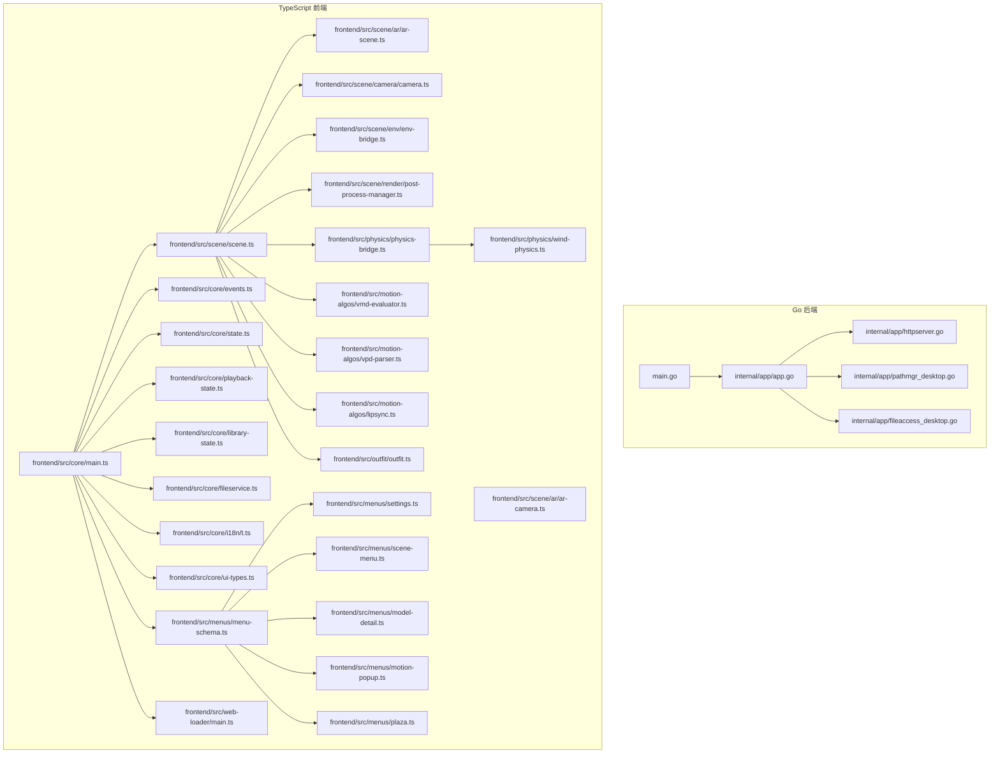
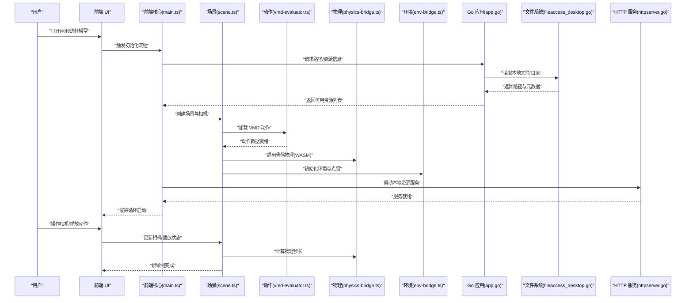
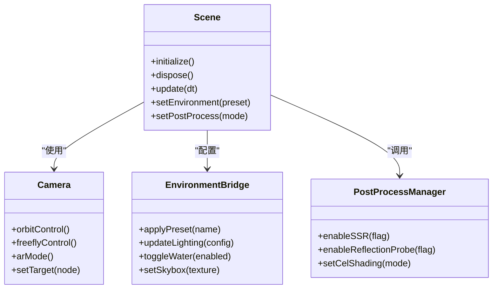
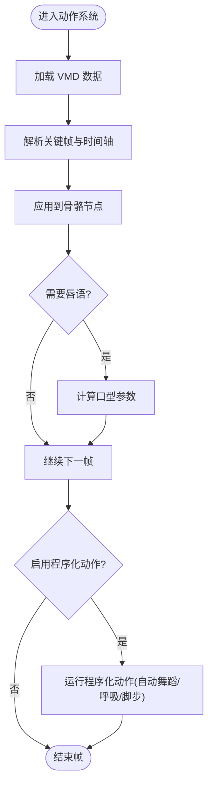
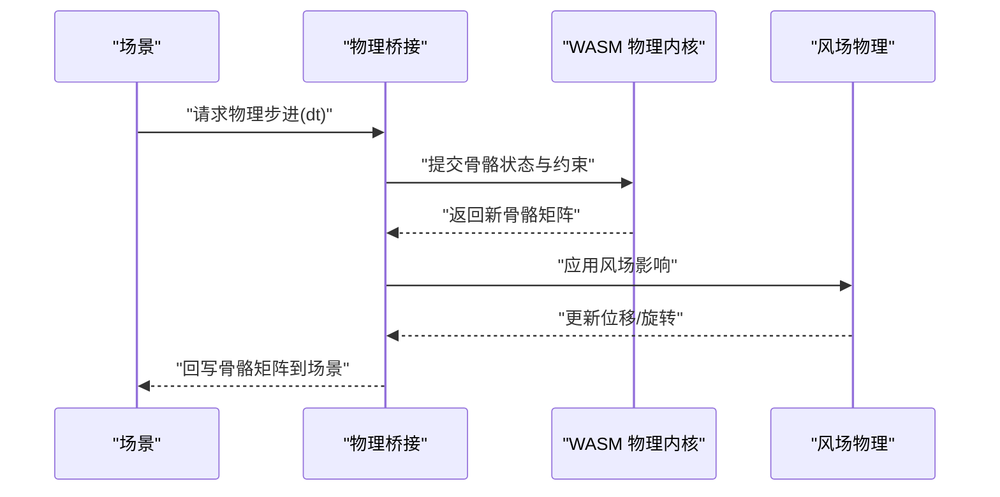
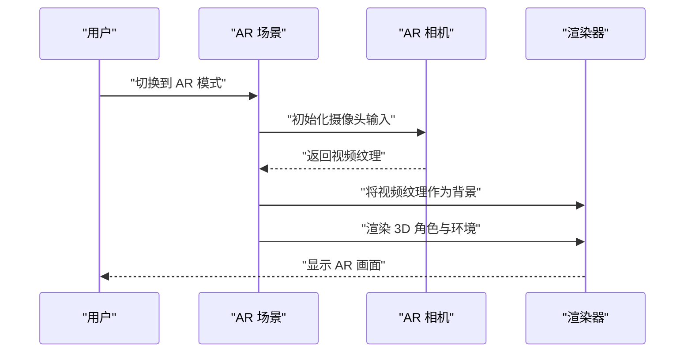
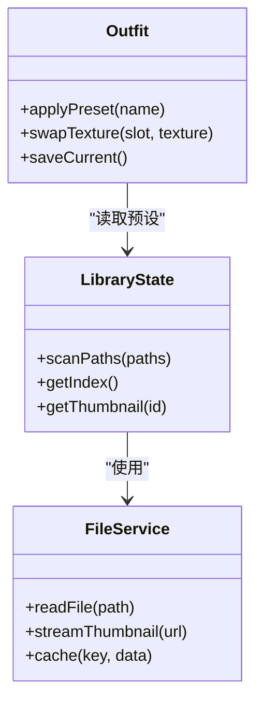
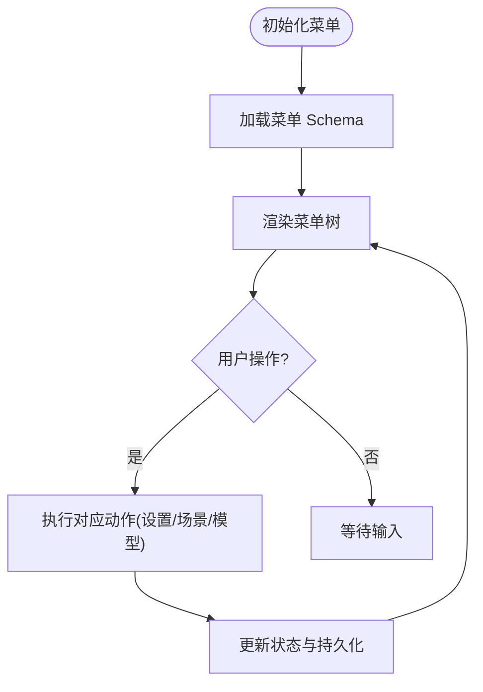
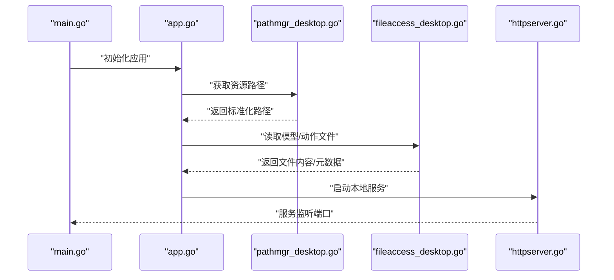
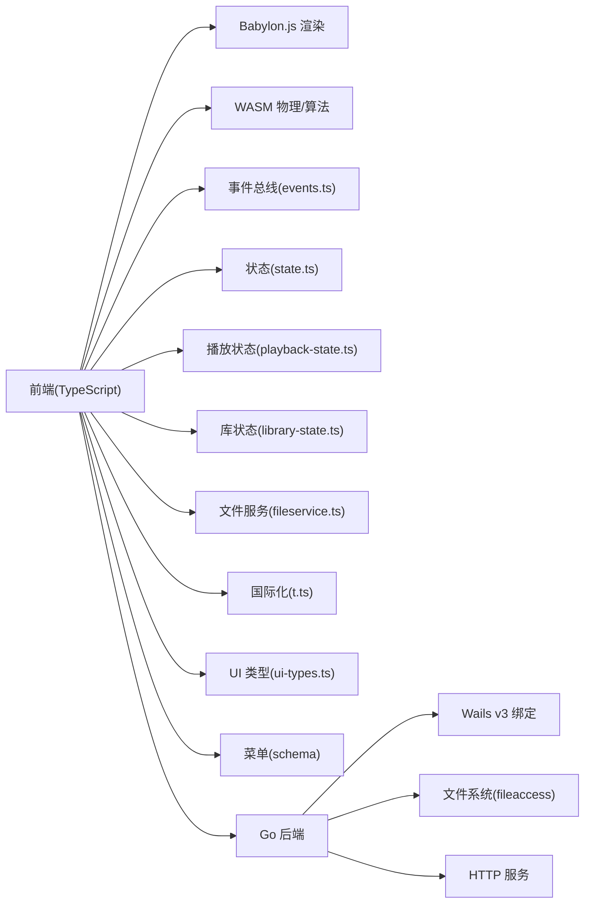

# 项目概述

<cite>
**本文引用的文件**   
- [README.md](file://README.md)
- [main.go](file://main.go)
- [go.mod](file://go.mod)
- [frontend/package.json](file://frontend/package.json)
- [frontend/src/core/main.ts](file://frontend/src/core/main.ts)
- [frontend/src/config.ts](file://frontend/src/config.ts)
- [frontend/src/scene/scene.ts](file://frontend/src/scene/scene.ts)
- [frontend/src/motion-algos/procedural-motion.ts](file://frontend/src/motion-algos/procedural-motion.ts)
- [internal/app/app.go](file://internal/app/app.go)
- [internal/app/httpserver.go](file://internal/app/httpserver.go)
- [internal/app/pathmgr_desktop.go](file://internal/app/pathmgr_desktop.go)
- [internal/app/fileaccess_desktop.go](file://internal/app/fileaccess_desktop.go)
- [frontend/src/scene/ar/ar-scene.ts](file://frontend/src/scene/ar/ar-scene.ts)
- [frontend/src/scene/ar/ar-camera.ts](file://frontend/src/scene/ar/ar-camera.ts)
- [frontend/src/physics/physics-bridge.ts](file://frontend/src/physics/physics-bridge.ts)
- [frontend/src/physics/wind-physics.ts](file://frontend/src/physics/wind-physics.ts)
- [frontend/src/motion-algos/vmd-evaluator.ts](file://frontend/src/motion-algos/vmd-evaluator.ts)
- [frontend/src/motion-algos/vpd-parser.ts](file://frontend/src/motion-algos/vpd-parser.ts)
- [frontend/src/motion-algos/lipsync.ts](file://frontend/src/motion-algos/lipsync.ts)
- [frontend/src/scene/env/env-bridge.ts](file://frontend/src/scene/env/env-bridge.ts)
- [frontend/src/scene/render/post-process-manager.ts](file://frontend/src/scene/render/post-process-manager.ts)
- [frontend/src/scene/camera/camera.ts](file://frontend/src/scene/camera/camera.ts)
- [frontend/src/core/events.ts](file://frontend/src/core/events.ts)
- [frontend/src/core/state.ts](file://frontend/src/core/state.ts)
- [frontend/src/core/playback-state.ts](file://frontend/src/core/playback-state.ts)
- [frontend/src/core/library-state.ts](file://frontend/src/core/library-state.ts)
- [frontend/src/core/fileservice.ts](file://frontend/src/core/fileservice.ts)
- [frontend/src/core/i18n/t.ts](file://frontend/src/core/i18n/t.ts)
- [frontend/src/core/ui-types.ts](file://frontend/src/core/ui-types.ts)
- [frontend/src/menus/menu-schema.ts](file://frontend/src/menus/menu-schema.ts)
- [frontend/src/menus/settings.ts](file://frontend/src/menus/settings.ts)
- [frontend/src/menus/scene-menu.ts](file://frontend/src/menus/scene-menu.ts)
- [frontend/src/menus/model-detail.ts](file://frontend/src/menus/model-detail.ts)
- [frontend/src/menus/motion-popup.ts](file://frontend/src/menus/motion-popup.ts)
- [frontend/src/menus/plaza.ts](file://frontend/src/menus/plaza.ts)
- [frontend/src/outfit/outfit.ts](file://frontend/src/outfit/outfit.ts)
- [frontend/src/web-loader/main.ts](file://frontend/src/web-loader/main.ts)
</cite>

## 目录
1. [简介](#简介)
2. [项目结构](#项目结构)
3. [核心组件](#核心组件)
4. [架构总览](#架构总览)
5. [详细组件分析](#详细组件分析)
6. [依赖关系分析](#依赖关系分析)
7. [性能考量](#性能考量)
8. [故障排查指南](#故障排查指南)
9. [结论](#结论)
10. [附录](#附录)

## 简介
MikuMikuAR 是一款基于 Wails v3 的跨平台桌面应用，面向 MMD（MikuMikuDance）生态，提供 3D 角色动画播放、增强现实（AR）能力与程序化动作系统。其技术栈采用 Go 后端 + TypeScript 前端，渲染层基于 Babylon.js，并通过 WebAssembly 运行时执行高性能骨骼物理与算法模块。项目支持 PMX 模型、VMD 动作、VPD 姿态等主流格式，内置丰富的环境、材质、相机与后期处理选项，并提供菜单化配置与多语言界面。

本概述旨在帮助初学者快速理解项目目标、主要特性与技术架构，并给出快速开始指引与核心概念说明。

## 项目结构
仓库采用前后端分离的组织方式：
- 根目录包含 Go 后端入口、构建脚本与文档；
- frontend 为 TypeScript 前端工程，内含场景、渲染、动作、UI 与工具模块；
- internal 为 Go 侧业务逻辑与平台适配；
- docs 包含架构决策记录（ADR）、研究笔记与发布说明；
- scripts 提供构建与辅助工具。

图表来源
- [main.go:1-200](file://main.go#L1-L200)
- [internal/app/app.go:1-200](file://internal/app/app.go#L1-L200)
- [internal/app/httpserver.go:1-200](file://internal/app/httpserver.go#L1-L200)
- [internal/app/pathmgr_desktop.go:1-200](file://internal/app/pathmgr_desktop.go#L1-L200)
- [internal/app/fileaccess_desktop.go:1-200](file://internal/app/fileaccess_desktop.go#L1-L200)
- [frontend/src/core/main.ts:1-200](file://frontend/src/core/main.ts#L1-L200)
- [frontend/src/scene/scene.ts:1-200](file://frontend/src/scene/scene.ts#L1-L200)
- [frontend/src/scene/ar/ar-scene.ts:1-200](file://frontend/src/scene/ar/ar-scene.ts#L1-L200)
- [frontend/src/scene/ar/ar-camera.ts:1-200](file://frontend/src/scene/ar/ar-camera.ts#L1-L200)
- [frontend/src/physics/physics-bridge.ts:1-200](file://frontend/src/physics/physics-bridge.ts#L1-L200)
- [frontend/src/physics/wind-physics.ts:1-200](file://frontend/src/physics/wind-physics.ts#L1-L200)
- [frontend/src/motion-algos/vmd-evaluator.ts:1-200](file://frontend/src/motion-algos/vmd-evaluator.ts#L1-L200)
- [frontend/src/motion-algos/vpd-parser.ts:1-200](file://frontend/src/motion-algos/vpd-parser.ts#L1-L200)
- [frontend/src/motion-algos/lipsync.ts:1-200](file://frontend/src/motion-algos/lipsync.ts#L1-L200)
- [frontend/src/scene/env/env-bridge.ts:1-200](file://frontend/src/scene/env/env-bridge.ts#L1-L200)
- [frontend/src/scene/render/post-process-manager.ts:1-200](file://frontend/src/scene/render/post-process-manager.ts#L1-L200)
- [frontend/src/scene/camera/camera.ts:1-200](file://frontend/src/scene/camera/camera.ts#L1-L200)
- [frontend/src/core/events.ts:1-200](file://frontend/src/core/events.ts#L1-L200)
- [frontend/src/core/state.ts:1-200](file://frontend/src/core/state.ts#L1-L200)
- [frontend/src/core/playback-state.ts:1-200](file://frontend/src/core/playback-state.ts#L1-L200)
- [frontend/src/core/library-state.ts:1-200](file://frontend/src/core/library-state.ts#L1-L200)
- [frontend/src/core/fileservice.ts:1-200](file://frontend/src/core/fileservice.ts#L1-L200)
- [frontend/src/core/i18n/t.ts:1-200](file://frontend/src/core/i18n/t.ts#L1-L200)
- [frontend/src/core/ui-types.ts:1-200](file://frontend/src/core/ui-types.ts#L1-L200)
- [frontend/src/menus/menu-schema.ts:1-200](file://frontend/src/menus/menu-schema.ts#L1-L200)
- [frontend/src/menus/settings.ts:1-200](file://frontend/src/menus/settings.ts#L1-L200)
- [frontend/src/menus/scene-menu.ts:1-200](file://frontend/src/menus/scene-menu.ts#L1-L200)
- [frontend/src/menus/model-detail.ts:1-200](file://frontend/src/menus/model-detail.ts#L1-L200)
- [frontend/src/menus/motion-popup.ts:1-200](file://frontend/src/menus/motion-popup.ts#L1-L200)
- [frontend/src/menus/plaza.ts:1-200](file://frontend/src/menus/plaza.ts#L1-L200)
- [frontend/src/outfit/outfit.ts:1-200](file://frontend/src/outfit/outfit.ts#L1-L200)
- [frontend/src/web-loader/main.ts:1-200](file://frontend/src/web-loader/main.ts#L1-L200)

章节来源
- [README.md:1-200](file://README.md#L1-L200)
- [go.mod:1-200](file://go.mod#L1-L200)
- [frontend/package.json:1-200](file://frontend/package.json#L1-L200)

## 核心组件
- 应用启动与生命周期管理：负责初始化 Wails 应用、注册事件总线、加载资源与 UI、协调前后端通信。
- 场景与渲染：封装 Babylon.js 场景、相机控制、环境系统、后处理管线与 AR 模式切换。
- 动作与物理：VMD 解析与回放、VPD 姿态解析、唇语同步、程序化动作系统与骨骼物理（WASM）。
- 资源与库：模型、材质、动作、预设的统一管理与缓存，缩略图与流式加载。
- 设置与菜单：声明式菜单与设置面板，支持多语言与快捷键。
- 平台与文件系统：路径管理、文件访问、HTTP 服务与代理，适配桌面与移动端。

章节来源
- [frontend/src/core/main.ts:1-200](file://frontend/src/core/main.ts#L1-L200)
- [frontend/src/scene/scene.ts:1-200](file://frontend/src/scene/scene.ts#L1-L200)
- [frontend/src/motion-algos/procedural-motion.ts:1-200](file://frontend/src/motion-algos/procedural-motion.ts#L1-L200)
- [internal/app/app.go:1-200](file://internal/app/app.go#L1-L200)
- [internal/app/httpserver.go:1-200](file://internal/app/httpserver.go#L1-L200)
- [internal/app/pathmgr_desktop.go:1-200](file://internal/app/pathmgr_desktop.go#L1-L200)
- [internal/app/fileaccess_desktop.go:1-200](file://internal/app/fileaccess_desktop.go#L1-L200)

## 架构总览
MikuMikuAR 采用“Go 后端 + TS 前端”的双引擎架构：
- Go 后端通过 Wails v3 暴露 API，提供文件系统、路径管理、HTTP 服务与平台能力；
- TS 前端使用 Babylon.js 进行 3D 渲染，结合 WASM 运行时的骨骼物理与算法；
- 前后端通过事件总线与绑定接口通信，状态集中在前端状态管理中；
- 菜单与设置通过声明式 Schema 驱动，统一交互体验。

图表来源
- [frontend/src/core/main.ts:1-200](file://frontend/src/core/main.ts#L1-L200)
- [frontend/src/scene/scene.ts:1-200](file://frontend/src/scene/scene.ts#L1-L200)
- [frontend/src/motion-algos/vmd-evaluator.ts:1-200](file://frontend/src/motion-algos/vmd-evaluator.ts#L1-L200)
- [frontend/src/physics/physics-bridge.ts:1-200](file://frontend/src/physics/physics-bridge.ts#L1-L200)
- [frontend/src/scene/env/env-bridge.ts:1-200](file://frontend/src/scene/env/env-bridge.ts#L1-L200)
- [internal/app/app.go:1-200](file://internal/app/app.go#L1-L200)
- [internal/app/fileaccess_desktop.go:1-200](file://internal/app/fileaccess_desktop.go#L1-L200)
- [internal/app/httpserver.go:1-200](file://internal/app/httpserver.go#L1-L200)

## 详细组件分析

### 场景与渲染子系统
- 场景管理：负责 Babylon.js 场景实例、资源加载、对象生命周期与销毁。
- 相机控制：轨道相机、自由飞行相机与 AR 相机模式切换。
- 环境系统：天空盒、地面、水体、反射与粒子效果，统一桥接至渲染管线。
- 后处理：SSR、反射探针、卡通着色等后处理模块集成。

图表来源
- [frontend/src/scene/scene.ts:1-200](file://frontend/src/scene/scene.ts#L1-L200)
- [frontend/src/scene/camera/camera.ts:1-200](file://frontend/src/scene/camera/camera.ts#L1-L200)
- [frontend/src/scene/env/env-bridge.ts:1-200](file://frontend/src/scene/env/env-bridge.ts#L1-L200)
- [frontend/src/scene/render/post-process-manager.ts:1-200](file://frontend/src/scene/render/post-process-manager.ts#L1-L200)

章节来源
- [frontend/src/scene/scene.ts:1-200](file://frontend/src/scene/scene.ts#L1-L200)
- [frontend/src/scene/camera/camera.ts:1-200](file://frontend/src/scene/camera/camera.ts#L1-L200)
- [frontend/src/scene/env/env-bridge.ts:1-200](file://frontend/src/scene/env/env-bridge.ts#L1-L200)
- [frontend/src/scene/render/post-process-manager.ts:1-200](file://frontend/src/scene/render/post-process-manager.ts#L1-L200)

### 动作与程序化动作系统
- VMD 评估器：解析与回放 VMD 关键帧，驱动骨骼变换。
- VPD 解析器：加载与应用姿态文件。
- 唇语同步：根据音频或节拍生成口型动画。
- 程序化动作：基于规则与感知层的自动舞蹈、呼吸、脚步检测等。

图表来源
- [frontend/src/motion-algos/vmd-evaluator.ts:1-200](file://frontend/src/motion-algos/vmd-evaluator.ts#L1-L200)
- [frontend/src/motion-algos/vpd-parser.ts:1-200](file://frontend/src/motion-algos/vpd-parser.ts#L1-L200)
- [frontend/src/motion-algos/lipsync.ts:1-200](file://frontend/src/motion-algos/lipsync.ts#L1-L200)
- [frontend/src/motion-algos/procedural-motion.ts:1-200](file://frontend/src/motion-algos/procedural-motion.ts#L1-L200)

章节来源
- [frontend/src/motion-algos/vmd-evaluator.ts:1-200](file://frontend/src/motion-algos/vmd-evaluator.ts#L1-L200)
- [frontend/src/motion-algos/vpd-parser.ts:1-200](file://frontend/src/motion-algos/vpd-parser.ts#L1-L200)
- [frontend/src/motion-algos/lipsync.ts:1-200](file://frontend/src/motion-algos/lipsync.ts#L1-L200)
- [frontend/src/motion-algos/procedural-motion.ts:1-200](file://frontend/src/motion-algos/procedural-motion.ts#L1-L200)

### 物理与风场系统
- 物理桥接：连接 Babylon.js 与 WASM 骨骼物理，统一步进与结果回写。
- 风场物理：对布料、头发等软体施加风力影响，提升自然度。

图表来源
- [frontend/src/physics/physics-bridge.ts:1-200](file://frontend/src/physics/physics-bridge.ts#L1-L200)
- [frontend/src/physics/wind-physics.ts:1-200](file://frontend/src/physics/wind-physics.ts#L1-L200)

章节来源
- [frontend/src/physics/physics-bridge.ts:1-200](file://frontend/src/physics/physics-bridge.ts#L1-L200)
- [frontend/src/physics/wind-physics.ts:1-200](file://frontend/src/physics/wind-physics.ts#L1-L200)

### 增强现实（AR）子系统
- AR 场景：在移动设备上启用摄像头输入，叠加 3D 角色与环境。
- AR 相机：将设备摄像头作为主相机源，处理透视与对齐。

图表来源
- [frontend/src/scene/ar/ar-scene.ts:1-200](file://frontend/src/scene/ar/ar-scene.ts#L1-L200)
- [frontend/src/scene/ar/ar-camera.ts:1-200](file://frontend/src/scene/ar/ar-camera.ts#L1-L200)

章节来源
- [frontend/src/scene/ar/ar-scene.ts:1-200](file://frontend/src/scene/ar/ar-scene.ts#L1-L200)
- [frontend/src/scene/ar/ar-camera.ts:1-200](file://frontend/src/scene/ar/ar-camera.ts#L1-L200)

### 资源与库管理
- 库状态：维护模型、动作、预设的索引与缓存。
- 文件服务：封装本地与网络资源访问，提供缩略图与流式加载。
- 换装系统：按预设或动态替换材质与纹理。

图表来源
- [frontend/src/core/library-state.ts:1-200](file://frontend/src/core/library-state.ts#L1-L200)
- [frontend/src/core/fileservice.ts:1-200](file://frontend/src/core/fileservice.ts#L1-L200)
- [frontend/src/outfit/outfit.ts:1-200](file://frontend/src/outfit/outfit.ts#L1-L200)

章节来源
- [frontend/src/core/library-state.ts:1-200](file://frontend/src/core/library-state.ts#L1-L200)
- [frontend/src/core/fileservice.ts:1-200](file://frontend/src/core/fileservice.ts#L1-L200)
- [frontend/src/outfit/outfit.ts:1-200](file://frontend/src/outfit/outfit.ts#L1-L200)

### 设置与菜单系统
- 菜单 Schema：声明式定义菜单项、分组与校验规则。
- 设置面板：多语言、主题、性能与渲染选项。
- 场景与模型细节：快捷操作与属性编辑。

图表来源
- [frontend/src/menus/menu-schema.ts:1-200](file://frontend/src/menus/menu-schema.ts#L1-L200)
- [frontend/src/menus/settings.ts:1-200](file://frontend/src/menus/settings.ts#L1-L200)
- [frontend/src/menus/scene-menu.ts:1-200](file://frontend/src/menus/scene-menu.ts#L1-L200)
- [frontend/src/menus/model-detail.ts:1-200](file://frontend/src/menus/model-detail.ts#L1-L200)
- [frontend/src/menus/motion-popup.ts:1-200](file://frontend/src/menus/motion-popup.ts#L1-L200)
- [frontend/src/menus/plaza.ts:1-200](file://frontend/src/menus/plaza.ts#L1-L200)

章节来源
- [frontend/src/menus/menu-schema.ts:1-200](file://frontend/src/menus/menu-schema.ts#L1-L200)
- [frontend/src/menus/settings.ts:1-200](file://frontend/src/menus/settings.ts#L1-L200)
- [frontend/src/menus/scene-menu.ts:1-200](file://frontend/src/menus/scene-menu.ts#L1-L200)
- [frontend/src/menus/model-detail.ts:1-200](file://frontend/src/menus/model-detail.ts#L1-L200)
- [frontend/src/menus/motion-popup.ts:1-200](file://frontend/src/menus/motion-popup.ts#L1-L200)
- [frontend/src/menus/plaza.ts:1-200](file://frontend/src/menus/plaza.ts#L1-L200)

### 平台与后端集成
- 应用入口：注册 Wails 绑定、启动 HTTP 服务与窗口管理。
- 路径管理：跨平台路径规范化与缓存。
- 文件访问：桌面端直接 IO，移动端受限访问策略。

图表来源
- [main.go:1-200](file://main.go#L1-L200)
- [internal/app/app.go:1-200](file://internal/app/app.go#L1-L200)
- [internal/app/pathmgr_desktop.go:1-200](file://internal/app/pathmgr_desktop.go#L1-L200)
- [internal/app/fileaccess_desktop.go:1-200](file://internal/app/fileaccess_desktop.go#L1-L200)
- [internal/app/httpserver.go:1-200](file://internal/app/httpserver.go#L1-L200)

章节来源
- [main.go:1-200](file://main.go#L1-L200)
- [internal/app/app.go:1-200](file://internal/app/app.go#L1-L200)
- [internal/app/pathmgr_desktop.go:1-200](file://internal/app/pathmgr_desktop.go#L1-L200)
- [internal/app/fileaccess_desktop.go:1-200](file://internal/app/fileaccess_desktop.go#L1-L200)
- [internal/app/httpserver.go:1-200](file://internal/app/httpserver.go#L1-L200)

## 依赖关系分析
- 前端依赖：Babylon.js（渲染）、WASM（骨骼物理与算法）、TypeScript 工具链与测试框架。
- 后端依赖：Wails v3（跨平台打包与绑定）、标准库与平台特定实现。
- 外部资源：PMX/VMD/VPD 格式解析、纹理与字体资源、本地与网络资源服务。

图表来源
- [frontend/src/core/events.ts:1-200](file://frontend/src/core/events.ts#L1-L200)
- [frontend/src/core/state.ts:1-200](file://frontend/src/core/state.ts#L1-L200)
- [frontend/src/core/playback-state.ts:1-200](file://frontend/src/core/playback-state.ts#L1-L200)
- [frontend/src/core/library-state.ts:1-200](file://frontend/src/core/library-state.ts#L1-L200)
- [frontend/src/core/fileservice.ts:1-200](file://frontend/src/core/fileservice.ts#L1-L200)
- [frontend/src/core/i18n/t.ts:1-200](file://frontend/src/core/i18n/t.ts#L1-L200)
- [frontend/src/core/ui-types.ts:1-200](file://frontend/src/core/ui-types.ts#L1-L200)
- [frontend/src/menus/menu-schema.ts:1-200](file://frontend/src/menus/menu-schema.ts#L1-L200)
- [internal/app/app.go:1-200](file://internal/app/app.go#L1-L200)
- [internal/app/fileaccess_desktop.go:1-200](file://internal/app/fileaccess_desktop.go#L1-L200)
- [internal/app/httpserver.go:1-200](file://internal/app/httpserver.go#L1-L200)

章节来源
- [go.mod:1-200](file://go.mod#L1-L200)
- [frontend/package.json:1-200](file://frontend/package.json#L1-L200)

## 性能考量
- 渲染优化：按需启用后处理（如 SSR、反射探针），合理设置阴影与抗锯齿等级。
- 物理步长：平衡精度与性能，避免每帧多次求解导致卡顿。
- 资源加载：使用缩略图与流式加载，减少首屏延迟与内存占用。
- 动作回放：批量更新骨骼矩阵，减少中间对象分配。
- 平台差异：移动端限制高开销特效，优先保证流畅度。

[本节为通用指导，不直接分析具体文件]

## 故障排查指南
- WASM 加载失败：检查 index_bg.wasm 是否可访问，确认构建产物路径与 MIME 类型。
- VMD 播放无反应：确认动作文件路径与时间轴范围，检查骨骼名称匹配。
- 程序化动作无效：验证动作层优先级与骨骼覆写开关。
- 水面关闭后未恢复：检查环境预设切换与状态回滚逻辑。
- 两套物理引擎并存导致性能差：统一物理后端，避免重复计算。
- 菜单快捷键冲突：审查快捷键注册表，确保唯一性。

章节来源
- [frontend/src/core/playback-state.ts:1-200](file://frontend/src/core/playback-state.ts#L1-L200)
- [frontend/src/scene/env/env-bridge.ts:1-200](file://frontend/src/scene/env/env-bridge.ts#L1-L200)
- [frontend/src/motion-algos/procedural-motion.ts:1-200](file://frontend/src/motion-algos/procedural-motion.ts#L1-L200)
- [frontend/src/physics/physics-bridge.ts:1-200](file://frontend/src/physics/physics-bridge.ts#L1-L200)
- [frontend/src/menus/menu-schema.ts:1-200](file://frontend/src/menus/menu-schema.ts#L1-L200)

## 结论
MikuMikuAR 以 Wails v3 为桥梁，整合 Go 后端与 TypeScript 前端，借助 Babylon.js 与 WASM 实现高性能 3D 渲染与骨骼物理。项目具备完善的场景、动作、环境、AR 与菜单体系，适合扩展与二次开发。建议从“快速开始”入手，逐步深入各子系统，并结合 ADR 与审计文档了解设计权衡与演进方向。

[本节为总结，不直接分析具体文件]

## 附录

### 快速开始指南
- 环境搭建
  - 安装 Go 与 Node.js，确保版本满足 go.mod 与 package.json 要求。
  - 在项目根目录执行依赖安装与构建命令（参考 README 与 Taskfile）。
- 基本使用
  - 启动应用后，通过菜单导入 PMX 模型与 VMD 动作。
  - 在场景面板调整环境、相机与后处理参数。
  - 在动作面板播放、暂停与切换动作，尝试程序化动作与唇语同步。
- 核心概念
  - 场景：3D 世界与对象的容器，负责渲染与生命周期。
  - 动作：VMD 关键帧驱动骨骼，VPD 用于姿态快照。
  - 物理：WASM 骨骼物理与风场，提升自然度。
  - 环境：天空、地面、水体与光照的统一配置。
  - 菜单与设置：声明式 Schema 驱动的交互与持久化。

章节来源
- [README.md:1-200](file://README.md#L1-L200)
- [frontend/src/core/main.ts:1-200](file://frontend/src/core/main.ts#L1-L200)
- [frontend/src/scene/scene.ts:1-200](file://frontend/src/scene/scene.ts#L1-L200)
- [frontend/src/motion-algos/vmd-evaluator.ts:1-200](file://frontend/src/motion-algos/vmd-evaluator.ts#L1-L200)
- [frontend/src/motion-algos/vpd-parser.ts:1-200](file://frontend/src/motion-algos/vpd-parser.ts#L1-L200)
- [frontend/src/physics/physics-bridge.ts:1-200](file://frontend/src/physics/physics-bridge.ts#L1-L200)
- [frontend/src/scene/env/env-bridge.ts:1-200](file://frontend/src/scene/env/env-bridge.ts#L1-L200)
- [frontend/src/menus/menu-schema.ts:1-200](file://frontend/src/menus/menu-schema.ts#L1-L200)