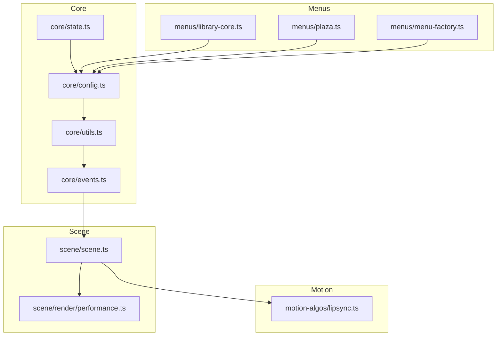

```mermaid
graph TD;
    subgraph Core
        core_state["core/state.ts"]
        core_config["core/config.ts"]
        core_utils["core/utils.ts"]
        core_events["core/events.ts"]
    end
    subgraph Menus
        menus_library["menus/library-core.ts"]
        menus_plaza["menus/plaza.ts"]
        menus_menu["menus/menu-factory.ts"]
    end
    subgraph Scene
        scene_scene["scene/scene.ts"]
        scene_render["scene/render/performance.ts"]
    end
    subgraph Motion
        motion_lipsync["motion-algos/lipsync.ts"]
    end
    core_state --> core_config
    core_config --> core_utils
    core_utils --> core_events
    core_events --> scene_scene
    scene_scene --> scene_render
    scene_scene --> motion_lipsync
    menus_library --> core_config
    menus_plaza --> core_config
    menus_menu --> core_config
```